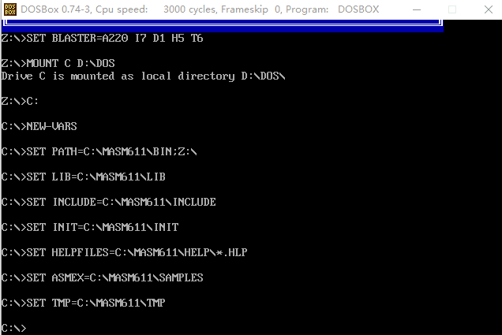

### 前言
> 本文的初衷是对8086汇编语言的基本知识点进行汇总，参考的书籍是王爽编著的《汇编语言第三版》。

<!--more-->

#### ch1 基础知识

1. 汇编指令是机器指令的助记符，同机器指令一一对应。

2. 在存储器中指令和数据没有任何区别，都是二进制信息。

3. 一个CPU可以引出3种总线的宽度标志了这个CPU的不同方面的性能：

    地址总线的宽度决定了CPU的寻址能力；     

    数据总线的宽度决定了CPU与其他器件进行数据传输时的一次数据传送量；

    控制总线的宽度决定了CPU对系统中其他器件的控制能力。

4. 8086CPU的地址总线的宽度为20，内存地址空间大小为1MB;

    80386CPU的地址总线宽度为32，内存地址空间最大为4GB. 

5. 8086PC机内存地址空间分配的基本情况：


#### Ch2 寄存器组

8086CPU一共有14个寄存器，分别是:

- 通用寄存器：`AX、BX、CX、DX、`
- `SI、DI、`
- `SP、BP、IP、`
- 段寄存器：`CS、SS、DS、ES、`
- `PSW`

其中，`CS：IP`表示执行代码；`SS：SP`表示栈顶；`DS`表示当前的内存段地址

**Q:** CPU在执行 `add al, 93H` 指令时，`al`的进位会加到`ah`中吗？ 

**A:** 不会，`al`和`ah`被当做两个不相关的寄存器

**Q:** 8086CPU为什么要有段地址和偏移地址的概念，如`CS:IP`

**A:** 8086CPU的寻址范围是`20位（1MB）`，但是地址总线只有`16位`，因此用`两个16位`表示一个`20位`的地址
    
    物理地址 = 段地址 * 16 + 偏移地址
            = 基础地址 + 偏移地址
    一个段可寻址的最大范围是64KB，因为偏移地址寄存器只有16位的。

**Q:** 指令和数据在内存中是没有区别的，什么时候把内存中的信息看做指令？

**A:** 被`CS:IP`指向的内存单元看做是指令，被取址执行。

**Q:** `MOV`指令可以修改`CS:IP`吗？

**A:** 不可以。需要用专门的指令修改`CS:IP`，如`jmp`指令。
    
    jmp 段地址:偏移地址    -> 修改CS、IP
    jmp 某一合法寄存器     ->  修改IP

#### Ch3 寄存器（内存访问）

**1. DS和[address]**

内存访问示例：
```
mov bx,1000H
mov ds,bx
mov al,[0]     //把1000:0内存地址的1字节内容拷贝到al寄存器
mov [0],al     //把al寄存器的值拷贝到1000:0内存地址处
```
`注意：不能直接把数据送给ds寄存器，需要寄存器中转。这是8086CPU硬件决定的`

**2. 栈**

- `push`和`pop`指令用于压栈和出栈

- `SS：SP`指向栈顶元素

- 8086CPU不保证对栈的操作不会越界，要程序员自己保证！

**Q:** `mov`指令和`push\pop`指令的区别？

**A:** `mov`指令只需一步操作；但是`push`和`pop`需要两步。`push`是先改变`SP`，然后拷贝；`pop`是先拷贝，再改`SP`。

`小结：栈段完全是我们自己的安排。CS：IP指向哪，就从哪取址执行；DS指向哪，就在哪操作内存；SS：SP指向哪，哪里就是栈顶。`

#### Ch4 第一个程序
一段简单的汇编程序：
```asm
assume cs:codesg

codesg segment
    mov ax,0123H
    mov bx,0456H
    add ax,bx
    add ax,ax

    mov ax,4c00H     //程序返回
    int 21H

codesg ends
end     
```
#### Ch5 [BX]和loop程序

一段简单的代码：把内存`ffff:0~ffff:b`单元中的数据复制到`0:200~0:20b`中
```
assume cs:code
code segment
    mov ax,0ffffh
    mov ds,ax     ;(ds) = 0ffffh

     mov ax,0020h
     mov es,ax     ;(es) = 0020h
     mov bx,0     
     mov cx,12     ;(cx) = 12,循环12次

s:   mov dl,[bx]
     mov es:[bx],dl
     inc bx
     loop s

     mov ax,4c00h
     int 21h
code ends
end
```
`说明：用loop做循环，循环次数由cx决定； 可以明确指定段地址如es:[bx]，否则默认用ds`

#### Ch6 包含多个段的程序
```
assume cs:b,ds:a,ss:c
a segment
    dw 0123h,...     //define word
a ends

c segment
    dw 0,0,...     
c ends

b segment
d: mov ax,c
    mov ss,ax
    mov sp,20h     ；希望用c段做栈空间，设置ss:sp指向c:20
    ...

b ends
end d    ;d处是要执行的第一条指令，即程序的入口
```
`说明：`

`一个段中的数据的段地址可以由段名代表，偏移地址看它在段中的位置。`

`如想要将a作为数据段，则把a通过ax寄存器赋给ds即可（不能直接把a赋给ds,cpu不允许）`

`如想要把c作为栈段，则把c通过ax赋给ss即可，当然还要指定sp为段中的最高位置。`

#### Ch7 更灵活的定位内存地址的方法
- `[idata]` 用一个常量来表示地址，可以直接定位一个内存单元               
- `[bx]` 用一个变量来表示内存地址，可用于间接定位一个内存单元
- `[bx+idata]` 用一个变量和常量表示地址，可在一个起始地址的基础上用变量间接定位一个内存单元
- `[bx+si]` 用两个变量表示内存地址
- `[bx+si+idata]` 用两个变量和一个常量表示内存地址

#### Ch8 数据处理的两个基本问题
**1. bx、si、di和bp**
- 在8086CPU中，只有这4个寄存器可以用在`“[...]”`中来进行内存单元的寻址
- 这4个寄存器可以单独出现，两两组合只能是：`bx和si，bx和di，bp和si，bp和di`
- 只要在`[...]`中使用寄存器`bp`，而指令中没有显式地给出段地址，则默认使用的是`ss`

**2. 寻址方式综合**                     
- 直接寻址：
`[idata]`
- 寄存器间接寻址：
    - `[bx]`
    - `[si]`
    - `[di]`
    - `[bp]`     //段地址默认是(ss)
- 寄存器相对寻址：
    - `[bx+idata]`
    - `[si+idata]`
    - `[di+idata]`
    - `[bp+idata]`
- 基址变址寻址：
    - `[bx+si]`
    - `[bx+di]`
    - `[bp+si]`
    - `[bp+di]`
- 相对基址变址寻址：
    - `[bx+si+idata]`
    - `[bx+di+idata]`
    - `[bp+si+idata]`    
    - `[bp+di+idata]`

**3. 指令要处理的数据有多长**
-  通过寄存器名确定

如：ax是字操作，ah是半字操作
- 通过 `word ptr`或`byte ptr`指明

如：`mov word ptr ds:[0],1`

`mov byte ptr ds:[0],1`
- 其他方法

有些指令是默认的，比如`push`和`pop`都是字操作

**4. div除法**

除数有8位和16位两种，如果除数是8位，则被除数位16位；如果除数是16位，则被除数是32位。
格式：
```
div reg
div 内存单元
```
举例：
```
div byte ptr ds:[0]
含义 (al) = (ax) / ((ds) * 16 + 0)的商
     (ah) = (ax) / ((ds) * 16 + 0)的余数

div word ptr es:[0]
含义 (ax) = [(dx)*10000H + (ax)]/ ((es) * 16 + 0)的商
     (dx) = [(dx)*10000H + (ax)] / ((es) * 16 + 0)的余数
```
**5. dup**

举例说明：
```
db 3 dup (0)
db 3 dup (0,1,2)     //0,1,2,0,1,2,0,1,2
db 3 dup ('abc', 'ABC')   //'abcABCabcABCabcABC'
dw 200 dup (0)     //200个word，值都是0
```

#### Ch9 转移指令的原理

8086CPU的转移指令有几种 ：

- 无条件转移指令（如jmp）
- 条件转移指令
- 循环指令（如loop）
- 过程
- 中断

**1. offset操作符**

功能：取得标号的偏移地址
```
assume cs:codesg
codesg segment
    start: mov ax,offset start     ;相当于mov ax,0
    s:       mov ax,offset s           ;相当于mov ax,3
codesg ends
end start
```
**2. jmp**
```
jmp short 标号     ;近跳转到标号处，对IP的修改范围是-128~127 ：只改IP，CS不变
jmp far ptr 标号   ;实现的是段间转移，又称为远转移：(cs)=标号所在的段；(IP)=标号在段中的偏移地址
jmp 段地址：偏移地址
jmp reg     ;(IP) = (reg)
jmp word ptr 内存单元地址     ;段内转移，(IP) = 内存中的值
jmp dword ptr 内存单元地址   ;段间转移，(IP) = 内存中的值；(CS)=(内存地址+2 地方的值)
```
**3. jcxz**

条件转移指令

所有的条件转移指令都是短转移！

功能：如果`cx`不等于0，则跳转到标号的地方

**4. loop指令**

功能：`(cx) = (cx) - 1`; `如果cx不等于0，则跳到标号的地方`

#### Ch10 CALL和RET指令
**1. ret和retf**

`ret` 修改IP的内容，实现近转移

功能：
```
(IP)=((ss)*16+(sp))
(sp) = (sp) + 2
```
`retf` 修改CS IP的内容，实现远转移

功能：
```
(IP)=((ss)*16+(sp))
(sp) = (sp) + 2
(CS)=((ss)*16+(sp))
(sp) = (sp) + 2
```
**2. call指令**

功能：

(1) 将当前的`IP`或`CS和IP`压入栈中

(2) 转移

几种用法：
```
call 标号
call far ptr 标号
call 16位reg
call word ptr 内存单元地址
call dword ptr 内存单元地址
```

**3. mul指令**

被乘的两个数要么都是8位，要么都是16位

`mul byte ptr ds:[0]`

含义：`(ax) = (al) * ((ds)*16+0)`

`mul word ptr [bi+si+8]`

含义：

`(ax) = (ax)* ((ds)*16+(bi)+(si)+8)结果的低16位`

`(dx) = (ax)* ((ds)*16+(bi)+(si)+8)结果的高16位`

#### Ch11 标志寄存器
**1 标志位介绍**
- ZF标志
执行相关指令后，结果是否为0.
- PF标志
结果所有的bit位中1的个数是否为偶数
- SF标志
结果是否为负（注意，要把运算操作数**当作有符号数看**才有意义）  
- CF标志
是否进位/借位（进行无符号数运算时）
- OF标志
是否溢出（进行有符号运算时）

**2 adc指令**
- 带进位（CF）的加法，用来进行更大的加法运算

**3 sbb指令**
- 带借位（CF）的减法，用来进行更大的减法运算

**3 cmp指令**
- cmp指令相当于减法指令，只是不保存结果，但是会对标志寄存器产生影响。

以cmp ah,bh为例

（1） 如果sf = 1,而of = 0
说明结果为负，没有溢出，(ah) < (bh)

（2） 如果sf = 1,而of = 1
说明结果为负，有溢出，(ah) > (bh)

（3） 如果sf = 0,而of = 1
说明结果为正，有溢出，(ah) < (bh)

（4） 如果sf = 0,而of = 0
说明结果为正，没有溢出，(ah) ≥ (bh)

**4 检测比较结果的条件转移指令**
|指令|含义|检测的相关标志位|
|:---|:---:|---:|
|je|等于则转移|zf = 1|
|jne|不等于则转移|zf = 0|
|jb|低于则转移|cf = 1|
|jnb|不低于则转移|cf = 0|
|ja|高于则转移|cf = 0 且 zf = 0|
|jna|不高于则转移|cf = 1 或 zf = 1|

**5 DF标志和串传送指令**

**cld**, df = 0 每次操作后si、di递增

**sti**, df = 1 每次操作后si、di递减

**movsb**

((es)*16 + (di)) = ((ds)*16 + (si)), 如果df = 0，则di,si加1；如果df = 1, 则di,si减1.

同样还有 **movsw**

**6 pushf和popf**

#### Ch12 内中断
**1 内中断的产生**
- 除法错误
- 单步指令
- 执行into指令
- 执行int指令

**2 中断向量表**

8086PC中，中端向量表存放在内存地址0处

一个表项占两个字，高地址字节存放段地址，低地址字节存放偏移地址

**3 中断过程**
```
(1) 取得中断类型码
(2) pushf
(3) TF = 0, IF = 0
(4) push CS
(5) push IP
(6) (IP) = (N * 4), (CS) = (N * 4 + 2)
```

**4 中断处理程序和iret指令**

中断处理程序必须是一直存储在内存的某段空间之中

中断程序的常规步骤：
```
(1) 保存用到的寄存器
(2) 处理中断
(3) 恢复用到的寄存器
(4) 用iret指令返回
```
**iret**指令的功能：
pop IP
pop CS
popf

**TF IF标志位** 

TF = 1，则产生单步中断，引发中断过程

IF = 1，响应可屏蔽中断， = 0则不响应

#### Ch13 int指令
**1 int指令**

执行一条int指令，相当于引发一个n号中断的中断过程，过程如下
```
(1) 取得中断类型码
(2) pushf， TF = 0, IF = 0
(3) CS、 IP入栈
(4) (IP) = (N * 4), (CS) = (N * 4 + 2)
```

#### Ch14 端口

端口的读写

- in al, 20h
- out 20h,al

#### Ch15 外中断

外中断分为可屏蔽中断和不可屏蔽中断

看个例子：依次在屏幕中央显示'a'~'z'，按下esc按键时，改变颜色

```x86asm
assume cs:codesg
stack segment	;申请栈空间
	db 128 dup (0)
stack ends

data segment
	dw 0,0
data ends

codesg segment
start: 
	mov ax,stack	;设置栈
	mov ss,ax
	mov sp, 128
	
	mov ax,data		;ds = data 
	mov ds,ax
	
	mov ax,0	;es = 0
	mov es,ax
	
	push es:[9*4]
	pop ds:[0]
	push es:[9*4 + 2]
	pop ds:[2]	;将原来int 9中断例程的入口地址保存在ds:0、ds:2单元中
	
	mov word ptr es:[9*4],offset int9
	mov es:[9*4+2],cs	;在中断向量表中设置新的int 9中断例程的入口地址保存在ds
	
	mov ax, 0b800h
	mov es,ax
	mov ah,'a'
	
s:	mov es:[160*12+40*2],ah
	call delay
	inc ah
	cmp ah,'z'
	jna s		;依次显示'a'~'z'
	
	mov ax,0
	mov es,ax
	
	push ds:[0]
	pop es:[9*4]
	push ds:[2]
	pop es:[9*4+2]	;将中断向量表中int 9中断例程的入口恢复为原来的地址
	
	mov ax,4c00h
	int 21h
	
delay: 
	push ax	;延时函数
	push dx
	mov dx,10h
	mov ax,0
	
s1:	sub ax,1
	sbb dx,0
	cmp ax,0
	jne s1
	cmp dx,0
	jne s1
	pop dx
	pop ax
	ret
	
;-------以下为新的int 9中断例程-------------------------

int9:
	push ax
	push bx
	push es
	
	in al,60h	;从端口60h处读出键盘的输入
	
	pushf	;标志寄存器进栈
	pushf	;IF = 0; TF = 0
	pop bx
	and bh,11111100b
	push bx
	popf
	call dword ptr ds:[0]	;对int指令进行模拟，调用原来的int9中断例程
	
	cmp al,1	;ese的扫描码
	jne int9ret
	
	mov ax,0b800h
	mov es,ax
	inc byte ptr es:[160*12+40*2+1]	;将属性值加1，改变颜色
	
int9ret:
	pop es
	pop bx
	pop ax
	iret
	
	
codesg ends
end start 	
```




