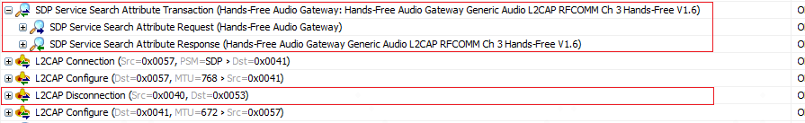
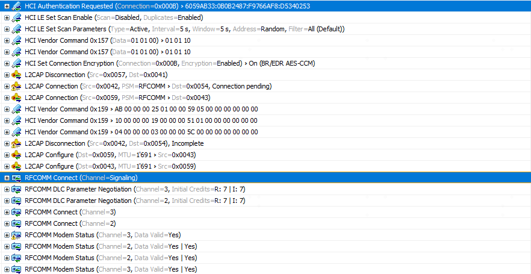
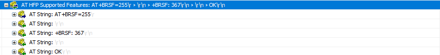

> 本文介绍Bluedroid HFP的相关流程和知识点。

<!--more-->

设备和手机连接之后，设备主动调用协议栈的接口去连接手机HFP。

```c
btif_hf_client_get_interface()->connect();
```

## 协议栈上下文切换

```c
bt_status_t connect(RawAddress* bd_addr) 
{
  CHECK_BTHF_CLIENT_INIT();
  // 把新的连接加到队列，并触发下一次调度进行连接
  return btif_queue_connect(UUID_SERVCLASS_HF_HANDSFREE, bd_addr, connect_int);
}

bt_status_t btif_queue_connect(uint16_t uuid, const RawAddress* bda,
                               btif_connect_cb_t connect_cb) {
  connect_node_t node;
  memset(&node, 0, sizeof(connect_node_t));
  node.bda = *bda;
  node.uuid = uuid;
  node.connect_cb = connect_cb;
  // 转发到btif上下文执行
  return btif_transfer_context(queue_int_handle_evt, BTIF_QUEUE_CONNECT_EVT,
                               (char*)&node, sizeof(connect_node_t), NULL);
}

bt_status_t btif_transfer_context(tBTIF_CBACK* p_cback, uint16_t event,
                                  char* p_params, int param_len,
                                  tBTIF_COPY_CBACK* p_copy_cback) {
  tBTIF_CONTEXT_SWITCH_CBACK* p_msg = (tBTIF_CONTEXT_SWITCH_CBACK*)osi_malloc(
      sizeof(tBTIF_CONTEXT_SWITCH_CBACK) + param_len);

  // 构造消息
  p_msg->hdr.event = BT_EVT_CONTEXT_SWITCH_EVT; /* internal event */
  p_msg->p_cb = p_cback;

  p_msg->event = event; /* callback event */

  /* check if caller has provided a copy callback to do the deep copy */
  if (p_copy_cback) {
    p_copy_cback(event, p_msg->p_param, p_params);
  } else if (p_params) {
    memcpy(p_msg->p_param, p_params, param_len); /* callback parameter data */
  }

  // 发送一个BT_EVT_CONTEXT_SWITCH事件，并且把具体的event和p_cback跟着消息一起发出去
  btif_sendmsg(p_msg);

  return BT_STATUS_SUCCESS;
}

void btif_sendmsg(void* p_msg) {
  do_in_jni_thread(base::Bind(&bt_jni_msg_ready, p_msg));
}

bt_status_t do_in_jni_thread(const base::Closure& task) {
  return do_in_jni_thread(FROM_HERE, task);
}

bt_status_t do_in_jni_thread(const tracked_objects::Location& from_here,
                             const base::Closure& task) {
  if (!message_loop_ || !message_loop_->task_runner().get()) {
    return BT_STATUS_FAIL;
  }

  // post任务到btif message loop，在JNI message loop执行
  if (message_loop_->task_runner()->PostTask(from_here, task))
    return BT_STATUS_SUCCESS;

  return BT_STATUS_FAIL;
}
```

`bt_jni_msg_ready()` 这个作业会在btif上下文执行。

```c
static void bt_jni_msg_ready(void* context) {
  BT_HDR* p_msg = (BT_HDR*)context;

  switch (p_msg->event) {
    case BT_EVT_CONTEXT_SWITCH_EVT:
      // 上下文切换之后，就可以执行了
      btif_context_switched(p_msg);
      break;
    default:
      break;
  }
  osi_free(p_msg);
}

static void btif_context_switched(void* p_msg) {

  tBTIF_CONTEXT_SWITCH_CBACK* p = (tBTIF_CONTEXT_SWITCH_CBACK*)p_msg;

  if (p->p_cb) p->p_cb(p->event, p->p_param);
}
```

因此，BTIF_QUEUE_CONNECT_EVT这个事件，会在btif线程里，由`queue_int_handle_evt()`这个方法来处理。

```c
static void queue_int_handle_evt(uint16_t event, char* p_param) {
  switch (event) {
    case BTIF_QUEUE_CONNECT_EVT:
      // 先放进队列中
      queue_int_add((connect_node_t*)p_param);
      break;

    case BTIF_QUEUE_ADVANCE_EVT:
      queue_int_advance();
      break;

    case BTIF_QUEUE_CLEANUP_EVT:
      queue_int_cleanup((uint16_t*)(p_param));
      return;
  }

  if (stack_manager_get_interface()->get_stack_is_running())
      // 由这个函数处理
      btif_queue_connect_next();
}

bt_status_t btif_queue_connect_next(void) {
  if (!connect_queue || list_is_empty(connect_queue)) return BT_STATUS_FAIL;

  connect_node_t* p_head = (connect_node_t*)list_front(connect_queue);
  
  // 如果队列忙，则先直接返回，继续让connect在后面排队
  if (p_head->busy) return BT_STATUS_SUCCESS;

  p_head->busy = true;
  // 否则调用connect_cb开始连接。
  return p_head->connect_cb(&p_head->bda, p_head->uuid);
}
```

**小结：**

- 给应用层的方法，基本都是会转发到btif上下文来执行。这样有一个好处，就是由多线程调用变成单线程处理，在btif层就可以减少很多并发保护的代码，让系统更加简单可靠。
- 发送方申请xiaoxi内存，接收方释放消息内存。
- 所有的connect也是排队执行的，简化了应用场景。

## 发起HF Client连接

前面我们看到，传进来的连接方法是`connect_int()`，而UUID是UUID_SERVCLASS_HF_HANDSFREE。

现在，在btif_task调用`connect_int()`。

```c
static bt_status_t connect_int(RawAddress* bd_addr, uint16_t uuid) {
  btif_hf_client_cb_t* cb = btif_hf_client_allocate_cb();
  if (cb == NULL) {
    return BT_STATUS_BUSY;
  }

  cb->peer_bda = *bd_addr;
  if (is_connected(cb)) return BT_STATUS_BUSY;

  cb->state = BTHF_CLIENT_CONNECTION_STATE_CONNECTING;
  cb->peer_bda = *bd_addr;

  // 打开HF连接，以获得相关的句柄
  BTA_HfClientOpen(cb->peer_bda, BTIF_HF_CLIENT_SECURITY, &cb->handle);

  return BT_STATUS_SUCCESS;
}
```

> 在btif上下文调用bta的api是正确的。

```c
void BTA_HfClientOpen(const RawAddress& bd_addr, tBTA_SEC sec_mask,
                      uint16_t* p_handle) {
  tBTA_HF_CLIENT_API_OPEN* p_buf =
      (tBTA_HF_CLIENT_API_OPEN*)osi_malloc(sizeof(tBTA_HF_CLIENT_API_OPEN));

  if (!bta_hf_client_allocate_handle(bd_addr, p_handle)) {
    APPL_TRACE_ERROR("%s: could not allocate handle", __func__);
    return;
  }

  p_buf->hdr.event = BTA_HF_CLIENT_API_OPEN_EVT;
  p_buf->hdr.layer_specific = *p_handle;
  p_buf->bd_addr = bd_addr;
  p_buf->sec_mask = sec_mask;
  // 这里直接把BTA_HF_CLIENT_API_OPEN_EVT发消息给到btu_task
  bta_sys_sendmsg(p_buf);
}
```

`BTA_HfClientOpen()`仅仅是调用`bta_sys_sendmsg()`把事件传到了btu_task。可见 btif 真的只是interface而已 。

`bta_sys_sendmsg()`则是post消息到btu的loop，到btu_task执行，处理函数是`bta_sys_event()`，它定义在bta_sys_main.cc中。

```c
void bta_sys_event(BT_HDR* p_msg) {
  uint8_t id;
  bool freebuf = true;

  /* get subsystem id from event */
  id = (uint8_t)(p_msg->event >> 8);

  /* verify id and call subsystem event handler */
  if ((id < BTA_ID_MAX) && (bta_sys_cb.reg[id] != NULL)) {
      // 调用提前注册好的evt_handler处理
      freebuf = (*bta_sys_cb.reg[id]->evt_hdlr)(p_msg);
  } else {
    APPL_TRACE_WARNING("%s: Received unregistered event id %d", __func__, id);
  }

  if (freebuf) {
    osi_free(p_msg);
  }
}
```

我们看消息的定义：

```c
enum {
  /* these events are handled by the state machine */
  BTA_HF_CLIENT_API_OPEN_EVT = BTA_SYS_EVT_START(BTA_ID_HS),
  BTA_HF_CLIENT_API_CLOSE_EVT,
  ...

  /* these events are handled outside of the state machine */
  BTA_HF_CLIENT_API_ENABLE_EVT,
  BTA_HF_CLIENT_API_DISABLE_EVT
};

// 其中，16位消息的高8位就是subsystem 的 id
#define BTA_SYS_EVT_START(id) ((id) << 8)
```

而 HF Client 注册的函数是`bta_hf_client_reg()`：

```c
tBTA_STATUS BTA_HfClientEnable(tBTA_HF_CLIENT_CBACK* p_cback, tBTA_SEC sec_mask,
                               tBTA_HF_CLIENT_FEAT features,
                               const char* p_service_name) {
  return bta_hf_client_api_enable(p_cback, sec_mask, features, p_service_name);
}

tBTA_STATUS bta_hf_client_api_enable(tBTA_HF_CLIENT_CBACK* p_cback,
                                     tBTA_SEC sec_mask,
                                     tBTA_HF_CLIENT_FEAT features,
                                     const char* p_service_name) {
  ...

  /* register with BTA system manager */
  bta_sys_register(BTA_ID_HS, &bta_hf_client_reg);

  ...

  return BTA_SUCCESS;
}

static const tBTA_SYS_REG bta_hf_client_reg = {bta_hf_client_hdl_event,
                                               BTA_HfClientDisable};
```

因此，BTA_HF_CLIENT_API_OPEN_EVT 这个event，会在btu_task中由`bta_hf_client_hdl_event()`处理。

除了 enable 和 disable 之外的事件，都会被传给 bta hf client 状态机处理。

> Bluedroid的状态机是整个蓝牙协议栈的核心驱动力。它的实现比较简单，但却非常有效！

**状态变化：**

- current state: INIT

- event: BTA_HF_CLIENT_API_OPEN_EVT 
- action: bta_hf_client_start_open
- next state: OPENING

```c
void bta_hf_client_start_open(tBTA_HF_CLIENT_DATA* p_data) {
    
  // p_data->hdr.layer_specific 保存的就是hfc的handle
  tBTA_HF_CLIENT_CB* client_cb =
      bta_hf_client_find_cb_by_handle(p_data->hdr.layer_specific);
  if (client_cb == NULL) {
    return;
  }

  // 保存参数
  if (p_data) {
    client_cb->peer_addr = p_data->api_open.bd_addr;
    client_cb->cli_sec_mask = p_data->api_open.sec_mask;
  }

  // 检查当前是否incoming的RFCOMM连接
  RawAddress pending_bd_addr;
  if (PORT_IsOpening(pending_bd_addr)) {
    // 如果有，后续在incoming connection连上之后再决定要怎么做
    bta_hf_client_collision_cback(0, BTA_ID_HS, 0, &client_cb->peer_addr);
    return;
  }

  client_cb->role = BTA_HF_CLIENT_INT;

  // sdp查找ag服务
  bta_hf_client_do_disc(client_cb);
}
```

要连接对端手机的handsfree服务，首先需要查找对端是否有ag的服务。

从设备的hci来看，也可以看到，设备先发起sdp，查找hf_ag的服务。


开始查找之前，我们看下如果连接冲突，是怎么处理的。

```c
void bta_hf_client_collision_cback(UNUSED_ATTR tBTA_SYS_CONN_STATUS status,
                                   uint8_t id, UNUSED_ATTR uint8_t app_id,
                                   const RawAddress* peer_addr) {
  // 根据对端地址查找是否有client_cb
  tBTA_HF_CLIENT_CB* client_cb = bta_hf_client_find_cb_by_bda(*peer_addr);
  if (client_cb != NULL && client_cb->state == BTA_HF_CLIENT_OPENING_ST) {
    // 如果查找到，并且是opening，则变成init state
    client_cb->state = BTA_HF_CLIENT_INIT_ST;

    // 取消sdp
    if (client_cb->p_disc_db) {
      (void)SDP_CancelServiceSearch(client_cb->p_disc_db);
      bta_hf_client_free_db(NULL);
    }

    // 2411ms（默认）之后，如果没有已经打开的连接，重新开始open流程
    alarm_set_on_mloop(client_cb->collision_timer,
                       BTA_HF_CLIENT_COLLISION_TIMER_MS,
                       bta_hf_client_collision_timer_cback, (void*)client_cb);
  }
}
```

可以看到，如果冲突了，则停止之前的连接，延时一会儿之后，我们重新发起连接。（为何是这个机制？不懂）

现在回到sdp查找服务。

```c
void bta_hf_client_do_disc(tBTA_HF_CLIENT_CB* client_cb) {
  ...
  // 作为发起方，get proto list 和 feature
  if (client_cb->role == BTA_HF_CLIENT_INT) {
    attr_list[0] = ATTR_ID_SERVICE_CLASS_ID_LIST;
    attr_list[1] = ATTR_ID_PROTOCOL_DESC_LIST;
    attr_list[2] = ATTR_ID_BT_PROFILE_DESC_LIST;
    attr_list[3] = ATTR_ID_SUPPORTED_FEATURES;
    num_attr = 4;
      
    // 查找AG这个标准服务
    uuid_list[0].uu.uuid16 = UUID_SERVCLASS_AG_HANDSFREE;
  }
  else {
    ...
  }

  // 申请db
  client_cb->p_disc_db = (tSDP_DISCOVERY_DB*)osi_malloc(BT_DEFAULT_BUFFER_SIZE);

  // 设置服务发现db
  uuid_list[0].len = LEN_UUID_16;
  uuid_list[1].len = LEN_UUID_16;
  db_inited = SDP_InitDiscoveryDb(client_cb->p_disc_db, BT_DEFAULT_BUFFER_SIZE,
                                  num_uuid, uuid_list, num_attr, attr_list);

  if (db_inited) {
    // 服务发现请求
    db_inited = SDP_ServiceSearchAttributeRequest2(
        client_cb->peer_addr, client_cb->p_disc_db, bta_hf_client_sdp_cback,
        (void*)client_cb);
  }
  ...
}
```

1. 准备db
2. 发起服务发现请求

sdp是基于l2cap标准通道做的，因此它需要先建立l2cap连接。

```c
bool SDP_ServiceSearchAttributeRequest2(const RawAddress& p_bd_addr,
                                        tSDP_DISCOVERY_DB* p_db,
                                        tSDP_DISC_CMPL_CB2* p_cb2,
                                        void* user_data) {
  tCONN_CB* p_ccb;

  // 指定对端地址，发起sdp连接
  p_ccb = sdp_conn_originate(p_bd_addr);

  if (!p_ccb) return (false);

  p_ccb->disc_state = SDP_DISC_WAIT_CONN;
  p_ccb->p_db = p_db;
  p_ccb->p_cb2 = p_cb2;

  p_ccb->is_attr_search = true;
  p_ccb->user_data = user_data;

  return (true);
}
```

```c
tCONN_CB* sdp_conn_originate(const RawAddress& p_bd_addr) {
  tCONN_CB* p_ccb;
  uint16_t cid;

  // 申请sdp的ccb
  p_ccb = sdpu_allocate_ccb();

  SDP_TRACE_EVENT("SDP - Originate started");

  p_ccb->con_flags |= SDP_FLAGS_IS_ORIG;
  p_ccb->device_address = p_bd_addr;
  p_ccb->con_state = SDP_STATE_CONN_SETUP;
  // 发起LECAP连接请求，通道是SDP_PSM，PSM是复用通道
  cid = L2CA_ConnectReq(SDP_PSM, p_bd_addr);

  if (cid != 0) {
    // 保存cid
    p_ccb->connection_id = cid;
    return (p_ccb);
  } else {
    sdpu_release_ccb(p_ccb);
    return (NULL);
  }
}
```

**小结：**

- hf client是基于状态机运行的，几乎所有profile都是
- hf client连接前，需要先sdp查找对端ag服务
- sdp是基于l2cap的，因此要先建立l2cap连接

## L2CAP连接

两个设备想要发起SDP交互，首先需要建立L2CAP连接“

```c
uint16_t L2CA_ConnectReq(uint16_t psm, const RawAddress& p_bd_addr) {
  return L2CA_ErtmConnectReq(psm, p_bd_addr, NULL);
}
```

这个函数里面的第一个参数是 psm（*Protocol/ServiceMultiplexer*），这里简单介绍一下psm的概念：

- psm是通道服用，它用来指定再L2CAP上通信的更高层面的协议类型
- 相同的高层级的多个实例，可能使用不同的L2CAP通道，但它们可能使用相同的PSM的值

比如，rfcomm的多个通道可能使用相同的psm，但每个通道的cid可能是不同的。

这些是系统注册的psm，也叫做内置psm。

```c
#define BT_PSM_SDP 0x0001
#define BT_PSM_RFCOMM 0x0003
#define BT_PSM_TCS 0x0005
#define BT_PSM_CTP 0x0007
#define BT_PSM_BNEP 0x000F
#define BT_PSM_HIDC 0x0011
#define BT_PSM_HIDI 0x0013
#define BT_PSM_UPNP 0x0015
#define BT_PSM_AVCTP 0x0017
#define BT_PSM_AVDTP 0x0019
#define BT_PSM_AVCTP_13 0x001B /* Advanced Control - Browsing */
#define BT_PSM_UDI_CP \
  0x001D /* Unrestricted Digital Information Profile C-Plane  */
#define BT_PSM_ATT 0x001F /* Attribute Protocol  */
```

```c
uint16_t L2CA_ErtmConnectReq(uint16_t psm, const RawAddress& p_bd_addr,
                             tL2CAP_ERTM_INFO* p_ertm_info) {
  ...

  // 检查蓝牙是否打开
  if (!BTM_IsDeviceUp()) {
    return (0);
  }
    
  // 检查是否是提前注册好的psm
  p_rcb = l2cu_find_rcb_by_psm(psm);
  if (p_rcb == NULL) {
    return (0);
  }

  // 检查是否有link
  p_lcb = l2cu_find_lcb_by_bd_addr(p_bd_addr, BT_TRANSPORT_BR_EDR);
  if (p_lcb == NULL) {
    // 如果没有，则分配lcb并建立链路连接
    p_lcb = l2cu_allocate_lcb(p_bd_addr, false, BT_TRANSPORT_BR_EDR);
    if ((p_lcb == NULL) ||
        (l2cu_create_conn(p_lcb, BT_TRANSPORT_BR_EDR) == false)) {
      return (0);
    }
  }

  // 分配l2cap的ccb
  p_ccb = l2cu_allocate_ccb(p_lcb, 0);
  if (p_ccb == NULL) {
    return (0);
  }

  // 保存信息
  p_ccb->p_rcb = p_rcb;
  if (p_ertm_info) {
    ...
  }

  // 如果link是好的，则启动channel（对应cid）的连接
  if (p_lcb->link_state == LST_CONNECTED) {
    l2c_csm_execute(p_ccb, L2CEVT_L2CA_CONNECT_REQ, NULL);
  }
  ..
  
  // 返回local cid
  return (p_ccb->local_cid);
}
```

1. 检查蓝牙是否打开
2. 检查是否有link
3. 检查psm是否是提前注册好的
4. 申请ccb
5. 连接channel

最终走到`l2c_csm_execute`，交给l2cap的状态机处理。

接着，发起方和响应方会检查security的要求，如果不满足则可能还需要发起配对。

security满足要求之后，正式进行l2cap的通道连接，并对通道进行配置，最后才能开启数据传输。

/

L2CAPd的状态机这里暂不分析，最后会在CST_CONFIG状态下收到L2CEVT_L2CAP_CONFIG_RSP事件，从而状态机转到CST_OPEN状态。

```c
static void l2c_csm_config(tL2C_CCB* p_ccb, uint16_t event, void* p_data) {
  ...
  switch (event) {
    ...
    case L2CEVT_L2CAP_CONFIG_RSP:
      l2cu_process_peer_cfg_rsp(p_ccb, p_cfg);

      if (p_cfg->result != L2CAP_CFG_PENDING) {
        ...

        if (p_ccb->config_done & IB_CFG_DONE) {

	      ...
          // 变为CST_OPEN状态
          p_ccb->chnl_state = CST_OPEN;
          ...
        }
      }
      // 回调pL2CA_ConfigCfm_Cb
      (*p_ccb->p_rcb->api.pL2CA_ConfigCfm_Cb)(p_ccb->local_cid, p_cfg);
      break;
    ...
  }
}
```

这里的`pL2CA_ConfigCfm_Cb`是`sdp_init`时注册的reg_info，回调函数是`sdp_config_cfm()`。

```c
void sdp_init(void) {
  ...
  sdp_cb.reg_info.pL2CA_ConnectInd_Cb = sdp_connect_ind;
  sdp_cb.reg_info.pL2CA_ConnectCfm_Cb = sdp_connect_cfm;
  sdp_cb.reg_info.pL2CA_ConnectPnd_Cb = NULL;
  sdp_cb.reg_info.pL2CA_ConfigInd_Cb = sdp_config_ind;
  sdp_cb.reg_info.pL2CA_ConfigCfm_Cb = sdp_config_cfm;
  sdp_cb.reg_info.pL2CA_DisconnectInd_Cb = sdp_disconnect_ind;
  sdp_cb.reg_info.pL2CA_DisconnectCfm_Cb = sdp_disconnect_cfm;
  sdp_cb.reg_info.pL2CA_QoSViolationInd_Cb = NULL;
  sdp_cb.reg_info.pL2CA_DataInd_Cb = sdp_data_ind;
  sdp_cb.reg_info.pL2CA_CongestionStatus_Cb = NULL;
  sdp_cb.reg_info.pL2CA_TxComplete_Cb = NULL;

  /* Now, register with L2CAP */
  if (!L2CA_Register(SDP_PSM, &sdp_cb.reg_info)) {
    SDP_TRACE_ERROR("SDP Registration failed");
  }
}
```

```c
static void sdp_config_cfm(uint16_t l2cap_cid, tL2CAP_CFG_INFO* p_cfg) {
  ...
  if (p_cfg->result == L2CAP_CFG_OK) {
    p_ccb->con_flags |= SDP_FLAGS_MY_CFG_DONE;

    if (p_ccb->con_flags & SDP_FLAGS_HIS_CFG_DONE) {
      p_ccb->con_state = SDP_STATE_CONNECTED;

      if (p_ccb->con_flags & SDP_FLAGS_IS_ORIG) {
        // 作为sdp的发起方，这里才是正式启动sdp
        sdp_disc_connected(p_ccb);
      } else {
        /* Start inactivity timer */
        alarm_set_on_mloop(p_ccb->sdp_conn_timer, SDP_INACT_TIMEOUT_MS,
                           sdp_conn_timer_timeout, p_ccb);
      }
    }
  } else {
    ...
  }
}
```

## SDP服务发现

```c
void sdp_disc_connected(tCONN_CB* p_ccb) {
  if (p_ccb->is_attr_search) {
    p_ccb->disc_state = SDP_DISC_WAIT_SEARCH_ATTR;
    // 我们现在获取的是hfp的服务，走到这里
    process_service_search_attr_rsp(p_ccb, NULL, NULL);
  } else {
    // 第一步是获取server的服务句柄，然后才是获取属性
    p_ccb->num_handles = 0;
    sdp_snd_service_search_req(p_ccb, 0, NULL);
  }
}
```

```c
static void process_service_search_attr_rsp(tCONN_CB* p_ccb, uint8_t* p_reply,
                                            uint8_t* p_reply_end) {
  uint8_t *p, *p_start, *p_end, *p_param_len;
  uint8_t type;
  uint32_t seq_len;
  uint16_t param_len, lists_byte_count = 0;
  bool cont_request_needed = false;

  ...
  if ((cont_request_needed) || (!p_reply)) {
    BT_HDR* p_msg = (BT_HDR*)osi_malloc(SDP_DATA_BUF_SIZE);
    uint8_t* p;

    p_msg->offset = L2CAP_MIN_OFFSET;
    p = p_start = (uint8_t*)(p_msg + 1) + L2CAP_MIN_OFFSET;

    // 构造搜索服务attr的请求包
    UINT8_TO_BE_STREAM(p, SDP_PDU_SERVICE_SEARCH_ATTR_REQ);
    UINT16_TO_BE_STREAM(p, p_ccb->transaction_id);
    p_ccb->transaction_id++;

    /* Skip the length, we need to add it at the end */
    p_param_len = p;
    p += 2;

/* Build the UID sequence. */
#if (SDP_BROWSE_PLUS == TRUE)
    p = sdpu_build_uuid_seq(p, 1,
                            &p_ccb->p_db->uuid_filters[p_ccb->cur_uuid_idx]);
#else
    p = sdpu_build_uuid_seq(p, p_ccb->p_db->num_uuid_filters,
                            p_ccb->p_db->uuid_filters);
#endif

    /* Max attribute byte count */
    UINT16_TO_BE_STREAM(p, sdp_cb.max_attr_list_size);

    /* If no attribute filters, build a wildcard attribute sequence */
    if (p_ccb->p_db->num_attr_filters)
      p = sdpu_build_attrib_seq(p, p_ccb->p_db->attr_filters,
                                p_ccb->p_db->num_attr_filters);
    else
      p = sdpu_build_attrib_seq(p, NULL, 0);

    /* No continuation for first request */
    if (p_reply) {
      if ((p_reply + *p_reply + 1) <= p_reply_end) {
        memcpy(p, p_reply, *p_reply + 1);
        p += *p_reply + 1;
      } else {
        android_errorWriteLog(0x534e4554, "68161546");
      }
    } else
      UINT8_TO_BE_STREAM(p, 0);

    /* Go back and put the parameter length into the buffer */
    param_len = p - p_param_len - 2;
    UINT16_TO_BE_STREAM(p_param_len, param_len);

    /* Set the length of the SDP data in the buffer */
    p_msg->len = p - p_start;
    
      // 通过L2CAP发出去
    L2CA_DataWrite(p_ccb->connection_id, p_msg);

    /* Start inactivity timer */
    alarm_set_on_mloop(p_ccb->sdp_conn_timer, SDP_INACT_TIMEOUT_MS,
                       sdp_conn_timer_timeout, p_ccb);

    return;
  }
```

这里构造了真正的搜索服务请求包，然后把请求包通过L2CAP发送了出去。

而接着手机回复了我们搜索服务的应答包。

我们接收对端发过来的sdp的应答，l2cap是通过`sdp_data_ind()`回调传过来的。

```c
static void sdp_data_ind(uint16_t l2cap_cid, BT_HDR* p_msg) {
  tCONN_CB* p_ccb;

  /* Find CCB based on CID */
  p_ccb = sdpu_find_ccb_by_cid(l2cap_cid);
  if (p_ccb != NULL) {
    if (p_ccb->con_state == SDP_STATE_CONNECTED) {
      if (p_ccb->con_flags & SDP_FLAGS_IS_ORIG)
        // 作为发起方，处理server的response
        sdp_disc_server_rsp(p_ccb, p_msg);
      else
        sdp_server_handle_client_req(p_ccb, p_msg);
    } else {
	  ...
    }
  } else {
    ...
  }

  osi_free(p_msg);
}
```

```c
void sdp_disc_server_rsp(tCONN_CB* p_ccb, BT_HDR* p_msg) {
  uint8_t *p, rsp_pdu;
  bool invalid_pdu = true;

  ...
  switch (rsp_pdu) {
    ...
    case SDP_PDU_SERVICE_SEARCH_ATTR_RSP:
      if (p_ccb->disc_state == SDP_DISC_WAIT_SEARCH_ATTR) {
        // 处理应答
        process_service_search_attr_rsp(p_ccb, p, p_end);
        invalid_pdu = false;
      }
      break;
  }

  if (invalid_pdu) {
    sdp_disconnect(p_ccb, SDP_GENERIC_ERROR);
  }
}
```

`process_service_search_attr_rsp`这个函数我们在前面看到一次了，但前面是作为发起的时候，现在是收到应答：

```c
static void process_service_search_attr_rsp(tCONN_CB* p_ccb, uint8_t* p_reply,
                                            uint8_t* p_reply_end) {
  ...
  // 现在是收到应答了
  if (p_reply) {
    // 做长度合法性校验
    if (p_reply + 4 /* transaction ID and length */ + sizeof(lists_byte_count) >
        p_reply_end) {
      android_errorWriteLog(0x534e4554, "79884292");
      sdp_disconnect(p_ccb, SDP_INVALID_PDU_SIZE);
      return;
    }

    /* Skip transaction ID and length */
    p_reply += 4;

    BE_STREAM_TO_UINT16(lists_byte_count, p_reply);

    // 把结果拷贝到ccb中
    if ((p_ccb->list_len + lists_byte_count) > SDP_MAX_LIST_BYTE_COUNT) {
      sdp_disconnect(p_ccb, SDP_INVALID_PDU_SIZE);
      return;
    }

    if (p_reply + lists_byte_count + 1 /* continuation */ > p_reply_end) {
      android_errorWriteLog(0x534e4554, "79884292");
      sdp_disconnect(p_ccb, SDP_INVALID_PDU_SIZE);
      return;
    }

    if (p_ccb->rsp_list == NULL)
      p_ccb->rsp_list = (uint8_t*)osi_malloc(SDP_MAX_LIST_BYTE_COUNT);
    memcpy(&p_ccb->rsp_list[p_ccb->list_len], p_reply, lists_byte_count);
    p_ccb->list_len += lists_byte_count;
    p_reply += lists_byte_count;

    if (*p_reply) {
      if (*p_reply > SDP_MAX_CONTINUATION_LEN) {
        sdp_disconnect(p_ccb, SDP_INVALID_CONT_STATE);
        return;
      }

      cont_request_needed = true;
    }
  }

  // 判断是否需要继续做request，如果是，继续请求
  ... 
    
  p = &p_ccb->rsp_list[0];

  //
  type = *p++;

  if ((type >> 3) != DATA_ELE_SEQ_DESC_TYPE) {
    return;
  }
  p = sdpu_get_len_from_type(p, p + p_ccb->list_len, type, &seq_len);
  if (p == NULL || (p + seq_len) > (p + p_ccb->list_len)) {
    sdp_disconnect(p_ccb, SDP_ILLEGAL_PARAMETER);
    return;
  }
  p_end = &p_ccb->rsp_list[p_ccb->list_len];

  if ((p + seq_len) != p_end) {
    sdp_disconnect(p_ccb, SDP_INVALID_CONT_STATE);
    return;
  }

  while (p < p_end) {
    p = save_attr_seq(p_ccb, p, &p_ccb->rsp_list[p_ccb->list_len]);
    if (!p) {
      sdp_disconnect(p_ccb, SDP_DB_FULL);
      return;
    }
  }

  sdp_disconnect(p_ccb, SDP_SUCCESS);
}
```

1. 提取attr信息
2. 判断是否需要连续请求，如果需要则继续请求
3. 连续保存attr属性
4. 如果全部信息都拿到并保存好，则断开sdp连接




## RFCOMM连接

HFP是基于RFCOMM的，找到对端的AG服务后，就要开始进行RFCOMM的连接了。

```c
void sdp_disconnect(tCONN_CB* p_ccb, uint16_t reason) {
  ...
  // 检查是否有connection id
  if (p_ccb->connection_id != 0) {
    // 断开l2cap连接
    L2CA_DisconnectReq(p_ccb->connection_id);
    p_ccb->disconnect_reason = reason;
  }

  if (p_ccb->con_state == SDP_STATE_CONN_SETUP) {
    // 回调给应用
    if (p_ccb->p_cb)
      (*p_ccb->p_cb)(reason);
    else if (p_ccb->p_cb2)
      (*p_ccb->p_cb2)(reason, p_ccb->user_data);

    sdpu_release_ccb(p_ccb);
  }
}
```

在`sdp_disconnect`的时候，会回调告诉用户（这里的sdp的user是指的hfp）。这个cb是在`bta_hf_client_do_disc()`的时候传入的`bta_hf_client_sdp_cback()`：

```c
void bta_hf_client_do_disc(tBTA_HF_CLIENT_CB* client_cb) {
  ...
  if (db_inited) {
    /*Service discovery not initiated */
    db_inited = SDP_ServiceSearchAttributeRequest2(
        client_cb->peer_addr, client_cb->p_disc_db, bta_hf_client_sdp_cback,
        (void*)client_cb);
  }
  ...
}
```

在回调中，转发消息到btu_task进行处理，处理函数为`bta_hf_client_hdl_event`。而这个事件，会传到hf_client的状态机。

```c
static void bta_hf_client_sdp_cback(uint16_t status, void* data) {
  uint16_t event;
  tBTA_HF_CLIENT_DISC_RESULT* p_buf = (tBTA_HF_CLIENT_DISC_RESULT*)osi_malloc(
      sizeof(tBTA_HF_CLIENT_DISC_RESULT));

  tBTA_HF_CLIENT_CB* client_cb = (tBTA_HF_CLIENT_CB*)data;

  /* set event according to int/acp */
  if (client_cb->role == BTA_HF_CLIENT_ACP)
    event = BTA_HF_CLIENT_DISC_ACP_RES_EVT;
  else
    event = BTA_HF_CLIENT_DISC_INT_RES_EVT;

  p_buf->hdr.event = event;
  p_buf->hdr.layer_specific = client_cb->handle;
  p_buf->status = status;

  bta_sys_sendmsg(p_buf);  // 转发消息
}
```

**状态机驱动：**

- current state:OPENING

- event: BTA_HF_CLIENT_DISC_INT_RES_EVT 
- action: bta_hf_client_disc_int_res
- next state: OPENING

```c
void bta_hf_client_disc_int_res(tBTA_HF_CLIENT_DATA* p_data) {
  uint16_t event = BTA_HF_CLIENT_DISC_FAIL_EVT;

  ...
  // 如果找到了服务
  if (p_data->disc_result.status == SDP_SUCCESS ||
      p_data->disc_result.status == SDP_DB_FULL) {
    // 查找并保存对端的sttr
    if (bta_hf_client_sdp_find_attr(client_cb)) {
      event = BTA_HF_CLIENT_DISC_OK_EVT;
    }
  }

  /* free discovery db */
  bta_hf_client_free_db(p_data);

  // 继续驱动状态机
  bta_hf_client_sm_execute(event, p_data);
}
```

`bta_hf_client_sdp_find_attr`这个函数里面是从之前sdp保存在`bta_hf_client_cb.scb.p_disc_db`里面的结果，提取出来，保存在`bta_hf_client_cb`这个全局结构体中。

**状态机驱动：**

- current state:OPENING

- event: BTA_HF_CLIENT_DISC_OK_EVT 
- action: bta_hf_client_rfc_do_open
- next state: OPENING

```c
void bta_hf_client_rfc_do_open(tBTA_HF_CLIENT_DATA* p_data) {
  tBTA_HF_CLIENT_CB* client_cb =
      bta_hf_client_find_cb_by_handle(p_data->hdr.layer_specific);
  ...
  // 设置加密要求
  BTM_SetSecurityLevel(true, "", BTM_SEC_SERVICE_HF_HANDSFREE,
                       client_cb->cli_sec_mask, BT_PSM_RFCOMM,
                       BTM_SEC_PROTO_RFCOMM, client_cb->peer_scn);
  // 开启rfcomm连接
  if (RFCOMM_CreateConnection(UUID_SERVCLASS_HF_HANDSFREE, client_cb->peer_scn,
                              false, BTA_HF_CLIENT_MTU, client_cb->peer_addr,
                              &(client_cb->conn_handle),
                              bta_hf_client_mgmt_cback) == PORT_SUCCESS) {
    bta_hf_client_setup_port(client_cb->conn_handle);
  }
  ...
}

void bta_hf_client_setup_port(uint16_t handle) {
  PORT_SetEventMask(handle, PORT_EV_RXCHAR);
  // 这个bta_hf_client_port_cback后面rfcomm有事件变化会用到它
  PORT_SetEventCallback(handle, bta_hf_client_port_cback);
}
```

到这里，正式开启RFCOMM的连接，然后把这个port绑定给hf_client。

从HCI可以看到，发现服务之后，就开始对通道进行认证加密，然后进行RFCOMM（channel3）的连接。



`RFCOMM_CreateConnection`这个函数最后的一个参数是`bta_hf_client_mgmt_cback`，RFCOMM连接成功后，会回调该函数。

```c
static void bta_hf_client_mgmt_cback(uint32_t code, uint16_t port_handle) {
  ...
  if (code == PORT_SUCCESS) {
    if (client_cb && port_handle == client_cb->conn_handle) { /* out conn */
      // 把该事件转给了状态机
      p_buf->hdr.event = BTA_HF_CLIENT_RFC_OPEN_EVT;
    }
    ...
  }
  ...

  p_buf->hdr.layer_specific = client_cb != NULL ? client_cb->handle : 0;
  bta_sys_sendmsg(p_buf);
}
```

**状态机驱动：**

- current state:OPENING
- event: BTA_HF_CLIENT_RFC_OPEN_EVT 
- action: bta_hf_client_rfc_open
- next state: OPEN

```c
void bta_hf_client_rfc_open(tBTA_HF_CLIENT_DATA* p_data) {

  tBTA_HF_CLIENT_CB* client_cb =
      bta_hf_client_find_cb_by_handle(p_data->hdr.layer_specific);
  // 回调给应用
  bta_sys_conn_open(BTA_ID_HS, 1, client_cb->peer_addr);

  // 开启建立SLC的流程
  bta_hf_client_slc_seq(client_cb, false);
}
```

RFCOMM打开成功之后，把该事件回调给bta，然后开启HFP SCL的建立流程。

```c
void bta_sys_conn_open(uint8_t id, uint8_t app_id,
                       const RawAddress& peer_addr) {
  if (bta_sys_cb.prm_cb) {
    bta_sys_cb.prm_cb(BTA_SYS_CONN_OPEN, id, app_id, &peer_addr);
  }

  if (bta_sys_cb.ppm_cb) {
    bta_sys_cb.ppm_cb(BTA_SYS_CONN_OPEN, id, app_id, &peer_addr);
  }
}
```

另外值得指出的是，这一次，状态机从OPENING状态转变成了OPEN状态，而在hf client的状态机中，状态进入OPEN，会回调给app：

```c
/* If the state has changed then notify the app of the corresponding change */
  if (in_state != client_cb->state) {
    
    tBTA_HF_CLIENT evt;
    memset(&evt, 0, sizeof(evt));
    evt.bd_addr = client_cb->peer_addr;
    if (client_cb->state == BTA_HF_CLIENT_INIT_ST) {
      bta_hf_client_app_callback(BTA_HF_CLIENT_CLOSE_EVT, &evt);
    } else if (client_cb->state == BTA_HF_CLIENT_OPEN_ST) {
      evt.open.handle = client_cb->handle;
      // 进入OPEN状态会回调给应用
      bta_hf_client_app_callback(BTA_HF_CLIENT_OPEN_EVT, &evt);
    }
  }
```

而BTA_HF_CLIENT_OPEN_EVT这个事件，会被抛到btif层，然后再回调给应用：

```c
static void btif_hf_client_upstreams_evt(uint16_t event, char* p_param) {
  tBTA_HF_CLIENT* p_data = (tBTA_HF_CLIENT*)p_param;

  btif_hf_client_cb_t* cb = btif_hf_client_get_cb_by_bda(p_data->bd_addr);
  if (cb == NULL && event == BTA_HF_CLIENT_OPEN_EVT) {
    cb = btif_hf_client_allocate_cb();
    cb->handle = p_data->open.handle;
    cb->peer_bda = p_data->open.bd_addr;
  } 
  ...

  switch (event) {
    case BTA_HF_CLIENT_OPEN_EVT:
      if (p_data->open.status == BTA_HF_CLIENT_SUCCESS) {
        cb->state = BTHF_CLIENT_CONNECTION_STATE_CONNECTED;
        cb->peer_feat = 0;
        cb->chld_feat = 0;
      }
      ...

      // 回调给app
      HAL_CBACK(bt_hf_client_callbacks, connection_state_cb, &cb->peer_bda,
                cb->state, 0, /* peer feat */
                0 /* AT+CHLD feat */);

      if (cb->state == BTHF_CLIENT_CONNECTION_STATE_DISCONNECTED)
        cb->peer_bda = RawAddress::kAny;

      if (p_data->open.status != BTA_HF_CLIENT_SUCCESS) btif_queue_advance();
      break;

  }
}
```

可以看到，再RFCOMM建立连接后，第一次通过 `connection_state_cb` 回调给应用，接着开启SLC流程。

## AT命令

接下来就是韩兆Hands-Free Profile进行AT命令的交互了。

```c
void bta_hf_client_slc_seq(tBTA_HF_CLIENT_CB* client_cb, bool error) {
  ...
  switch (client_cb->at_cb.current_cmd) {
    case BTA_HF_CLIENT_AT_NONE:
      // 第一条AT命令
      bta_hf_client_send_at_brsf(client_cb, bta_hf_client_cb_arr.features);
      break;
    ...
  }
}

void bta_hf_client_send_at_brsf(tBTA_HF_CLIENT_CB* client_cb,
                                tBTA_HF_CLIENT_FEAT features) {
  char buf[BTA_HF_CLIENT_AT_MAX_LEN];
  int at_len;

  // 构造AT+BRSF 命令
  at_len = snprintf(buf, sizeof(buf), "AT+BRSF=%u\r", features);

  // 发送AT命令
  bta_hf_client_send_at(client_cb, BTA_HF_CLIENT_AT_BRSF, buf, at_len);
}

static void bta_hf_client_send_at(tBTA_HF_CLIENT_CB* client_cb,
                                  tBTA_HF_CLIENT_AT_CMD cmd, const char* buf,
                                  uint16_t buf_len) {

  if ((client_cb->at_cb.current_cmd == BTA_HF_CLIENT_AT_NONE ||
       client_cb->svc_conn == false) &&
      !alarm_is_scheduled(client_cb->at_cb.hold_timer)) {
    uint16_t len;

    client_cb->at_cb.current_cmd = cmd;
    
    if (!service_availability &&
        (cmd == BTA_HF_CLIENT_AT_CNUM || cmd == BTA_HF_CLIENT_AT_COPS)) {
      APPL_TRACE_WARNING("%s: No service, skipping %d command", __func__, cmd);
      bta_hf_client_handle_ok(client_cb);
      return;
    }

    // 通过RFCOMM把数据发送出去
    PORT_WriteData(client_cb->conn_handle, buf, buf_len, &len);

    // 启动应答定时器
    bta_hf_client_start_at_resp_timer(client_cb);

    return;
  }

  bta_hf_client_queue_at(client_cb, cmd, buf, buf_len);
}
```

前面提到，`bta_hf_client_setup_port`把`bta_hf_client_port_cback`回调注册给rfcomm，rfcomm在该端口收到数据时，会回调该函数。



而`bta_hf_client_port_cback`有直接交给了状态机：

```c
static void bta_hf_client_port_cback(UNUSED_ATTR uint32_t code,
                                     uint16_t port_handle) {
  ...
  tBTA_HF_CLIENT_RFC* p_buf =
      (tBTA_HF_CLIENT_RFC*)osi_malloc(sizeof(tBTA_HF_CLIENT_RFC));
  p_buf->hdr.event = BTA_HF_CLIENT_RFC_DATA_EVT;
  p_buf->hdr.layer_specific = client_cb->handle;
  bta_sys_sendmsg(p_buf);
}
```

**状态机驱动：**

- current state:OPEN
- event: BTA_HF_CLIENT_RFC_DATA_EVT 
- action: bta_hf_client_rfc_data
- next state: OPEN

```c
void bta_hf_client_rfc_data(tBTA_HF_CLIENT_DATA* p_data) {
  ...
  // 循环读取数据
  while (PORT_ReadData(client_cb->conn_handle, buf, BTA_HF_CLIENT_RFC_READ_MAX,
                       &len) == PORT_SUCCESS) {
    /* if no data, we're done */
    if (len == 0) {
      break;
    }
    // 解析AT指令
    bta_hf_client_at_parse(client_cb, buf, len);

    /* no more data to read, we're done */
    if (len < BTA_HF_CLIENT_RFC_READ_MAX) {
      break;
    }
  }
}
```

更多AT交互的细节，参考profile协议文档。

**总结：**

1. 协议栈的实现中，基本没有看到锁的存在，这得益于它良好的分层设计，不同层级之间通过发消息和回调的方式进行交互，把跨层的交互集中到一起单线程处理
2. 协议栈的实现依赖于它清晰可靠的状态机，状态机简化了我们的正常流程和异常处理
3. 需要一个可靠的alarm超时机制，处理无线传输中的各种超时/失效异常