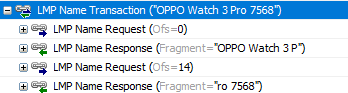
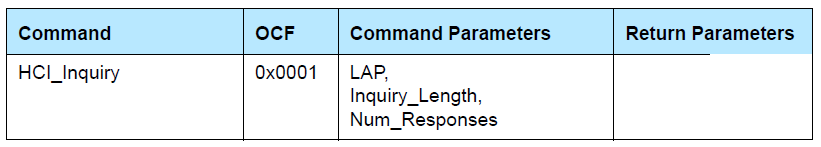
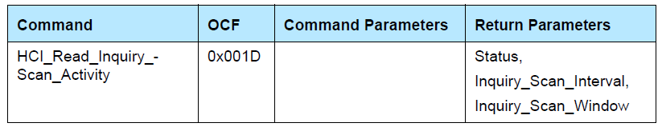
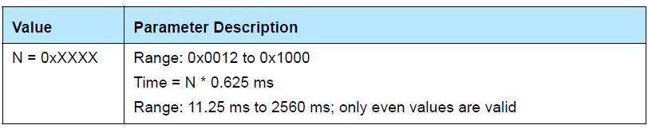
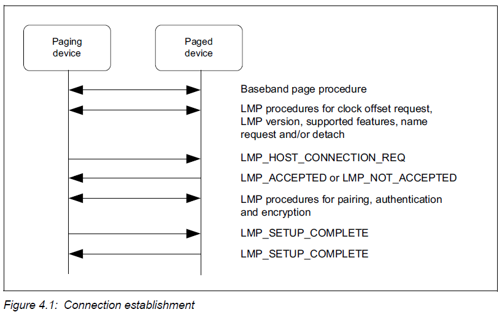
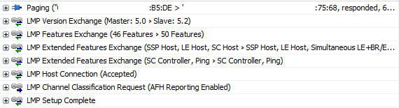
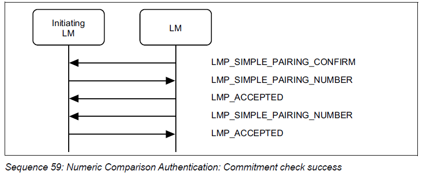
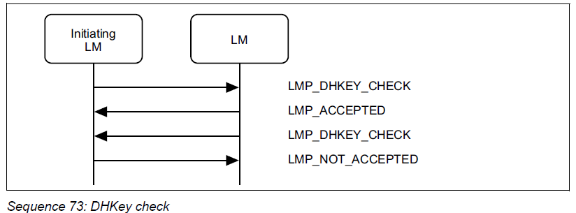
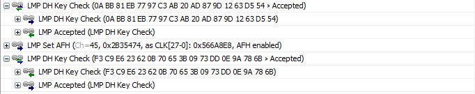
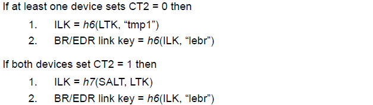

> 本文介绍Bluedroid 在BR/EDR上连接配对与在LE上连接配对的差异。

<!--more-->

## 基本概念

### Representation of Bluetooth Parameters

#### 蓝牙设备地址

BD_ADDR，分为Public地址和Random地址，在设备发现的过程中，从对端设备接收到的设备地址。

#### 设备名字

用户友好的设备名称，在LMP_NAME_RES中返回。

#### 蓝牙PIN

在配对过程中，用来认证两个设备的一串数字。

#### 设备类型（Class of Device）

在设备发现过程中传输的参数。CoD的定义见Assigned Numbers。

#### Apprearance Characteristic

一个16-bit的数字，可以映射成一个icon或string，描述设备的物理外观。Appearance的定义见Assigned NumbersMode

### Modes

#### 发现模式

- Non-discoverable mode
- Discoverable mode

可发现模式又分为Limited discoverable mode和General discoverable mode。

Limited discoverable mode：只能在一段时间内被发现。

General discoverable mode：可以一直被发现。

如果对端使用了Limited inquiry的话，是发现不了General discoverable mode的设备的。

#### 连接模式

- Non-connectable mode

不会进PAGE_SCAN

- Connectable mode

会周期地进入PAGE_SCAN

### Inquiry and Page

#### Inquiry

让蓝牙芯片进入发现周围蓝牙设备地模式。

它的返回值是周围蓝牙设备的信号。

Inquiry_Length表示inquiry的事件：

- Range: 0x01 ~ 0x30
- Time: N * 1.28s
- Range: 1.28s ~ 61.44s

#### Inquiry scan

蓝牙设备开启inquiry scan 模式，才能够被别的蓝牙设备搜索到。

Inquiry_Scan_Interval：

- T = N * 0.625 ms
- Range: 11.25ms ~ 2560ms

Inquiry_Scan_Window：

- T = N * 0.625 ms
- Range: 10.625ms ~ 2560ms

#### Page

发起连接的蓝牙设备向被连接的蓝牙设备发起连接请求或认证，请求即是一次page动作。

超时时间：0.625ms ~ 40.9s

#### Page scan

蓝牙设备开启page scan模式，才能够响应其他蓝牙设备的连接请求。例如蓝牙耳机只有处于page scan才允许其他设备来连接。

Page Scan Interval (寻呼扫描间隔)

Page Scan Window（寻呼扫描窗口）

## 配对流程

### 连接建立

对应air log：

1. 主机Page设备，设备Page scan响应之后，两个设备开始LMP连接
2. 连接前交换版本号，支持的feature等信息
3. 最终LMP Setup Complete，数据可以在BR/EDR的ACL逻辑链路上传输

### Secure Simple Pairing

#### IO能力交换

第一步，交换IO能力，选择配对方式。

> 这里请求io能力交换的时候，涉及和host的交互，因为配对方式和io能力是由host控制的，对应slave侧的HCI：

#### 交换public key

第二步，交换公钥。

#### 认证阶段1

第三步，根据IO能力决定要使用何种配对方式，并确认Pin Code。

可以是：numeric comparation，passkey entry，OOB。

这里选择数字比较方式：

**典型流程：**

**空口：**

> 这一步涉及用户确认PIN Code，因此会把comfirm code传给host，并由上层显示 PIN Code，让用户确认。

#### 认证阶段2

DHKey check，完成身份认证，并启动对链路的加密。

**典型流程：**

**空口：**

DHKey Check完成后，controller向host上报ssp完成事件，然后上报link key，再启动对链路的加密。

对应slave侧的HCI：

## Cross-Transport Key Derivation

蓝牙CTKD是蓝牙4.2版本后引入的一种交叉传输密钥派生的安全机制。主要用在蓝牙双模设备上，它可以跨越BLE和BT的边界，通过将BLE配对生成的LTK转化成BT配对的Link Key。当然，也可以通过BT配对生成的Link Key转化成BLE的LTK来实现。目前我们主要用的是前者，

通过CTKD可以通过一次配对将BT和BLE两个链路都配对上，从而提升蓝牙双模设备的配对体验。

LTK生成Link Key的方法：

更多内容参考 CoreSpec v5.3, Vol 3, Part H, Section 2.4.2.4等章节。

> 目前发现如果使能从BT到BLE的crosskey，也就是在第一次在BR/EDR上配对，通过Link Key生成BLE的LTK，会出现问题。
>
> 具体问题是，手机在第一次连接时，把设备的public address (type 0)加到白名单；而断链重连后，则把设备的public address当做random address (type 1)加入白名单。-> 即手机会把设备的地址类型搞错。这种情况将导致设备的BLE连接失败。
>
> 一般建议：BT和BLE不使用同一个public address（如果同时存在的话）。如果同时存在，建议BLE使用static random地址。