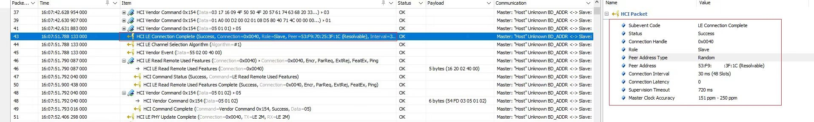
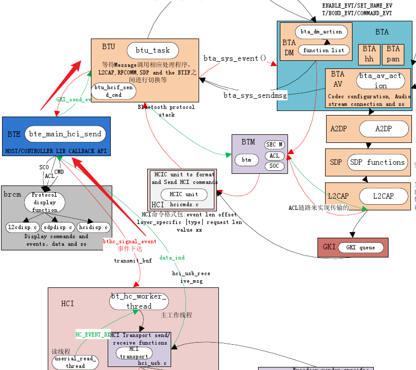
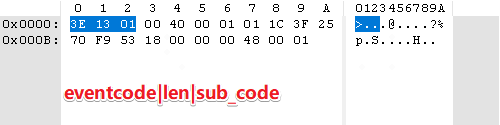
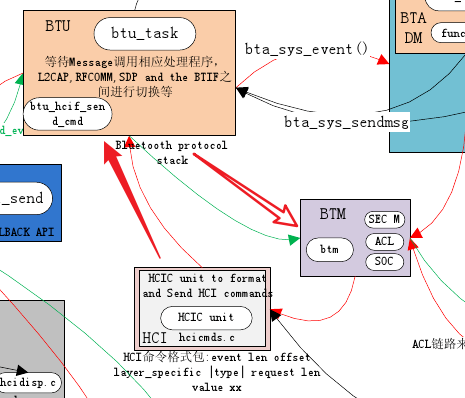
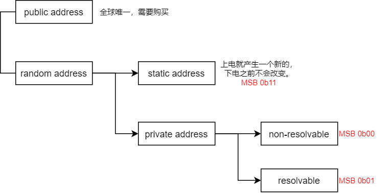
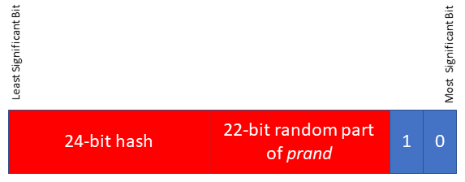
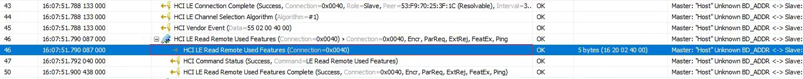
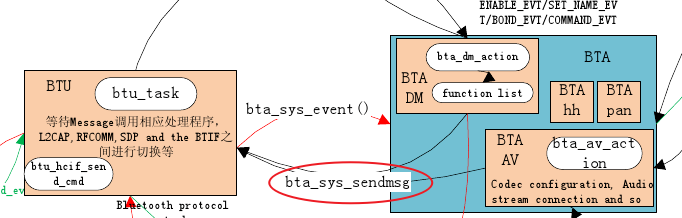

> 本文从hci, l2cap，到 btm 和 bta，最后到 btif，分析了连接过程发生的状态变化。需要指出的是，本文对连接的具体细节并没有过多描述，仅仅起到了穿针引线的导读的作用，目的是对协议栈的层次结构和代码机制有一个基础的了解。具体连接的细节，还需要结合spec和代码，针对问题来做更进一步的深入分析。

<!--more-->

### 协议栈接收和处理HCI Event

手机来连接设备BLE，设备蓝牙controller向host发了一个HCI LE Connection  Complete 的 event，对端地址为：53:F9:xx:xx:3F:1C，是 Resolvable 的随机地址。



HCI的数据，是在哪里执行的呢？引用[1] 中的一张图，可以看到HCI Event是在btu_task执行的。

btu承载了BTA和HCI，btm负责蓝牙配对和链路管理，它们都属于核心stack逻辑。



那btu_task又是如何处理HCI事件的呢？

我们看下btu_task的启动流程。

```c
void BTU_StartUp(void) {
  
  ...
  // 创建线程，之后会与多个任务队列绑定
  bt_workqueue_thread = thread_new(BT_WORKQUEUE_NAME);
  if (bt_workqueue_thread == NULL) goto error_exit;

  thread_set_rt_priority(bt_workqueue_thread, BTU_TASK_RT_PRIORITY);

  // 在bt_workqueue_thread中继续startup
  thread_post(bt_workqueue_thread, btu_task_start_up, NULL);
  return;
  ...
}
```

创建线程后，在`btu_task_start_up()`中继续enable：

```c
void btu_task_start_up(UNUSED_ATTR void* context) {
  LOG(INFO) << "Bluetooth chip preload is complete";

  btu_init_core();

  BTE_InitStack();

  bta_sys_init();

  module_init(get_module(BTE_LOGMSG_MODULE));

  message_loop_thread_ = thread_new("btu message loop");
  if (!message_loop_thread_) {
    LOG(FATAL) << __func__ << " unable to create btu message loop thread.";
  }
  // 创建message looper
  thread_set_rt_priority(message_loop_thread_, THREAD_RT_PRIORITY);
  thread_post(message_loop_thread_, btu_message_loop_run, nullptr);

}
```

`btu_task_start_up`中主要是：

1. 初始化必须的核心协议栈控制块，BTU，BTM，L2CAP，和 SDP
2. 初始化一些各类的协议栈组件，如RFCOMM，A2DP等
3. bta初始化（bta是蓝牙应用层，是相对于stack来说的，它承载了各profile的逻辑实现和处理）
4. 最主要的是，创建了一个btu的message looper

```c
void bte_main_boot_entry(void) {
  module_init(get_module(INTEROP_MODULE));

  hci = hci_layer_get_interface();
  if (!hci) {
    LOG_ERROR(LOG_TAG, "%s could not get hci layer interface.", __func__);
    return;
  }

  // 设置hci数据回调
  hci->set_data_cb(base::Bind(&post_to_hci_message_loop));

  module_init(get_module(STACK_CONFIG_MODULE));
}

void post_to_hci_message_loop(const tracked_objects::Location& from_here,
                              BT_HDR* p_msg) {
  base::MessageLoop* hci_message_loop = get_message_loop();
  // post到btu处理
  hci_message_loop->task_runner()->PostTask(
      from_here, base::Bind(&btu_hci_msg_process, p_msg));
}

```

中可以看到，bte_main_boot_entry中，给hci注册了data_cb，收到数据就post到btu_task进行处理。

所以hci数据的处理函数为`btu_hci_msg_process()`。

```c
void btu_hci_msg_process(BT_HDR* p_msg) {
  /* Determine the input message type. */
  switch (p_msg->event & BT_EVT_MASK) {
    case BT_EVT_TO_BTU_HCI_ACL:
      /* All Acl Data goes to L2CAP */
      l2c_rcv_acl_data(p_msg);
      break;

    case BT_EVT_TO_BTU_L2C_SEG_XMIT:
      /* L2CAP segment transmit complete */
      l2c_link_segments_xmitted(p_msg);
      break;

    case BT_EVT_TO_BTU_HCI_SCO:
#if (BTM_SCO_INCLUDED == TRUE)
      btm_route_sco_data(p_msg);
      break;
#endif

    case BT_EVT_TO_BTU_HCI_EVT:
      // 处理 hci event
      btu_hcif_process_event((uint8_t)(p_msg->event & BT_SUB_EVT_MASK), p_msg);
      osi_free(p_msg);
      break;

    case BT_EVT_TO_BTU_HCI_CMD:
      // 发送 hci command
      btu_hcif_send_cmd((uint8_t)(p_msg->event & BT_SUB_EVT_MASK), p_msg);
      break;

    default:
      osi_free(p_msg);
      break;
  }
}
```

`btu_hci_msg_process()` 中判断消息类型，是l2cap，l2cap发送，sco，hci event，还是 hci command。

最终再根据 event code 判断对各类事件进行处理：

```c
void btu_hcif_process_event(UNUSED_ATTR uint8_t controller_id, BT_HDR* p_msg) {
  uint8_t* p = (uint8_t*)(p_msg + 1) + p_msg->offset;
  uint8_t hci_evt_code, hci_evt_len;
  uint8_t ble_sub_code;
  STREAM_TO_UINT8(hci_evt_code, p);
  STREAM_TO_UINT8(hci_evt_len, p);

  switch (hci_evt_code) {
    case HCI_INQUIRY_COMP_EVT:
      btu_hcif_inquiry_comp_evt(p);
      break;
    ...

    case HCI_BLE_EVENT: {
      STREAM_TO_UINT8(ble_sub_code, p);

      uint8_t ble_evt_len = hci_evt_len - 1;
      switch (ble_sub_code) {
        ...
        case HCI_BLE_CONN_COMPLETE_EVT:
          btu_ble_ll_conn_complete_evt(p, hci_evt_len);
          break;
        ...
  }
}
```



> 关于HCI的LE Meta event的定义，参考Core spec 5.3的Vol 4, Part E，7.7.65小节

可以看到，HCI_BLE_CONN_COMPLETE_EVENT这个event的处理函数是：`btu_ble_ll_conn_complete_evt()` 

前面提到，BTU是承接BTA和HCI的，而蓝牙连接和配对是由BTM负责的。

所以，BTU直接调用了BTM的方法进行处理。

```c
static void btu_ble_ll_conn_complete_evt(uint8_t* p, uint16_t evt_len) {
  btm_ble_conn_complete(p, evt_len, false);
}
```



**小结：**

通过本小节，我们简单了bluedroid的btu，bta，btm和hci的关系。我们知道，hci命令和事件，是在btu_task进行处理的。btu_task承载bta和hci，不做核心的控制逻辑，而将链接和配对的主要工作交给btm来完成。

### BLE地址类型介绍及协议栈的处理



一共四种地址类型：

- **public address**
- random address
  - **static address**
  - private address
    - **non-resolvable address**
    - **resolvable address**

其中，要产生resolvable private address（也叫rpa），需要设备有**Identity Resolving Key（IRK）**。


$$
hash = ah(IRK, prand)
$$

```c
void btm_ble_conn_complete(uint8_t* p, UNUSED_ATTR uint16_t evt_len,
                           bool enhanced) 
{
  ...
  // 字段解析，这里面得到了connection handle，以及bda等关键信息
  STREAM_TO_UINT8(status, p);
  STREAM_TO_UINT16(handle, p);
  STREAM_TO_UINT8(role, p);
  STREAM_TO_UINT8(bda_type, p);
  STREAM_TO_BDADDR(bda, p);

  if (status == 0) {
    if (enhanced) {
      STREAM_TO_BDADDR(local_rpa, p);
      STREAM_TO_BDADDR(peer_rpa, p);
    }

    // 字段解析，得到连接相关控制信息
    STREAM_TO_UINT16(conn_interval, p);
    STREAM_TO_UINT16(conn_latency, p);
    STREAM_TO_UINT16(conn_timeout, p);
    handle = HCID_GET_HANDLE(handle);

#if (BLE_PRIVACY_SPT == TRUE)
    peer_addr_type = bda_type;
    // 把identity address 映射成一个伪随机地址，我们现在就是rpa，所以不需要做什么
    match = btm_identity_addr_to_random_pseudo(&bda, &bda_type, true);

    // 如果这个设备是已经配对过了的
    if (!match && BTM_BLE_IS_RESOLVE_BDA(bda)) {
      // 看配对记录里面是否有match record
      tBTM_SEC_DEV_REC* match_rec = btm_ble_resolve_random_addr(bda);
      if (match_rec) {
        LOG_INFO(LOG_TAG, "%s matched and resolved random address", __func__);
        match = true;
        match_rec->ble.active_addr_type = BTM_BLE_ADDR_RRA;
        match_rec->ble.cur_rand_addr = bda;
        // 如果有记录，则把最开始的rpa更新到bda上报上去
        if (!btm_ble_init_pseudo_addr(match_rec, bda)) {
          /* assign the original address to be the current report address */
          bda = match_rec->ble.pseudo_addr;
        } else {
          // 否则，用现在的rpa
          bda = match_rec->bd_addr;
        }
      } else {
        LOG_INFO(LOG_TAG, "%s unable to match and resolve random address",
                 __func__);
        // 我们现在还没有配对过，因此走到这里
      }
    }
#endif

    // 最后调用 btm_ble_connected，让btm处理 ble 连接事件
    btm_ble_connected(bda, handle, HCI_ENCRYPT_MODE_DISABLED, role, bda_type,
                      match);

    // l2c 处理 ble连接事件
    l2cble_conn_comp(handle, role, bda, bda_type, conn_interval, conn_latency,
                     conn_timeout);

    ...
  } else {
    ...
  }

  btm_ble_update_mode_operation(role, &bda, status);
}
```

`btm_ble_conn_complete()`中，对ble的连接地址做了一些处理，如果是rpa，则对rpa地址进行解析。

这里面有个细节：

> 对端的rpa地址是会定时刷新的。第一次连接的时候，我们还没有设备记录，那么就把当前的bda上报上去。
>
> 如果后续对端的rpa地址刷新了，也是会把第一次的rpa地址上报上去。

另外，不妨看下rpa是怎么解析的：

```c
tBTM_SEC_DEV_REC* btm_ble_resolve_random_addr(const RawAddress& random_bda) {

  list_node_t* n = list_foreach(btm_cb.sec_dev_rec, btm_ble_match_random_bda,
                                (void*)&random_bda);
  tBTM_SEC_DEV_REC* p_dev_rec = nullptr;
  if (n != nullptr) p_dev_rec = static_cast<tBTM_SEC_DEV_REC*>(list_node(n));

  return p_dev_rec;
}

static bool btm_ble_match_random_bda(void* data, void* context) {
  RawAddress* random_bda = (RawAddress*)context;
  
  /* bda的MSB 3字节是rand */
  uint8_t rand[3];
  rand[0] = random_bda->address[2];
  rand[1] = random_bda->address[1];
  rand[2] = random_bda->address[0];

  tSMP_ENC output;
  tBTM_SEC_DEV_REC* p_dev_rec = static_cast<tBTM_SEC_DEV_REC*>(data);

  if (!(p_dev_rec->device_type & BT_DEVICE_TYPE_BLE) ||
      !(p_dev_rec->ble.key_type & BTM_LE_KEY_PID))
    return true;

  /* generate X = E irk(R0, R1, R2) and R is random address 3 LSO */
  // 用IRK和rand，得到hash保存在output中
  SMP_Encrypt(p_dev_rec->ble.keys.irk, BT_OCTET16_LEN, &rand[0], 3, &output);
  
  // if it was match, finish iteration, otherwise continue
  // 比较地址里的hash和计算的hash，如果一致，就是成功
  return !btm_ble_proc_resolve_x(output, *random_bda);
}
```

可以看到，rpa的解析与前面介绍的rpa的定义是一致的。我们是首次连接，所以没有匹配记录。

**小结：**

本小节介绍了BLE地址类型及一些相关知识点，我们看到RPA地址是如何解析的，以及RPA上报的时候即使刷新也会把最开始的RPA上报上去。

两个设备连接，stack中需要保存一些相关设备记录的信息。其中，BTM是管理连接和配对的，L2CAP是管理数据链路通道的，因此它们需要对连接做一些数据记录和管理的工作。

在`btm_ble_conn_complete()`最后，会调用`btm_ble_connected()` 和 `l2cble_conn_comp()`进行下一步的处理。

### BTM创建设备记录及L2CAP连接管理

```c
void btm_ble_connected(const RawAddress& bda, uint16_t handle, uint8_t enc_mode,
                       uint8_t role, tBLE_ADDR_TYPE addr_type,
                       UNUSED_ATTR bool addr_matched) {
  // 从secure connection records中查找设备，新的连接，找不到
  tBTM_SEC_DEV_REC* p_dev_rec = btm_find_dev(bda);
  tBTM_BLE_CB* p_cb = &btm_cb.ble_ctr_cb;

  ...
  if (!p_dev_rec) {
    // 分配一个新的rec
    p_dev_rec = btm_sec_alloc_dev(bda);
    if (p_dev_rec == NULL) return;
  } else /* Update the timestamp for this device */
  {
    p_dev_rec->timestamp = btm_cb.dev_rec_count++;
  }

  /* update device information */
  p_dev_rec->device_type |= BT_DEVICE_TYPE_BLE;
  p_dev_rec->ble_hci_handle = handle;  // 这个handle就是hci event报上来的handle
  p_dev_rec->ble.ble_addr_type = addr_type;  // rpa类型
  /* update pseudo address */
  p_dev_rec->ble.pseudo_addr = bda;  // rpa地址

  p_dev_rec->role_master = false;  // 我们是被动连接，所以不是master
  if (role == HCI_ROLE_MASTER) p_dev_rec->role_master = true;

#if (BLE_PRIVACY_SPT == TRUE)
  if (!addr_matched) p_dev_rec->ble.active_addr_type = BTM_BLE_ADDR_PSEUDO;

  if (p_dev_rec->ble.ble_addr_type == BLE_ADDR_RANDOM && !addr_matched)
    p_dev_rec->ble.cur_rand_addr = bda;
#endif

  p_cb->inq_var.directed_conn = BTM_BLE_CONNECT_EVT;

  return;
}
```

1. btm收到 BLE connected事件后，为这个新的连接分配一个record
2. 设置connection handle，地址类型，地址等信息，现在这些都是传上来的rpa

```c
tBTM_SEC_DEV_REC* btm_sec_alloc_dev(const RawAddress& bd_addr) {
  tBTM_INQ_INFO* p_inq_info;
  BTM_TRACE_EVENT("btm_sec_alloc_dev");

  // 分配一个新的record
  tBTM_SEC_DEV_REC* p_dev_rec = btm_sec_allocate_dev_rec();

  // 检查inquiry db中是否有outgoing connection，我们是被动连接，所以是没有的
  p_inq_info = BTM_InqDbRead(bd_addr);
  if (p_inq_info != NULL) {
    memcpy(p_dev_rec->dev_class, p_inq_info->results.dev_class, DEV_CLASS_LEN);
	// 如果有，那就用之前的信息，因为db里面的是先存在的
    p_dev_rec->device_type = p_inq_info->results.device_type;
    p_dev_rec->ble.ble_addr_type = p_inq_info->results.ble_addr_type;
  } else if (bd_addr == btm_cb.connecting_bda)
    memcpy(p_dev_rec->dev_class, btm_cb.connecting_dc, DEV_CLASS_LEN);

  // 使用默认连接参数
  memset(&p_dev_rec->conn_params, 0xff, sizeof(tBTM_LE_CONN_PRAMS));

  p_dev_rec->bd_addr = bd_addr;

  // 从btm_cb中获取acl handle（这里还没看到什么时候赋值的）
  p_dev_rec->ble_hci_handle = BTM_GetHCIConnHandle(bd_addr, BT_TRANSPORT_LE);
  p_dev_rec->hci_handle = BTM_GetHCIConnHandle(bd_addr, BT_TRANSPORT_BR_EDR);

  return (p_dev_rec);
}
```

`btm_sec_allocate_dev_rec()` 是申请一个新的dev_record，并添加到 btm_cb.sec_dev_rec 这个链表中。其规则是：

- 如果超过了最大的sec rec数量，则找到最老的设备删除
- 优先删除没有paired的设备

这样，btm中就记录了一条secure device record了。

接着分析`l2cble_conn_comp()`这个函数。

```c
void l2cble_conn_comp(uint16_t handle, uint8_t role, const RawAddress& bda,
                      tBLE_ADDR_TYPE type, uint16_t conn_interval,
                      uint16_t conn_latency, uint16_t conn_timeout) {
  btm_ble_update_link_topology_mask(role, true);

  if (role == HCI_ROLE_MASTER) {
    l2cble_scanner_conn_comp(handle, bda, type, conn_interval, conn_latency,
                             conn_timeout);
  } else {
    // 作为slave，走到这里
    l2cble_advertiser_conn_comp(handle, bda, type, conn_interval, conn_latency,
                                conn_timeout);
  }
}
```

```c
void l2cble_advertiser_conn_comp(uint16_t handle, const RawAddress& bda,
                                 UNUSED_ATTR tBLE_ADDR_TYPE type,
                                 UNUSED_ATTR uint16_t conn_interval,
                                 UNUSED_ATTR uint16_t conn_latency,
                                 UNUSED_ATTR uint16_t conn_timeout) {
  tL2C_LCB* p_lcb;
  tBTM_SEC_DEV_REC* p_dev_rec;

  // 查找是否已经存在lcb，新设备找不到
  p_lcb = l2cu_find_lcb_by_bd_addr(bda, BT_TRANSPORT_LE);

  // 如果没有则新建一个lcb
  if (!p_lcb) {
    p_lcb = l2cu_allocate_lcb(bda, false, BT_TRANSPORT_LE);
    if (!p_lcb) {
      btm_sec_disconnect(handle, HCI_ERR_NO_CONNECTION);
      return;
    } else {
      // 初始化固定的ccb（ATT）
      if (!l2cu_initialize_fixed_ccb(
              p_lcb, L2CAP_ATT_CID,
              &l2cb.fixed_reg[L2CAP_ATT_CID - L2CAP_FIRST_FIXED_CHNL]
                   .fixed_chnl_opts)) {
        btm_sec_disconnect(handle, HCI_ERR_NO_CONNECTION);
        return;
      }
    }
  }

  // lcb也保存handle
  p_lcb->handle = handle;

  // 保存role和transport
  p_lcb->link_role = HCI_ROLE_SLAVE;
  p_lcb->transport = BT_TRANSPORT_LE;

  // 保存连接参数
  p_lcb->min_interval = p_lcb->max_interval = conn_interval;
  p_lcb->timeout = conn_timeout;
  p_lcb->latency = conn_latency;
  p_lcb->conn_update_mask = L2C_BLE_NOT_DEFAULT_PARAM;

  // 告诉btm，acl已经建立好了
  p_dev_rec = btm_find_or_alloc_dev(bda);

  // btm继续做acl连接相关的工作
  btm_acl_created(bda, NULL, p_dev_rec->sec_bd_name, handle, p_lcb->link_role,
                  BT_TRANSPORT_LE);

#if (BLE_PRIVACY_SPT == TRUE)
  btm_ble_disable_resolving_list(BTM_BLE_RL_ADV, true);
#endif

  p_lcb->peer_chnl_mask[0] = L2CAP_FIXED_CHNL_ATT_BIT |
                             L2CAP_FIXED_CHNL_BLE_SIG_BIT |
                             L2CAP_FIXED_CHNL_SMP_BIT;

  if (!HCI_LE_SLAVE_INIT_FEAT_EXC_SUPPORTED(
          controller_get_interface()->get_features_ble()->as_array)) {
    p_lcb->link_state = LST_CONNECTED;
    l2cu_process_fixed_chnl_resp(p_lcb);
  }

  /* when adv and initiating are both active, cancel the direct connection */
  if (l2cb.is_ble_connecting && bda == l2cb.ble_connecting_bda) {
    L2CA_CancelBleConnectReq(bda);
  }
}
```

1. 创建一个l2cap的cb
2. 初始化状态，保存handle和连接参数等信息
3. 告诉btm，acl建立好了。btm继续做acl连接相关工作

现在，又回到btm继续进行处理。

```c
void btm_acl_created(const RawAddress& bda, DEV_CLASS dc, BD_NAME bdn,
                     uint16_t hci_handle, uint8_t link_role,
                     tBT_TRANSPORT transport) {
  tBTM_SEC_DEV_REC* p_dev_rec = NULL;
  tACL_CONN* p;
  uint8_t xx;


  // 确保我们没有重复的连接
  p = btm_bda_to_acl(bda, transport);
  if (p != (tACL_CONN*)NULL) {
    p->hci_handle = hci_handle;
    p->link_role = link_role;
    p->transport = transport;
    VLOG(1) << "Duplicate btm_acl_created: RemBdAddr: " << bda;
    BTM_SetLinkPolicy(p->remote_addr, &btm_cb.btm_def_link_policy);
    return;
  }

  // 在btm_cb分配一个acl_db
  for (xx = 0, p = &btm_cb.acl_db[0]; xx < MAX_L2CAP_LINKS; xx++, p++) {
    if (!p->in_use) {
      p->in_use = true;
      p->hci_handle = hci_handle;
      p->link_role = link_role;
      p->link_up_issued = false;
      p->remote_addr = bda;

      p->transport = transport;
#if (BLE_PRIVACY_SPT == TRUE)
      if (transport == BT_TRANSPORT_LE)
        // 刷新acl_db中的conn_addr
        btm_ble_refresh_local_resolvable_private_addr(
            bda, btm_cb.ble_ctr_cb.addr_mgnt_cb.private_addr);
#else
      p->conn_addr_type = BLE_ADDR_PUBLIC;
      p->conn_addr = *controller_get_interface()->get_address();

#endif
      p->switch_role_failed_attempts = 0;
      p->switch_role_state = BTM_ACL_SWKEY_STATE_IDLE;

      btm_pm_sm_alloc(xx);

      if (dc) memcpy(p->remote_dc, dc, DEV_CLASS_LEN);

      if (bdn) memcpy(p->remote_name, bdn, BTM_MAX_REM_BD_NAME_LEN);

      // 如果是BR/EDR，需要读取更多的信息，如时钟偏移，版本
      if (transport == BT_TRANSPORT_BR_EDR) {
        btsnd_hcic_read_rmt_clk_offset(p->hci_handle);
        btsnd_hcic_rmt_ver_req(p->hci_handle);
      }
      p_dev_rec = btm_find_dev_by_handle(hci_handle);


      if (p_dev_rec && !(transport == BT_TRANSPORT_LE)) {
        // 如果知道对端的信息，保存下来，然后继续连接
        if ((p_dev_rec->num_read_pages) &&
            (p_dev_rec->num_read_pages <= (HCI_EXT_FEATURES_PAGE_MAX + 1))) {
          memcpy(p->peer_lmp_feature_pages, p_dev_rec->feature_pages,
                 (HCI_FEATURE_BYTES_PER_PAGE * p_dev_rec->num_read_pages));
          p->num_read_pages = p_dev_rec->num_read_pages;

          const uint8_t req_pend = (p_dev_rec->sm4 & BTM_SM4_REQ_PEND);

          // 保存security capabilities
          btm_sec_set_peer_sec_caps(p, p_dev_rec);

          BTM_TRACE_API("%s: pend:%d", __func__, req_pend);
          if (req_pend) {
            /* Request for remaining Security Features (if any) */
            l2cu_resubmit_pending_sec_req(&p_dev_rec->bd_addr);
          }
          btm_establish_continue(p);
          return;
        }
      }

      // 如果还不知道，则请求对端的feature
      if (p_dev_rec && transport == BT_TRANSPORT_LE) {
#if (BLE_PRIVACY_SPT == TRUE)
        // 保存对端的地址到btm_cb.acl_db记录中
        btm_ble_get_acl_remote_addr(p_dev_rec, p->active_remote_addr,
                                    &p->active_remote_addr_type);
#endif

        if (HCI_LE_SLAVE_INIT_FEAT_EXC_SUPPORTED(
                controller_get_interface()->get_features_ble()->as_array) ||
            link_role == HCI_ROLE_MASTER) {
          // 请求对端feature
          btsnd_hcic_ble_read_remote_feat(p->hci_handle);
        } else {
          btm_establish_continue(p);
        }
      } else {
        btm_read_remote_features(p->hci_handle);
      }

      return;
    }
  }
}
```

1. 在btm_cb的acl_db中分配一个节点
2. 更新一些信息，btm_cb的acl节点和l2cb的lcb，通过handle关联起来
3. btm触发读取remote feature，获取更完整的连接参数和安全特性参数

**小结：**

btm保存了一个acl_db的池子，管理acl连接。l2cb中也有lcb_pool。它们之间通过acl_handle关联了起来。

### ACL状态上报到BTA和应用层

回到hci log，可以看到，手机来连接设备时，设备发的第一个hci command，就是HCI LE Read Remote Used Features。



接着，手机应答了该命令，然后hci event上来，抛到btu_task进行处理。

```c
void btu_hcif_process_event(UNUSED_ATTR uint8_t controller_id, BT_HDR* p_msg) {
  uint8_t* p = (uint8_t*)(p_msg + 1) + p_msg->offset;
  uint8_t hci_evt_code, hci_evt_len;
  uint8_t ble_sub_code;
  STREAM_TO_UINT8(hci_evt_code, p);
  STREAM_TO_UINT8(hci_evt_len, p);

  switch (hci_evt_code) {
	...
    case HCI_READ_RMT_FEATURES_COMP_EVT:
      btu_hcif_read_rmt_features_comp_evt(p);
      break;
    ...
  }
}

static void btu_hcif_read_rmt_features_comp_evt(uint8_t* p) {
  btm_read_remote_features_complete(p);
}
```

```c
void btm_read_remote_features_complete(uint8_t* p) {
  tACL_CONN* p_acl_cb;
  uint8_t status;
  uint16_t handle;
  uint8_t acl_idx;

  STREAM_TO_UINT8(status, p);

  STREAM_TO_UINT16(handle, p);

  // 根据handle得到acl idx
  acl_idx = btm_handle_to_acl_index(handle);

  p_acl_cb = &btm_cb.acl_db[acl_idx];

  // 保存remote features
  STREAM_TO_ARRAY(p_acl_cb->peer_lmp_feature_pages[0], p,
                  HCI_FEATURE_BYTES_PER_PAGE);

  // 如果支持extended features，则去读extended features
  if ((HCI_LMP_EXTENDED_SUPPORTED(p_acl_cb->peer_lmp_feature_pages[0])) &&
      (controller_get_interface()
           ->supports_reading_remote_extended_features())) {
    btm_read_remote_ext_features(handle, 1);
    return;
  }

  // btm 针对 feature 进行一些处理
  btm_process_remote_ext_features(p_acl_cb, 1);

  // 继续hci connection的建立过程
  btm_establish_continue(p_acl_cb);
}
```

1. 根据handle查找得到acl idx
2. 保存remote features
3. 如果支持extended fetures，则去读extended features
4. btm针对feature做一些处理
5. 继续hci connection的建立过程

处理remote的features，主要是一些secure相关的特性：

```c
void btm_process_remote_ext_features(tACL_CONN* p_acl_cb,
                                     uint8_t num_read_pages) {
  uint16_t handle = p_acl_cb->hci_handle;
  tBTM_SEC_DEV_REC* p_dev_rec = btm_find_dev_by_handle(handle);
  uint8_t page_idx;

  if (p_dev_rec == NULL) {
    p_dev_rec = btm_find_or_alloc_dev(p_acl_cb->remote_addr);
  }

  p_acl_cb->num_read_pages = num_read_pages;
  p_dev_rec->num_read_pages = num_read_pages;

  for (page_idx = 0; page_idx < num_read_pages; page_idx++) {
    if (page_idx > HCI_EXT_FEATURES_PAGE_MAX) {
      BTM_TRACE_ERROR("%s: page=%d unexpected", __func__, page_idx);
      break;
    }
    // 保存到btm的p_dev_rec中
    memcpy(p_dev_rec->feature_pages[page_idx],
           p_acl_cb->peer_lmp_feature_pages[page_idx],
           HCI_FEATURE_BYTES_PER_PAGE);
  }

  const uint8_t req_pend = (p_dev_rec->sm4 & BTM_SM4_REQ_PEND);

  // 保存对端设备的secure capabilites (in SM4 and rmt_sec_caps)
  btm_sec_set_peer_sec_caps(p_acl_cb, p_dev_rec);

  BTM_TRACE_API("%s: pend:%d", __func__, req_pend);
  if (req_pend) {
    // 如果还有其他的secure features，则继续请求
    l2cu_resubmit_pending_sec_req(&p_dev_rec->bd_addr);
  }
}
```

接着是`btm_establish_continue()`：

```c
void btm_establish_continue(tACL_CONN* p_acl_cb) {
  tBTM_BL_EVENT_DATA evt_data;

  p_acl_cb->link_up_issued = true;

  // 给关心Busy Level状态改变的人上报状态
  if (btm_cb.p_bl_changed_cb) {
    evt_data.event = BTM_BL_CONN_EVT;
    evt_data.conn.p_bda = &p_acl_cb->remote_addr;
    evt_data.conn.p_bdn = p_acl_cb->remote_name;
    evt_data.conn.p_dc = p_acl_cb->remote_dc;
    evt_data.conn.p_features = p_acl_cb->peer_lmp_feature_pages[0];
    evt_data.conn.handle = p_acl_cb->hci_handle;
    evt_data.conn.transport = p_acl_cb->transport;

    // 上报BTM_BL_CONN_EVT事件
    (*btm_cb.p_bl_changed_cb)(&evt_data);
  }
  // 上报busy level的ACL_UP事件
  btm_acl_update_busy_level(BTM_BLI_ACL_UP_EVT);
}
```

`btm_establish_continue()` 会给关心连接事件变化的人回调。我们知道。btu是承接bta和hci的，btm的上层就是bta。接下来可以看到，这个事件就是回调给bta进行处理了。

`btm_cb.p_bl_changed_cb`是在蓝牙初始化的时候注册的：

```c
void bta_dm_enable(tBTA_DM_MSG* p_data) {
  tBTA_DM_ENABLE enable_event;
  ...
  // 注册 SYS HW MANAGER的回调，蓝牙开的时候就会回调
  bta_sys_hw_register(BTA_SYS_HW_BLUETOOTH, bta_dm_sys_hw_cback);
  ...
}

static void bta_dm_sys_hw_cback(tBTA_SYS_HW_EVT status) {
  
  ...
  if (status == BTA_SYS_HW_OFF_EVT) {
    ...
  } else if (status == BTA_SYS_HW_ON_EVT) {
    ...
    BTM_SecRegister((tBTM_APPL_INFO*)&bta_security);
    BTM_SetDefaultLinkSuperTout(p_bta_dm_cfg->link_timeout);
    BTM_WritePageTimeout(p_bta_dm_cfg->page_timeout);
    bta_dm_cb.cur_policy = p_bta_dm_cfg->policy_settings;
    BTM_SetDefaultLinkPolicy(bta_dm_cb.cur_policy);
    // 这里注册了busy level的notify callback
    BTM_RegBusyLevelNotif(bta_dm_bl_change_cback, NULL,
                          BTM_BL_UPDATE_MASK | BTM_BL_ROLE_CHG_MASK);
    ...
}
    
tBTM_STATUS BTM_RegBusyLevelNotif(tBTM_BL_CHANGE_CB* p_cb, uint8_t* p_level,
                                  tBTM_BL_EVENT_MASK evt_mask) {
  if (p_level) *p_level = btm_cb.busy_level;

  btm_cb.bl_evt_mask = evt_mask;

  if (!p_cb)
    btm_cb.p_bl_changed_cb = NULL;
  else if (btm_cb.p_bl_changed_cb)
    return (BTM_BUSY);
  else
    btm_cb.p_bl_changed_cb = p_cb;  // 这里bta的cb就注册到btm来了

  return (BTM_SUCCESS);
}
```

因此，BTM_BL_CONN_EVT将在`bta_dm_bl_change_cback()` 中进行处理。

```c
static void bta_dm_bl_change_cback(tBTM_BL_EVENT_DATA* p_data) {
  tBTA_DM_ACL_CHANGE* p_msg =
      (tBTA_DM_ACL_CHANGE*)osi_malloc(sizeof(tBTA_DM_ACL_CHANGE));

  p_msg->event = p_data->event;
  p_msg->is_new = false;

  switch (p_msg->event) {
    // 连接事件
    case BTM_BL_CONN_EVT:
      p_msg->is_new = true;
      p_msg->bd_addr = *p_data->conn.p_bda;
      p_msg->transport = p_data->conn.transport;
      p_msg->handle = p_data->conn.handle;
      break;
    ...
  }
  // 转到bta进行处理
  p_msg->hdr.event = BTA_DM_ACL_CHANGE_EVT;
  bta_sys_sendmsg(p_msg);
}
```



通过 action 数组找到BTA_DM_ACL_CHANGE_EVT对应的处理函数为`bta_dm_acl_change`：

```c
const tBTA_DM_ACTION bta_dm_action[] = {
    ...
    bta_dm_acl_change,     /* 8  BTA_DM_ACL_CHANGE_EVT */
    ...
};

void bta_dm_acl_change(tBTA_DM_MSG* p_data) {
  ...
  // 如果是新的连接
  if (is_new) {
    // 这里新连接找不到
    for (i = 0; i < bta_dm_cb.device_list.count; i++) {
      if (bta_dm_cb.device_list.peer_device[i].peer_bdaddr == p_bda &&
          bta_dm_cb.device_list.peer_device[i].conn_handle ==
              p_data->acl_change.handle)
        break;
    }
    // 在device_list分配一个设备，count++，并保存句柄
    if (i == bta_dm_cb.device_list.count) {
      if (bta_dm_cb.device_list.count < BTA_DM_NUM_PEER_DEVICE) {
        bta_dm_cb.device_list.peer_device[bta_dm_cb.device_list.count]
            .peer_bdaddr = p_bda;
        bta_dm_cb.device_list.peer_device[bta_dm_cb.device_list.count]
            .link_policy = bta_dm_cb.cur_policy;
        bta_dm_cb.device_list.count++;
        bta_dm_cb.device_list.peer_device[i].conn_handle =
            p_data->acl_change.handle;
        if (p_data->acl_change.transport == BT_TRANSPORT_LE)
          bta_dm_cb.device_list.le_count++;
      }
    }
    // 更新状态
    bta_dm_cb.device_list.peer_device[i].conn_state = BTA_DM_CONNECTED;
    bta_dm_cb.device_list.peer_device[i].pref_role = BTA_ANY_ROLE;
    conn.link_up.bd_addr = p_bda;
    bta_dm_cb.device_list.peer_device[i].info = BTA_DM_DI_NONE;
    conn.link_up.link_type = p_data->acl_change.transport;
    bta_dm_cb.device_list.peer_device[i].transport =
        p_data->acl_change.transport;

    if (((NULL != (p = BTM_ReadLocalFeatures())) &&
         HCI_SNIFF_SUB_RATE_SUPPORTED(p)) &&
        ((NULL != (p = BTM_ReadRemoteFeatures(p_bda))) &&
         HCI_SNIFF_SUB_RATE_SUPPORTED(p))) {
      /* both local and remote devices support SSR */
      bta_dm_cb.device_list.peer_device[i].info = BTA_DM_DI_USE_SSR;
    }

    // 这里继续向上回调
    if (bta_dm_cb.p_sec_cback)
      bta_dm_cb.p_sec_cback(BTA_DM_LINK_UP_EVT, (tBTA_DM_SEC*)&conn);
  } else {
      ...
  }

  bta_dm_adjust_roles(true);
}
```

1. 如果是新的连接，则在bta_dm_cb.device_list中查找设备，找不到则分配一个
2. 保存相关信息，对端地址、连接状态，传输类型等
3. 继续`bta_dm_cb.p_sec_cback()` 向上回调
4. 如果不是新设备，则做另外的处理

`bta_dm_cb.p_sec_cback()`是在BTA_EnableBluetooeh() 时注册进来的，注册的函数是 bte_dm_evt()。

因此，BTA_DM_LINK_UP_EVT 在 `bte_dm_evt()` 中被处理，而它只是转发到 btif 线程。

```c
void bte_dm_evt(tBTA_DM_SEC_EVT event, tBTA_DM_SEC* p_data) {
  // 转发到 btif 上下文，由 btif_dm_upstreams_evt 进行处理
  bt_status_t status = btif_transfer_context(
      btif_dm_upstreams_evt, (uint16_t)event, (char*)p_data,
      sizeof(tBTA_DM_SEC), btif_dm_data_copy);

  ASSERTC(status == BT_STATUS_SUCCESS, "context transfer failed", status);
}
```


```c
static void btif_dm_upstreams_evt(uint16_t event, char* p_param) {
  tBTA_DM_SEC* p_data = (tBTA_DM_SEC*)p_param;
  ...

  switch (event) {
    
    case BTA_DM_BUSY_LEVEL_EVT: {
      // busy level 事件对应的是inquire相关的状态改变
      if (p_data->busy_level.level_flags & BTM_BL_INQUIRY_PAGING_MASK) {
        if (p_data->busy_level.level_flags == BTM_BL_INQUIRY_STARTED) {
          HAL_CBACK(bt_hal_cbacks, discovery_state_changed_cb,
                    BT_DISCOVERY_STARTED);
          btif_dm_inquiry_in_progress = true;
        } else if (p_data->busy_level.level_flags == BTM_BL_INQUIRY_CANCELLED) {
          HAL_CBACK(bt_hal_cbacks, discovery_state_changed_cb,
                    BT_DISCOVERY_STOPPED);
          btif_dm_inquiry_in_progress = false;
        } else if (p_data->busy_level.level_flags == BTM_BL_INQUIRY_COMPLETE) {
          btif_dm_inquiry_in_progress = false;
        }
      }
    } break;

    case BTA_DM_LINK_UP_EVT:
      bd_addr = p_data->link_up.bd_addr;
      BTIF_TRACE_DEBUG("BTA_DM_LINK_UP_EVT. Sending BT_ACL_STATE_CONNECTED");

      btif_update_remote_version_property(&bd_addr);
      // LINKUP事件，就回调给应用了，也即是acl_state_changed_cb
      HAL_CBACK(bt_hal_cbacks, acl_state_changed_cb, BT_STATUS_SUCCESS,
                &bd_addr, BT_ACL_STATE_CONNECTED);
      break;

    case BTA_DM_LINK_DOWN_EVT:
      bd_addr = p_data->link_down.bd_addr;
      btm_set_bond_type_dev(p_data->link_down.bd_addr, BOND_TYPE_UNKNOWN);
      btif_av_move_idle(bd_addr);
      BTIF_TRACE_DEBUG(
          "BTA_DM_LINK_DOWN_EVT. Sending BT_ACL_STATE_DISCONNECTED");
      HAL_CBACK(bt_hal_cbacks, acl_state_changed_cb, BT_STATUS_SUCCESS,
                &bd_addr, BT_ACL_STATE_DISCONNECTED);
      break;

      ...
  }

  btif_dm_data_free(event, p_data);
}

```

**小结：**

1. bta也有dm相关控制块，叫做bta_dm_cb。这里面的device_list记录着acl连接的设备
2. btu 通过发消息把连接事件转给bta_dm模块处理，bta_dm创建了相应的设备节点
3. bta继续回调把acl连接事件转给btif线程，btif线程通过acl_state_changed_cb通知给应用

**参考资料：**

1. *https://www.cnblogs.com/blogs-of-lxl/p/7010061.html*
2. *http://t.zoukankan.com/libs-liu-p-9211278.html*
3. *https://www.cnblogs.com/blfbuaa/p/7067065.html*