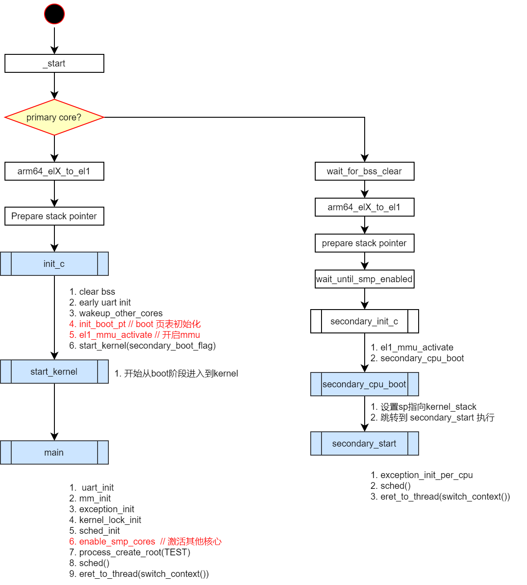
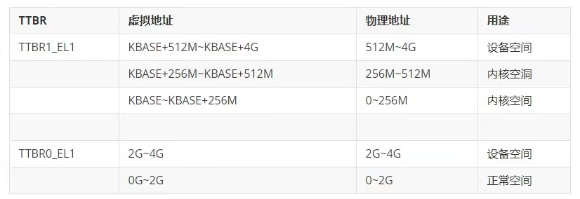
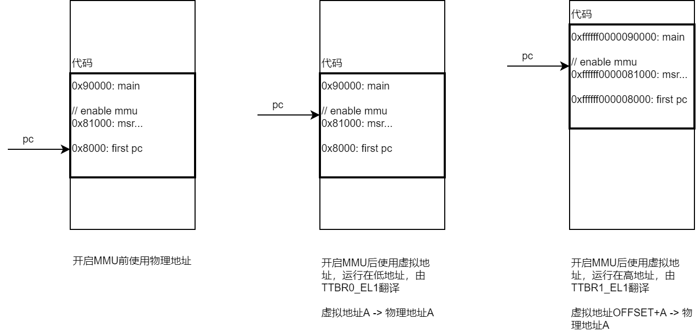

### 前言

> 主要内容：理解ChChor多核启动流程。

<!--more-->

### MMU开启过程及内核地址映射

内核和用户的虚拟内存空间是如何映射的？刚启动的时候，MMU还没有配置，没有地址翻译；MMU启动后，开始进行地址翻译，内核是如何保证这个转换顺利进行的呢？

**知识点**

- 在AArch64中，拥有两个页表地址寄存器：TTBR0_EL1和TTBR1_EL1
- 这两个寄存器所翻译的虚拟地址范围可以通过TCR_EL1进行配置
- 通常，操作系统会将TTBR1_EL1用于存储内核映射的页表，将TTBR0_EL1寄存器用于存储用户态程序映射的页表

这里要也别说明一下：TTBR0_EL1和TTBR1_EL1，都是给内核使用的（EL1特权级别），用哪个完全是根据虚拟地址范围来决定。

基于以上特性，我们可以在链接的时候，把boot阶段的代码指定在低地址（由TTBR0_EL1的页表进行翻译），把kernel的代码指定在高地址（由TTBR1_EL1）的页表进行翻译。

### MMU开启过程

