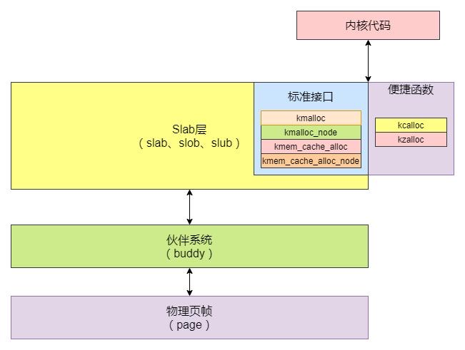
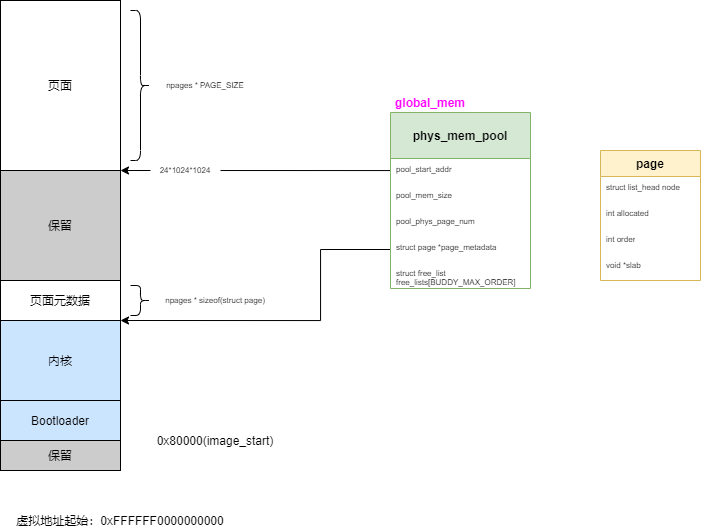
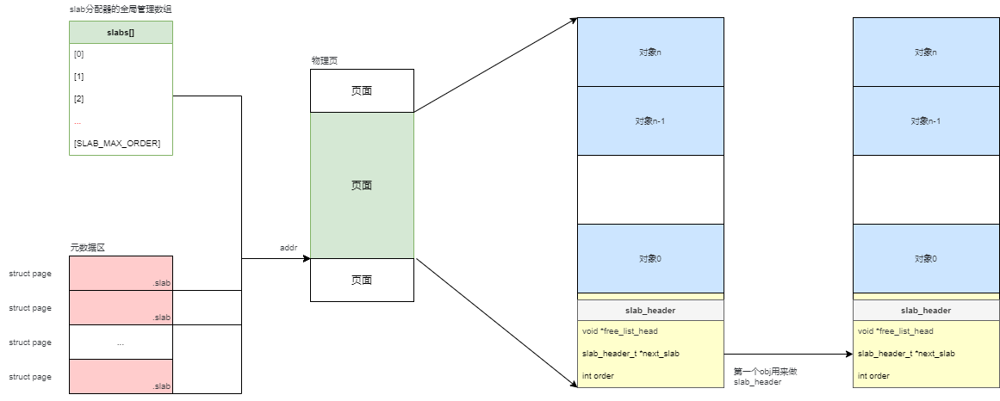
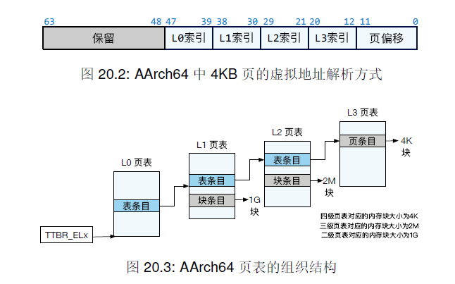

### 前言

> 主要内容：理解ChChor的内存管理方法和虚拟内存映射方法。

<!--more-->



### 内存布局



### Buddy系统

物理页的内存管理方法，以4KB的page为单位。

一个物理page对应一个struct page的管理结构体。

以order为单位分配，对应1，2，4，8，16...个page。

每个order对应一个free_lists链表

在分配和释放时做merge和split的动作，避免浪费。

### Slab系统

slab时建立在buddy system上的分配器，用于分配小于4KB的内存。操作系统里面的结构体大小常为几十、几百字节。

这里分析下ChChor里的使用的slab分配器。

首先，slab定义了一个全局数组：

```c
/* order range: [SLAB_MIN_ORDER, SLAB_MAX_ORDER] */
#define SLAB_MIN_ORDER (5)
#define SLAB_MAX_ORDER (11)

/* local variables */
slab_header_t *slabs[SLAB_MAX_ORDER + 1];
```

它只分配固定大小的size，分别是32，64，128...2048



#### slab分配器初始化

1. 只能分配固定大小的obj，从32,64...到2048，每个大小的slab用全局数据管理

2. 初始化时，先分配物理page(2MB)，然后初始化物理页，按照obj大小划分为n个物理对象

3. 第一个物理对象，用来存放slab_header，slab_header的free_list_head链表把所有的空闲对象串联起来；next_slab指向相同大小的下一个slab对象

#### slab内存分配

1. 根据size找到对应的slab对象，超过2048则直接从buddy system分配page

2. 首先从第一个slab_header分配，如果free_list_head为NULL，表示没有空闲的了，尝试从next_slab分配

3. 如果都没有了，则重新向buddy system申请slab cache

#### slab内存释放

1. 根据addr得到page

2. page的元数据区保存了slab的指针，找到slab对象

3. 把该对象（slot节点）加到slab的free_list_head中

**总结**

- slab分配器是只slab,slub,slob等分配器家族。
- chcore中只实现了slab分配器，没有实现slub（没有current，partial，full等链表来加快分配过程）
- slab分配器中只看到了init_slab_cach，不够时一直从buddy system申请物理页，但是没有看到释放物理页，因此它会一直保持峰值时占用的物理内存，即使后面不再使用了。

### 虚拟内存映射



AArch64支持的物理内存地址空间的大小为48位，对应4级页表9位的页表索引（每个页表512个条目）+12位的页偏移（每页4KB大小）。

页表基地址寄存器：TTBR0_EL1（存储用户程序映射的页表）和TTBR1_EL1（存储内核映射的页表）。

AArch64页表的项被称为**描述符**。一共有三种：

- 表描述符：包含下一级页表的地址（next_table_address）和相应的属性。对应图20.3中的蓝色条目
- 块条目：L1 和 L2中可以存储块条目，对应1G的块和2M的块，pfn分别为18和27位，也就是常常说的大页
- 页条目：L3 页表中存储的是页条目，每个条目对应1个4K的块

分析几个主要的函数：

get_next_ptp ：找到下一个页表的ptp（page table page）

```c
int get_next_ptp(ptp_t * cur_ptp, u32 level, vaddr_t va,
			ptp_t ** next_ptp, pte_t ** pte, bool alloc)
{
	u32 index = 0;
	pte_t *entry;

	if (cur_ptp == NULL)
		return -ENOMAPPING;
	/* 根据虚拟地址的拆解（9+9+9+9+12）,得到每一级的index */
	switch (level) {
	case 0:
		index = GET_L0_INDEX(va);
		break;
	case 1:
		index = GET_L1_INDEX(va);
		break;
	case 2:
		index = GET_L2_INDEX(va);
		break;
	case 3:
		index = GET_L3_INDEX(va);
		break;
	default:
		BUG_ON(1);
	}
	/* 根据索引得到 pte */
	entry = &(cur_ptp->ent[index]);
	if (IS_PTE_INVALID(entry->pte)) {
		if (alloc == false) {
			return -ENOMAPPING;
		} else {
			/* 如果下一级页表不存在，并且允许allic，则分配一个新的物理页作为下一级页表的ptp */
			ptp_t *new_ptp;
			paddr_t new_ptp_paddr;
			pte_t new_pte_val;

			/* alloc a single physical page as a new page table page */
			new_ptp = get_pages(0);
			BUG_ON(new_ptp == NULL);
			memset((void *)new_ptp, 0, PAGE_SIZE);
			new_ptp_paddr = virt_to_phys((vaddr_t) new_ptp);

            /* pte和table是union类型 */
			new_pte_val.pte = 0;
			new_pte_val.table.is_valid = 1;
			new_pte_val.table.is_table = 1;
			new_pte_val.table.next_table_addr
			    = new_ptp_paddr >> PAGE_SHIFT;

			/* 填充pte页表项，注意这里面最杆件的是nenx_table_index */
			entry->pte = new_pte_val.pte;
		}
	}
    /* 返回next_ptp，entry的next_table_addr得到paddr，再转成vaddr返回 */
	*next_ptp = (ptp_t *) GET_NEXT_PTP(entry);
	*pte = entry;
	if (IS_PTE_TABLE(entry->pte))
		return NORMAL_PTP;
	else
		return BLOCK_PTP;
}
```

map_range_in_pgtbl：给定页表基地址，把虚拟地址空间映射成物理地址空间。

```c
int map_range_in_pgtbl(vaddr_t * pgtbl, vaddr_t va, paddr_t pa,
		       size_t len, vmr_prop_t flags)
{
	ptp_t *ptp_0 = (ptp_t *)(pgtbl), *ptp_1, *ptp_2, *ptp_3, *next_ptp;
	pte_t *pte_0, *pte_1, *pte_2, *pte_3;
	size_t page_num = ROUND_UP(len, PAGE_SIZE) / PAGE_SIZE;
	/* 逐页循环 */
	for( size_t i=0; i< page_num ;i++, va += PAGE_SIZE, pa += PAGE_SIZE)
	{
        /* 一级一级得到ptp和pte */
		int err = get_next_ptp(ptp_0,0,va,&ptp_1,&pte_0,true);
		if(err<0) 
			return err;

		err = get_next_ptp(ptp_1,1,va,&ptp_2,&pte_1,true);
		if(err<0) 
			return err;

		err = get_next_ptp(ptp_2,2,va,&ptp_3,&pte_2,true);
		if(err<0) 
			return err;
		
		err = get_next_ptp(ptp_3,3,va,&next_ptp,&pte_3,true);
		if(err<0) 
			return err;
		set_pte_flags(pte_3, flags, USER_PTE);
        /* 映射物理页 */
		pte_3->l3_page.pfn = pa >> PAGE_SHIFT;
	}
    /* 刷新tlb */
	flush_tlb();
	return 0;
}

```

query_in_pgtbl：根据pgtbl和va，得到pa（物理地址）和entry（页表条目里有属性）

```c
int query_in_pgtbl(vaddr_t * pgtbl, vaddr_t va, paddr_t * pa, pte_t ** entry)
{
	// <lab2>
	ptp_t * cur_ptp = (ptp_t *)pgtbl;
	/* Q : why pgtbl is vaddr_t ?? */ 
	ptp_t * next_ptp;
	pte_t * pte;
	int err = 2;

    /* 逐级循环 */
	for(int i=0;i<=3;i++)
	{
		/* 获取下一级页表的ptp和自己的pte */
		err = get_next_ptp(cur_ptp,i,va,&next_ptp,&pte,false);
		if(err < 0)
			return err;
		
		/* 如果是大页，可以直接返回 */
		if(err == BLOCK_PTP)
		{	
			*entry = pte;
			switch (i)
			{
			case 1:
				*pa = virt_to_phys((vaddr_t) next_ptp) + GET_VA_OFFSET_L1(va);//offset=[0:29]
				break;
			case 2:
				*pa = virt_to_phys((vaddr_t) next_ptp) + GET_VA_OFFSET_L2(va);//offset=[0:20]
				break;
			case 3:
				*pa = virt_to_phys((vaddr_t) next_ptp) + GET_VA_OFFSET_L3(va);//offset=[0:12]
				break;	
			
			default:
				break;
			}
			return 0;
		}
		cur_ptp = next_ptp;
	}
	/* 转换成物理地址并加上偏移，可以得到真正的物理地址 */
	*entry = pte;
	*pa = virt_to_phys((vaddr_t) next_ptp) + GET_VA_OFFSET_L3(va);

	return 0;
}
```

