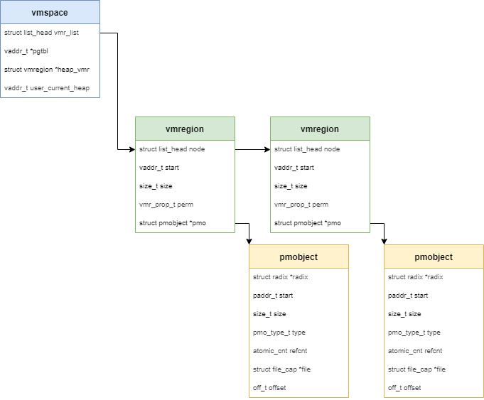
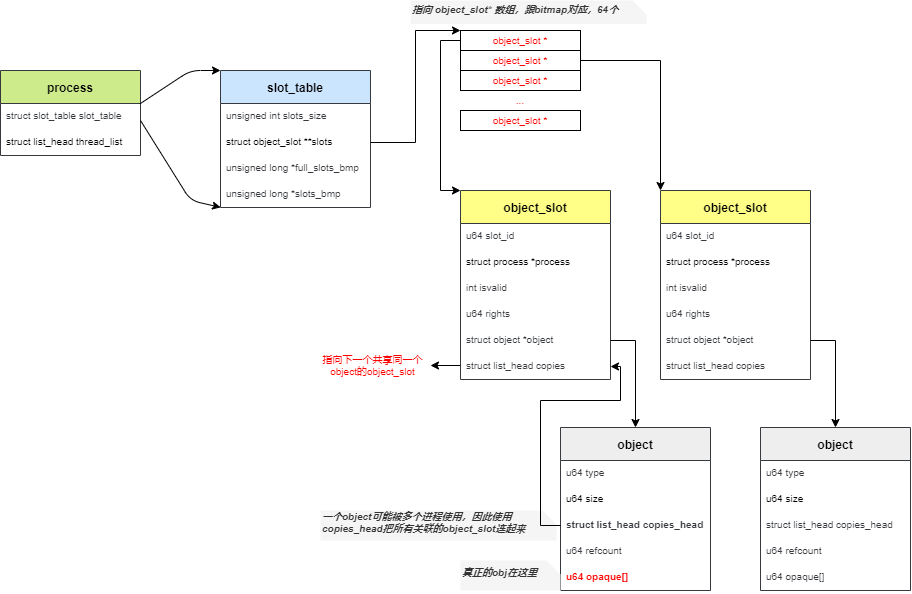
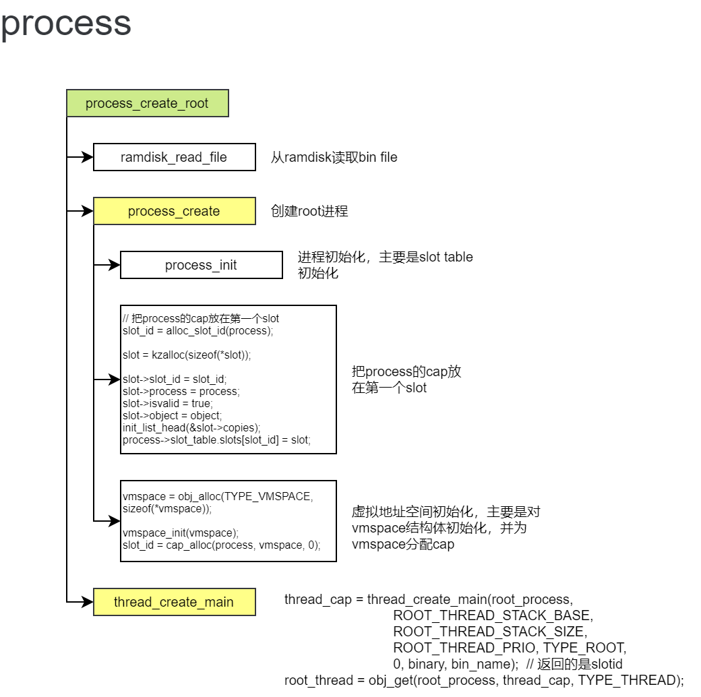
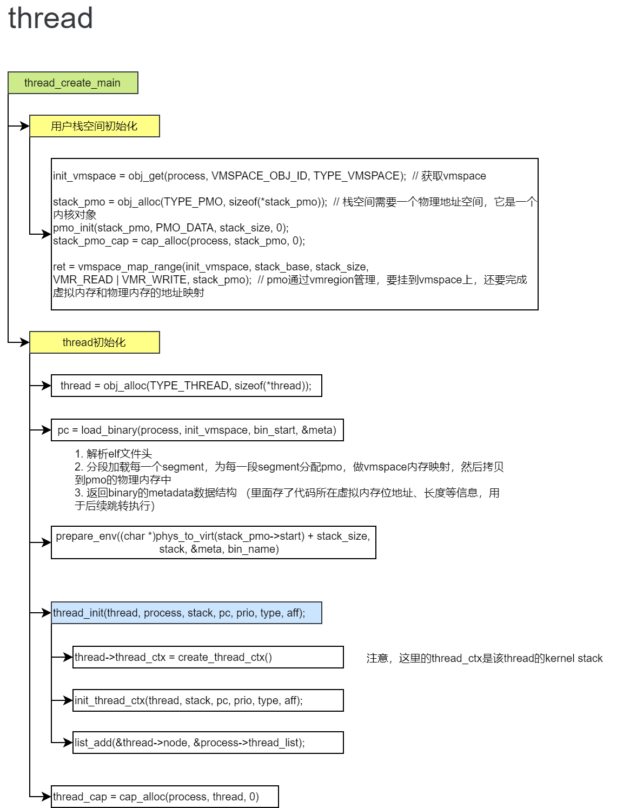
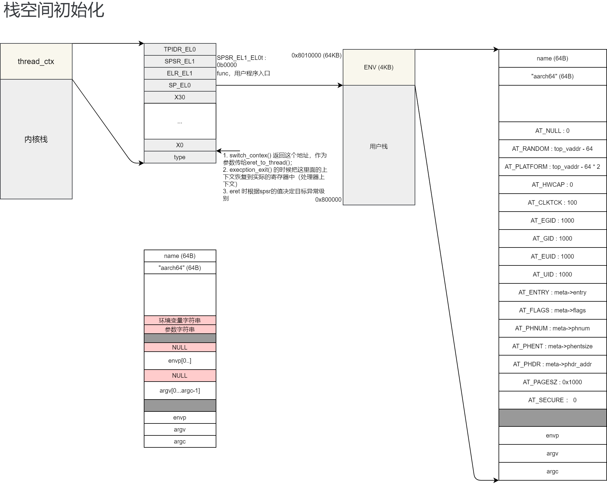

---

title: ChChorOS-4-Process
date: 2023-04-22 10:07:34
categories: OS
tags:
---

### 前言

> 本章主要描述进程、线程和上下文切换相关内容。

<!--more-->

### 1. vmspace



每个进程都需要有自己的虚拟地址空间，这个虚拟地址空间用vmspace来描述。

```c
struct vmspace {
    /* list of vmregion */
    struct list_head vmr_list;
    /* root page table */
    vaddr_t *pgtbl;

    struct vmregion *heap_vmr;  // 用户栈对应的vmregion
    vaddr_t user_current_heap;  // 用户栈
};

struct vmregion {
    struct list_head node;  // vmr_list
    vaddr_t start;
    size_t size;
    vmr_prop_t perm;
    struct pmobject *pmo;   // 真正的物理内存是pmo
};
```

1. 虚拟地址空间翻译需要有页表基地址，vmspace中的pgtbl就是该进程的页表基地址
2. 一个vmspace可能由多个vmregion组成，因此使用链表进行管理

#### 1.1 初始化

```c
#define HEAP_START (0x600000000000)

int vmspace_init(struct vmspace *vmspace)
{
    init_list_head(&vmspace->vmr_list);
    /* 分配root页表页 */
    vmspace->pgtbl = get_pages(0);
    BUG_ON(vmspace->pgtbl == NULL);
    memset((void *)vmspace->pgtbl, 0, PAGE_SIZE);

    /* 指定用户栈的起始地址 */
    vmspace->user_current_heap = HEAP_START;

    return 0;
}
```

- 分配root页表页
- 指定用户栈的地址

#### 1.2 内存映射

假设我们已经分配好了一个物理内存对象（pmo），我们需要将虚拟地址和物理地址进行映射。

```c
int vmspace_map_range(struct vmspace *vmspace, vaddr_t va, size_t len,
              vmr_prop_t flags, struct pmobject *pmo)
{
    struct vmregion *vmr;
    int ret;

    va = ROUND_DOWN(va, PAGE_SIZE);
    if (len < PAGE_SIZE)
        len = PAGE_SIZE;
    
    /* 分配一个vmregion对象 */
    vmr = alloc_vmregion();
    if (!vmr) {
        ret = -ENOMEM;
        goto out_fail;
    }
    vmr->start = va;
    vmr->size = len;
    vmr->perm = flags;
    vmr->pmo = pmo;

    /* 把vmr添加到vmspace中 */
    ret = add_vmr_to_vmspace(vmspace, vmr);

    if (ret < 0)
        goto out_free_vmr;
    BUG_ON((pmo->type != PMO_DATA) &&
           (pmo->type != PMO_ANONYM) &&
           (pmo->type != PMO_DEVICE) && (pmo->type != PMO_SHM));
    /* on-demand mapping for anonymous mapping */
    if (pmo->type == PMO_DATA)
        /* 填充页表，完成物理内存映射 */
        fill_page_table(vmspace, vmr);
    return 0;
 out_free_vmr:
    free_vmregion(vmr);
 out_fail:
    return ret;
}
```

1. 分配vmregion对象
2. vmr添加到vmspace中，就是添加到链表中
3. 调用`fill_page_table()`填充页表，这是内核提供的page_table的相关函数（参考memory章节）

#### 1.3 内存去映射

```c
int vmspace_unmap_range(struct vmspace *vmspace, vaddr_t va, size_t len)
{
    struct vmregion *vmr;
    vaddr_t start;
    size_t size;

    /* 遍历vmspace，找到vmr */
    vmr = find_vmr_for_va(vmspace, va);
    if (!vmr)
        return -1;
    start = vmr->start;
    size = vmr->size;

    if ((va != start) && (len != size)) {
        printk("we only support unmap a whole vmregion now.\n");
        BUG_ON(1);
    }

    /* 从vmspace中删除vmr */
    del_vmr_from_vmspace(vmspace, vmr);

    /* 从页表中删除相应表项 */
    unmap_range_in_pgtbl(vmspace->pgtbl, va, len);

    return 0;
}
```

#### 1.4 切换虚拟地址空间

不同的进程使用不同的虚拟地址空间，切换虚拟地址空间就是设置pgtbl到ttbr0_el1寄存器即可。

```c
void switch_vmspace_to(struct vmspace *vmspace)
{
    set_page_table(virt_to_phys(vmspace->pgtbl));
}
```

### 2 capability

ChChor基于capability对内核资源进行访问控制。

所有内核资源（如物理内存等）均被抽象为了**内核对象**。应用通过整型的标识符cap访问从属于该进程的内核对象。



capability的代码不复杂，这里不分析代码了，主要是理解它的数据结构的设计。

- 真正的内核对象用object进行表示，一个object就是一个内核对象
- 内核对象的obj，藏在object->opaque中，它可以是物理内存，也可以是其他
- 一个object可以被多个进程共享，因此，object->copies_head就是用来把所有引用了该对象的object_slot用链表管理起来
- 一个进程所有的内核对象是通过slot_table进行管理的，它是一个数组，用bitmap标识，一个数组元素指向一个object_slot
- 通过slot_id即可找到该进程的内核对象

### 3 process



### 4 thread





### 5 跳转到thread执行

```c
void main(void *addr)
{
    /* Init uart */
    uart_init();
    
    mm_init();
    
    exception_init();
    
    kernel_lock_init();
    
    lock_kernel();

    sched_init(&rr);
    
    enable_smp_cores(addr);
    
    process_create_root(TEST);

    sched();

    /* 重点是这句话，创建好root进程后，会跳转到thread执行 */
    eret_to_thread(switch_context());

    /* Should provide panic and use here */
    BUG("[FATAL] Should never be here!\n");
}
```

```c
u64 switch_context(void)
{
    struct thread *target_thread;
    struct thread_ctx *target_ctx;

    target_thread = current_thread;     // want to change to *current_thread*
    BUG_ON(!target_thread);
    BUG_ON(!target_thread->thread_ctx);

    target_ctx = target_thread->thread_ctx;

    /* These 3 types of thread do not have vmspace */
    if (target_thread->thread_ctx->type != TYPE_IDLE &&
        target_thread->thread_ctx->type != TYPE_KERNEL &&
        target_thread->thread_ctx->type != TYPE_TESTS) {
        BUG_ON(!target_thread->vmspace);
        /* 设置页表基地址为当前线程的页表基地址 */
        switch_thread_vmspace_to(target_thread);
    }
    
    /* 返回当前 thread ctx 中保存应用程上下文的sp */
    return (u64)target_ctx->ec.reg; 
}
```

```c
BEGIN_FUNC(eret_to_thread)
    mov sp, x0
    /* 恢复应用程序上下文，然后调用eret退出到应用程序来执行 */
    exception_return
END_FUNC(eret_to_thread)

```

