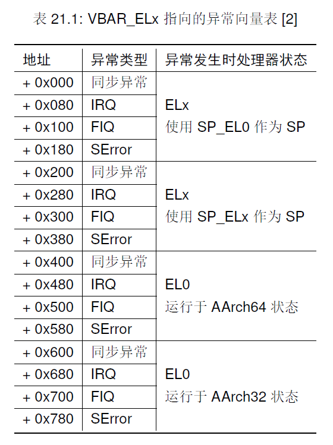
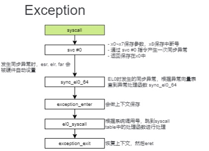
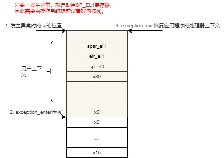

> 主要内容：理解AArch64的异常机制和系统调用机制。

<!--more-->

### 1 AArch64中的异常

异常是指低特权级软件（如用户程序）请求高特权级软件（例如内核中的异常处理程序）采取某些措施以确保程序平稳运行的系统事件。

异常分类：

- 同步异常
  - 同步中止（取值或数值访问失败）
  - 异常生成指令（svc，hvc，smc）
- 异布异常
  - IRQ，FIQ，SError

**异常向量表**

每个异常级别有自己独立的异常向量表（EBAR_EL3, EBAR_EL2, EBAR_EL1），每个异常向量表有16个条目。



设置异常向量表：

```c
BEGIN_FUNC(set_exception_vector)
    adr x0, el1_vector
    msr vbar_el1, x0
    ret
END_FUNC(set_exception_vector)
```

**异常处理相关寄存器**

- ESR_ELx：存储有关异常原因的信息
- FAR_ELx：存储所有同步指令中止、同步数据中止和对齐异常所对应的虚拟地址
- ELR_ELx：异常的首选返回地址

### 2 异步处理流程

#### 触发同步异常

以svc系统调用为例分析异常处理流程：

```c
u64 syscall(u64 sys_no, u64 arg0, u64 arg1, u64 arg2, u64 arg3, u64 arg4,
        u64 arg5, u64 arg6, u64 arg7, u64 arg8)
{

    u64 ret = 0;
    /* 参数保存在x0-x7中，系统调用号保存在x8中
     * 返回值保存在x0中
     */
    asm volatile("mov x0, %1\n\t"
                "mov x1, %2\n\t"
                "mov x2, %3\n\t"
                "mov x3, %4\n\t"
                "mov x4, %5\n\t"
                "mov x5, %6\n\t"
                "mov x6, %7\n\t"
                "mov x7, %8\n\t"
                "mov x8, %9\n\t"
                "svc #0\n\t"
                "mov %0, x0\n\t"
                : "=r" (ret)
                : "r" (arg0), "r" (arg1), "r" (arg2), "r" (arg3), "r" (arg4), "r" (arg5), "r" (arg6), "r" (arg7), "r" (sys_no)
                : "x0", "x1", "x2", "x3", "x4", "x5", "x6", "x7", "x8");

    return ret;
}
```

`svc #0`指令会出发同步异常，于是发生特权级别切换。

#### 处理器自动保存

1. PC保存在ELR_EL1
2. 异常事件的原因保存在ESR_EL1
3. 当前状态保存在SPSR_EL1
4. 异常信息保存在FAR_EL1
5. 栈寄存器开始使用SP_EL1，不在使用SP_EL0
6. 修改PSTATE中的特权级标志位，设置为内核态（EL1）
7. 根据VBAR_EL1寄存器中保存的异常向量表基地址，以及异常事件发生的类型，找到异常处理函数的入口地址，并把该地址设置到PC，开始运行操作系统的代码

#### 异常进入、处理和退出

操作系统在异常处理函数会做异常处理的一些上下文保存、函数调用和上下文恢复动作。





操作系统在特权级切换过程中的动作：

1. 保存x0-x31，sp_el0，elr_el1，spsr_el1等寄存器到内核栈中（切换到EL1时自动使用SP_EL1）

2. 做系统调用或其他异常处理

3. 恢复应用程序的处理器上下文

4. 调用eret返回应用程序

#### 异常返回eret

调用eret时，处理器自动完成：

1. SPSR_EL1写入到PSTATE
2. 开始使用SP_EL0
3. ELR_EL1写入PC，并执行应用程序的代码

```c
.align  11
EXPORT(el1_vector)
        exception_entry sync_el1t
        exception_entry irq_el1t
        exception_entry fiq_el1t
        exception_entry error_el1t

        exception_entry sync_el1h
        exception_entry irq_el1h
        exception_entry fiq_el1h
        exception_entry error_el1h

        /* svc时跳到sync_el0_64执行 */
        exception_entry sync_el0_64
        exception_entry irq_el0_64
        exception_entry fiq_el0_64
        exception_entry error_el0_64

        exception_entry sync_el0_32
        exception_entry irq_el0_32
        exception_entry fiq_el0_32
        exception_entry error_el0_32
```

```c
sync_el0_64:
    /* Since we cannot touch x0-x7, we need some extra work here */
    /* 异常进入，保存处理器上下文 */
    exception_enter
    mrs x25, esr_el1
    /* 检查ESR_EL1，确认是SVC异常 */
    lsr x24, x25, #ESR_EL1_EC_SHIFT
    cmp x24, #ESR_EL1_EC_SVC_64
    /* 跳转执行 */
    b.eq    el0_syscall
    /* Not supported exception */
    mov x0, SYNC_EL0_64 
    mrs x1, esr_el1
    mrs x2, elr_el1
    bl  handle_entry_c
    exception_return
```

```c
.macro  exception_enter
    sub sp, sp, #ARCH_EXEC_CONT_SIZE
    /* 保护用户态的寄存器 */
    stp x0, x1, [sp, #16 * 0]
    stp x2, x3, [sp, #16 * 1]
    stp x4, x5, [sp, #16 * 2]
    stp x6, x7, [sp, #16 * 3]
    stp x8, x9, [sp, #16 * 4]
    stp x10, x11, [sp, #16 * 5]
    stp x12, x13, [sp, #16 * 6]
    stp x14, x15, [sp, #16 * 7]
    stp x16, x17, [sp, #16 * 8]
    stp x18, x19, [sp, #16 * 9]
    stp x20, x21, [sp, #16 * 10]
    stp x22, x23, [sp, #16 * 11]
    stp x24, x25, [sp, #16 * 12]
    stp x26, x27, [sp, #16 * 13]
    stp x28, x29, [sp, #16 * 14]
    mrs x10, sp_el0
    mrs x11, elr_el1
    mrs x12, spsr_el1 
    stp x30, x10, [sp, #16 * 15]
    stp x11, x12, [sp, #16 * 16]
.endm
```
```c
el0_syscall:
    /* 省略一些不太理解的寄存器保存 */
    ...
    /* 找到系统调用号，根据syscall_table找到系统调用处理函数，并跳转执行 */
    adr x27, syscall_table      // syscall table in x27
    uxtw    x16, w8             // syscall number in x16
    ldr x16, [x27, x16, lsl #3]     // find the syscall entry
    blr x16

    /* 从syscall返回 */
    //bl    disable_irq
    str x0, [sp] /* set the return value of the syscall */
    /* 异常退出 */
    exception_return
```

```c
.macro  exception_exit
    /* 恢复应用程序的处理器上下文，并通过eret返回，执行应用程序 */
    ldp x11, x12, [sp, #16 * 16]
    ldp x30, x10, [sp, #16 * 15] 
    msr sp_el0, x10
    msr elr_el1, x11
    msr spsr_el1, x12
    /* 恢复用户态的寄存器 */
    ldp x0, x1, [sp, #16 * 0]
    ldp x2, x3, [sp, #16 * 1]
    ldp x4, x5, [sp, #16 * 2]
    ldp x6, x7, [sp, #16 * 3]
    ldp x8, x9, [sp, #16 * 4]
    ldp x10, x11, [sp, #16 * 5]
    ldp x12, x13, [sp, #16 * 6]
    ldp x14, x15, [sp, #16 * 7]
    ldp x16, x17, [sp, #16 * 8]
    ldp x18, x19, [sp, #16 * 9]
    ldp x20, x21, [sp, #16 * 10]
    ldp x22, x23, [sp, #16 * 11]
    ldp x24, x25, [sp, #16 * 12]
    ldp x26, x27, [sp, #16 * 13]
    ldp x28, x29, [sp, #16 * 14]
    add sp, sp, #ARCH_EXEC_CONT_SIZE
    eret
.endm
```

