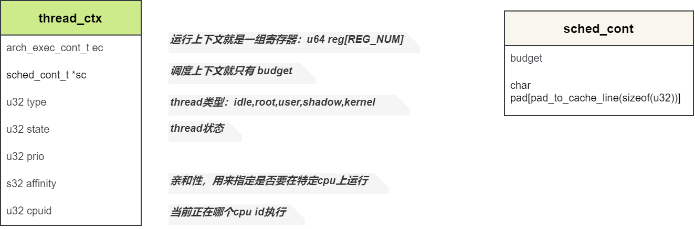
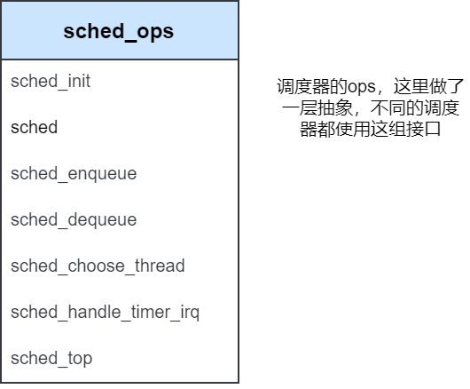
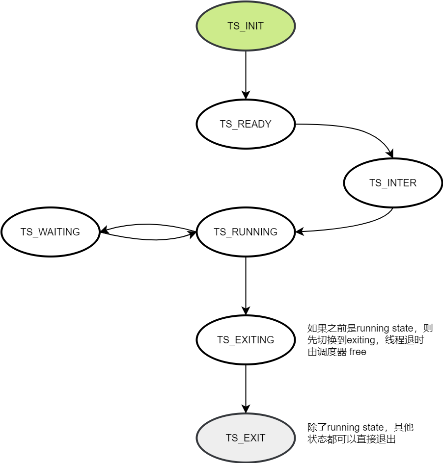

### 前言

> 主要内容：掌握ChChor的内核调度策略与实现。

<!--more-->

### 调度相关的数据结构

**thread_ctx**

线程是调度的基本单元，因此thread_ctx中保存有调度相关的运行上下文、调度上下文、运行状态等信息。

- budget：rr调度器中的时间片


**sched_ops**

调度器的ops是一组抽象接口，不同的调度器都使用这一组接口



**thread_state**



### 调度器初始化

```c
void main(void *addr)
{
    ...
        
    kernel_lock_init();
    
    lock_kernel();

    /* 选用roung-robin调度器算法 */
    sched_init(&rr);
    
    ...
    
    sched();

    eret_to_thread(switch_context());
}
```

#### idle线程初始化

```c
int sched_init(struct sched_ops *sched_ops)
{
    BUG_ON(sched_ops == NULL);

    /* 确定调度器算法 */
    cur_sched_ops = sched_ops;
    /* 具体调度器算法的初始化 */
    cur_sched_ops->sched_init();
    return 0;
}
```

```c
int rr_sched_init(void)
{
    int i = 0;

    /* 初始化全局变量 */
    for (i = 0; i < PLAT_CPU_NUM; i++)
    {
        current_threads[i] = NULL;
        init_list_head(&rr_ready_queue[i]);
    }

    /* 为每一个核创建一个idle线程，并加到对应的ready_queue */
    for (i = 0; i < PLAT_CPU_NUM; i++)
    {
        /* 创建idle线程的线程上下文 */
        BUG_ON(!(idle_threads[i].thread_ctx = create_thread_ctx()));
        /* 初始化idle线程的上下文 */
        init_thread_ctx(&idle_threads[i], 0, 0, MIN_PRIO, TYPE_IDLE, i);
        /* 调用arch相关的线程初始化 */
        arch_idle_ctx_init(idle_threads[i].thread_ctx,
                           idle_thread_routine);
        /* idle线程运行在内核态，没有vmspace */
        idle_threads[i].vmspace = NULL;
    }
    kdebug("Scheduler initialized. Create %d idle threads.\n", i);

    return 0;
}
```

1. 初始化全局变量
2. 为每一个核创建idle线程，并加到RQ
   - 创建idle线程的上下文，主要是创建kernel stack
   - 初始化idle线程的上下文

### 线程调度

#### rr_sched

挑选一个thread来执行

```c
int rr_sched(void)
{
    /*  
     * 调度器应只能在某个线程预算等于零时才能调度该线程
     */
    if (current_thread != NULL && current_thread->thread_ctx != NULL && current_thread->thread_ctx->sc != NULL && current_thread->thread_ctx->sc->budget != 0)
    {
        return 0;
    }
    /*
     * 首先检查当前是否正在运行某个线程
     * 如果是，它将调用rr_sched_enqueue()将线程添加回rr_ready_queue
     * rr_ready_queue 里面是不运行的线程哦
     */
    if (current_thread != NULL)
    {
        rr_sched_enqueue(current_thread);
    }

    /* 选择一个线程来执行 */
    struct thread *target_thread;
    if ((target_thread = rr_sched_choose_thread()) == NULL)
    {
        return -EINVAL;
    }

    /* 重新设置budget */
    rr_sched_refill_budget(target_thread, DEFAULT_BUDGET);

    /* 切换到新的线程 */ 
    return switch_to_thread(target_thread);
}
```

#### rr_sched_enqueue

一个线程切出，重新放到RQ即可。这里涉及到了亲和性的概念，也就是线程是否要执行在哪个cpu执行。

```c
int rr_sched_enqueue(struct thread *thread)
{
    if (thread == NULL || thread->thread_ctx == NULL || thread->thread_ctx->state == TS_READY)
    {
        return -EINVAL;
    }
    /* If the thread is IDEL thread, do nothing! */
    if (thread->thread_ctx->type == TYPE_IDLE)
    {
        return 0;
    }

    /* 
     * If affinity = NO_AFF, assign the core to the current cpu.
     * 将线程给他指定的cpu运行
     */
    u32 cpu_id = smp_get_cpu_id();
    if (thread->thread_ctx->affinity != NO_AFF)
    {
        cpu_id = thread->thread_ctx->affinity;
        if (cpu_id >= PLAT_CPU_NUM)
        {
            return -EINVAL;
        }
    }
    /* 添加到RQ的尾部 */
    list_append(&thread->ready_queue_node, &rr_ready_queue[cpu_id]);
    /* 设置线程状态 */
    thread->thread_ctx->state = TS_READY;
    thread->thread_ctx->cpuid = cpu_id;
    return 0;
}
```

#### rr_sched_choose_thread

选择一个线程来执行，从RQ队首出队即可。

```c
struct thread *rr_sched_choose_thread(void)
{
    /* 首先检查CPU 核心的rr_ready_queue是否为空
     * 如果是，rr_choose_thread返回CPU 核心自己的空闲线程 
     */
    u32 cpu_id = smp_get_cpu_id();
    if (list_empty(&(rr_ready_queue[cpu_id])))
    {
        return &(idle_threads[cpu_id]);
    }

    /*
     * 如果没有，它将选择rr_ready_queue的队首
     * 并调用rr_sched_dequeue()使该队首出队，然后返回该队首
     */
    struct thread *chosen_thread = list_entry(rr_ready_queue[cpu_id].next, struct thread, ready_queue_node);
    if (rr_sched_dequeue(chosen_thread) < 0)
    {
        return NULL;
    }
    return chosen_thread;
}
```

#### rr_sched_dequeue

```c
int rr_sched_dequeue(struct thread *thread)
{
    if (thread == NULL || thread->thread_ctx == NULL || thread->thread_ctx->state != TS_READY)
    {
        return -EINVAL;
    }

    /* 如果是空闲线程 则不用出队 */
    if (thread->thread_ctx->type == TYPE_IDLE)
    {
        // thread->thread_ctx->state = TS_INTER;
        return 0;
    }

    list_del(&thread->ready_queue_node);
    thread->thread_ctx->state = TS_INTER;
    return 0;
}
```

#### switch_to_thread

```c
int switch_to_thread(struct thread *target)
{
    target->thread_ctx->cpuid = smp_get_cpu_id();
    target->thread_ctx->state = TS_RUNNING;
    smp_wmb();
    current_thread = target;

    return 0;
}
```

#### switch_context

```c
u64 switch_context(void)
{
    struct thread *target_thread;
    struct thread_ctx *target_ctx;

    target_thread = current_thread;     // want to change to *current_thread*
    BUG_ON(!target_thread);
    BUG_ON(!target_thread->thread_ctx);

    target_ctx = target_thread->thread_ctx;

    /* These 3 types of thread do not have vmspace */
    if (target_thread->thread_ctx->type != TYPE_IDLE &&
        target_thread->thread_ctx->type != TYPE_KERNEL &&
        target_thread->thread_ctx->type != TYPE_TESTS) {
        BUG_ON(!target_thread->vmspace);
        switch_thread_vmspace_to(target_thread);
    }
    return (u64)target_ctx->ec.reg; 
}
```

切换上下文就是把vmspace切换到目标现成的地址空间，然后返回目标线程的上下文。

最后由`eret_to_thread`完成处理器上下文切换。

#### rr_sched_handle_timer_irq

时间片减一。

```c
void rr_sched_handle_timer_irq(void)
{
    if (current_thread != NULL && current_thread->thread_ctx->sc->budget > 0)
    {
        current_thread->thread_ctx->sc->budget--;
    }
}
```

rr调度器使用一个定时器来做时间片的更新，在定时器终端中budget减1，然后执行调度，决定是否要切换到新的线程来执行。