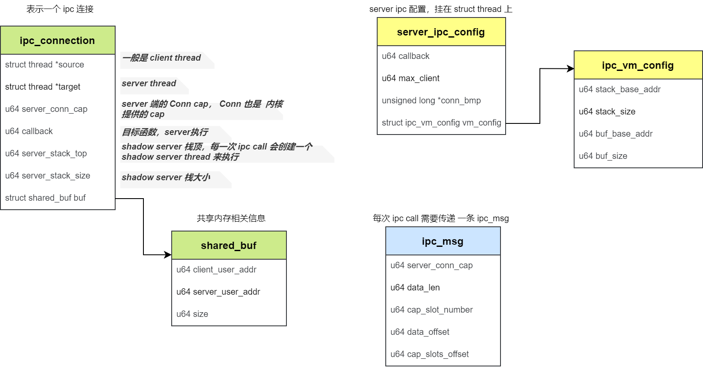

> 主要内容：了解ChChor中的IPC机制。

<!--more-->

前提说明：这里的 ipc 是进程间通信（ Inter-Process Communication），不是核间通信（Inter-Processor Communication），更不是RPC（Remote Procedure Call）。所以它的主要目的还是把一个进程的数据，传递到目标进程。

### ChChore进程间通信的特点

- 通信进程直接切换（有点像rpc，也是启发自LRPC和L4的直接切换技术）
- 同步的通信（client 调用 ipc_call 会阻塞等待 server 处理完然后 return）
- 通过共享内存传输大数据
- 基于Capability的权限控制
  - 类似Unix文件描述符的权限机制，Capability表示一个线程/进程对于系统资源的具体权限

### 用法示例

场景：client需要把自己的一块内存数据传递给server，基于同步的ipc机制

**client端**

```c
int client()
{
    /* 1. client需要知道server的thread cap */
    // get server_thread_cap

    /* 2. 注册 IPC client */
    ret = ipc_register_client(new_thread_cap, &client_ipc_struct);

    /* 3. 创建共享内存 */
    shared_page_pmo_cap = usys_create_pmo(PAGE_SIZE, PMO_DATA);

    /* 4. 映射共享内存 */
    ret = usys_map_pmo(SELF_CAP, shared_page_pmo_cap, SHARED_PAGE_VADDR,
               VM_READ | VM_WRITE);

    /* 5. 往共享内存写数据 */
    *(int *)SHARED_PAGE_VADDR = MAGIC_NUM;
    
    /* 6. 创建ipc消息，设置要共享的cap，IPC发送cap */
    ipc_msg = ipc_create_msg(&client_ipc_struct, 0, 1);
    
    /* 7. 把共享的cap放到ipc_msg中 */
    ipc_set_msg_cap(ipc_msg, 0, shared_page_pmo_cap);
    
    /* 8. ipc call, 让server thread处理消息 */
    ipc_call(&client_ipc_struct, ipc_msg);
    
    ipc_destroy_msg(ipc_msg);

    return 0;
}
```

上面的第3，4，5，7步是为了演示共享内存数据用的，实际可以不需要。

**server端**

```c
void ipc_dispatcher(ipc_msg_t * ipc_msg)
{
    int ret = 0;
    /* 获取 ipc_msg 的cap */
    int cap = ipc_get_msg_cap(ipc_msg, 0);

    /* 把pmo映射到自己的虚拟地址空间 */
    ret = usys_map_pmo(SELF_CAP, cap, SHARED_PAGE_VADDR + PAGE_SIZE,
               VM_READ | VM_WRITE);

    /* 现在就可以访问共享内存数据了 */
    printf("[Server] read %x\n", *(int *)(SHARED_PAGE_VADDR + PAGE_SIZE));
    ret = 0;

    ipc_return(ret);
}

int main(int argc, char *argv[], char *envp[])
{
    int ret;
    //...
    info_page = (struct info_page *)info_page_addr;
    // ...
}

```

### 数据结构



### 代码分析

为了简化分析，先只考虑一个 server 对应一个 client 的场景，因此先忽略多 cliient 的相关内容。

另外，主要分析 内核 相关的 ipc 代码，对用户空间的先不做分析。

#### 注册server

我们要在用户空间的 ipc server thread 执行函数，就得要指定一些信息：比如 callback（具体执行的函数），stack 的起始地址、size；server thread 需要访问共享内存，因此也需要指定 用户空间的 buffer 地址和 size。

这也是 为什么要 这样设置 server_ipc_config 的原因。

```c
u64 sys_register_server(u64 callback, u64 max_client, u64 vm_config_ptr)
{
    return register_server(current_thread, callback, max_client,
                   vm_config_ptr);
}

static int register_server(struct thread *server, u64 callback, u64 max_client,
               u64 vm_config_ptr)
{
    // ...

    // 创建 server_ipc_config，挂到server现成的控制块上
    server_ipc_config = kmalloc(sizeof(struct server_ipc_config));
    server->server_ipc_config = server_ipc_config;

    // 初始化 server ipc_config
    server_ipc_config->callback = callback;

    server_ipc_config->max_client = max_client;
    server_ipc_config->conn_bmp =
        kzalloc(BITS_TO_LONGS(max_client) * sizeof(long));
    
    // 拷贝用户空间的 vm_config
    vm_config = &server_ipc_config->vm_config;
    r = copy_from_user((char *)vm_config, (char *)vm_config_ptr,
               sizeof(*vm_config));
    // ...
}
```

可以看到，注册 ipc server，主要是 创建了 server_ipc_config 并挂到 server thread 上。

#### 注册client

注册一个client，它需要和 server 关联起来；另外一个 client 对应一个connection，因此也需要创建 conn cap 内核对象。另外，client 也有自己的 config 参数，用来保存用户栈空间和共享内存信息。

```c
u32 sys_register_client(u32 server_cap, u64 vm_config_ptr)
{
    // ...
    
    // 拷贝用户空间传过来的config数据
    r = copy_from_user((char *)&vm_config, (char *)vm_config_ptr,
               sizeof(vm_config));
    
    // 获取server thread
    server = obj_get(current_thread->process, server_cap, TYPE_THREAD);

    client_buf_size = vm_config.buf_size;

    // 创建connection
    conn_cap = create_connection(client, server, &vm_config);
    conn = obj_get(current_process, conn_cap, TYPE_CONNECTION);

    if (client_buf_size != vm_config.buf_size) {
        // 如果buf size有变化，（原因是client和server的size可能不一样），更新用户空间的config
        r = copy_to_user((char *)vm_config_ptr, (char *)&vm_config,
                 sizeof(vm_config));
        if (r < 0)
            goto out_obj_put_conn;
    }

    // 返回一个conn_cap的内核对象，后面就是用这个conn_cap进行ipc_call
    r = conn_cap;

    return r;
}
```

这里面最重要是`create_connection`函数，它创建了一个connection内核对象，完成了相关的信息绑定。

```c
static int create_connection(struct thread *source, struct thread *target,
                 struct ipc_vm_config *client_vm_config)
{
    // ...

    // 首先申请一个connection obj
    conn = obj_alloc(TYPE_CONNECTION, sizeof(*conn));
    
    // 创建server的影子线程
    conn->target = create_server_thread(target);

    // 获取server的config
    server_ipc_config = target->server_ipc_config;
    vm_config = &server_ipc_config->vm_config;
    conn_idx = find_next_zero_bit(server_ipc_config->conn_bmp,
                      server_ipc_config->max_client, 0);
    set_bit(conn_idx, server_ipc_config->conn_bmp);

    // 创建server线程的栈
    server_stack_base =
        vm_config->stack_base_addr + conn_idx * vm_config->stack_size;
    stack_size = vm_config->stack_size;
    kdebug("server stack base:%lx size:%lx\n", server_stack_base,
           stack_size);
    // stack也是一个pmo，需要申请并完成内存映射
    stack_pmo = kmalloc(sizeof(struct pmobject));
    if (!stack_pmo) {
        ret = -ENOMEM;
        goto out_free_obj;
    }
    pmo_init(stack_pmo, PMO_DATA, stack_size, 0);
    vmspace_map_range(target->vmspace, server_stack_base, stack_size,
              VMR_READ | VMR_WRITE, stack_pmo);

    conn->server_stack_top = server_stack_base + stack_size;

    // 创建共享内存，完成client和server的映射
    server_buf_base =
        vm_config->buf_base_addr + conn_idx * vm_config->buf_size;
    client_buf_base = client_vm_config->buf_base_addr;
    buf_size = MIN(vm_config->buf_size, client_vm_config->buf_size);
    client_vm_config->buf_size = buf_size;

    buf_pmo = kmalloc(sizeof(struct pmobject));

    pmo_init(buf_pmo, PMO_DATA, buf_size, 0);


    vmspace_map_range(current_thread->vmspace, client_buf_base, buf_size,
              VMR_READ | VMR_WRITE, buf_pmo);
    vmspace_map_range(target->vmspace, server_buf_base, buf_size,
              VMR_READ | VMR_WRITE, buf_pmo);

    // 完成配置
    conn->buf.client_user_addr = client_buf_base;
    conn->buf.server_user_addr = server_buf_base;

    // client进程给conn申请 conn_cap
    conn_cap = cap_alloc(current_process, conn, 0);

    // server的conn_cap保存在 conn 中
    server_conn_cap =
        cap_copy(current_process, target->process, conn_cap, 0, 0);
    if (server_conn_cap < 0) {
        ret = server_conn_cap;
        goto out_free_obj;
    }
    conn->server_conn_cap = server_conn_cap;

    return conn_cap;

}
```

这个函数有点复杂，主要是完成 conn 的创建，总结一下：

1. 申请一个 conn obj

2. 一个connection需要在server的上下文执行函数，因此需要创建一个 server thread，这是一个 shadow thread

   - 创建 server 线程

   - 获取 server 的 config

   - 根据 config 创建 server 线程的栈

3. 创建 共享内存，完成 内存映射
4. 完成 conn 的配置
5. client 的 conn_cap 返回给 client，server 的 conn_cap 挂在 conn 数据结构中

这样操作之后，就完成了 server 线程的创建，申请了共享内存，具备了共享数据和在 server thread 执行 callback 的条件。

`create_server_thread()` 主要是完成真正的 server thread 创建，并配置 server_ipc_config 信息。这里就贴代码了。

#### ipc_call

client 拿到了 conn_cap，这时候就可以开始进行 `ipc_call` 了。

```c
u64 sys_ipc_call(u32 conn_cap, ipc_msg_t *ipc_msg)
{
    struct ipc_connection *conn = NULL;
    u64 arg;
    int r;

    // 获取conn数据结构
    conn = obj_get(current_thread->process, conn_cap, TYPE_CONNECTION);

    // 把内核conn数据结构中的server_conn_cap拷贝到 ipc_msg 中
    r = copy_to_user((char *)&ipc_msg->server_conn_cap,
                     (char *)&conn->server_conn_cap, sizeof(u64));

    // 把cap发送到server线程，完成cap的拷贝
    r = ipc_send_cap(conn, ipc_msg);

    /*
     * 这个参数是传给ipc_dispatch的参数
     * 是共享内存在server的虚拟地址
     */
    arg = conn->buf.server_user_addr;
    thread_migrate_to_server(conn, arg);

    return r;
}
```

主要是两件事情：

1. cap拷贝给server
2. 转移到server线程执行

```c
int ipc_send_cap(struct ipc_connection *conn, ipc_msg_t *ipc_msg)
{
    int i, r;
    u64 cap_slot_number;
    u64 cap_slots_offset;
    u64 *cap_buf;

    // 这几步都是为了从client的用户空间拷贝cap
    r = copy_from_user((char *)&cap_slot_number,
                       (char *)&ipc_msg->cap_slot_number,
                       sizeof(cap_slot_number));

    r = copy_from_user((char *)&cap_slots_offset,
                       (char *)&ipc_msg->cap_slots_offset,
                       sizeof(cap_slots_offset));


    cap_buf = kmalloc(cap_slot_number * sizeof(*cap_buf));


    
    r = copy_from_user((char *)cap_buf, (char *)ipc_msg + cap_slots_offset,
                       sizeof(*cap_buf) * cap_slot_number);

    // 依次 cap_copy 拷贝到server线程
    for (i = 0; i < cap_slot_number; i++)
    {
        u64 dest_cap;

        kdebug("[IPC] send cap:%d\n", cap_buf[i]);
        dest_cap = cap_copy(current_process, conn->target->process,
                            cap_buf[i], false, 0);
        if (dest_cap < 0)
            goto out_free_cap;
        cap_buf[i] = dest_cap;
    }

    // 放回到 ipc_msg 中，注意，这里就已经是 server 的 cap 了
    r = copy_to_user((char *)ipc_msg + cap_slots_offset, (char *)cap_buf,
                     sizeof(*cap_buf) * cap_slot_number);

    return r;
}
```

```c
static u64 thread_migrate_to_server(struct ipc_connection *conn, u64 arg)
{
    struct thread *target = conn->target;

    conn->source = current_thread;
    target->active_conn = conn;
    current_thread->thread_ctx->state = TS_WAITING;
    obj_put(conn);


    // 这个stack是sp哦，所以是栈顶
    arch_set_thread_stack(target, conn->server_stack_top);
    
    // 设置ip
    arch_set_thread_next_ip(target, conn->target->server_ipc_config->callback);
    
    // 设置参数
    arch_set_thread_arg(target, arg);

    // 设置调度上下文
    target->thread_ctx->sc = current_thread->thread_ctx->sc;

    // 切换到server
    switch_to_thread(target);
    eret_to_thread(switch_context());

    /* Function never return */
    BUG_ON(1);
    return 0;
}
```

#### ipc_return

```c
static int thread_migrate_to_client(struct ipc_connection *conn, u64 ret_value)
{
    struct thread *source = conn->source;
    current_thread->active_conn = NULL;

    arch_set_thread_return(source, ret_value);
    /* 切换到client */
    switch_to_thread(source);
    eret_to_thread(switch_context());

    /* Function never return */
    BUG_ON(1);
    return 0;
}

void sys_ipc_return(u64 ret)
{
    struct ipc_connection *conn = current_thread->active_conn;

    thread_migrate_to_client(conn, ret);

    BUG("This function should never\n");
    return;
}
```

