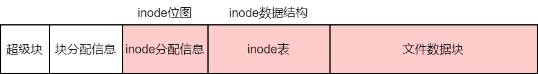
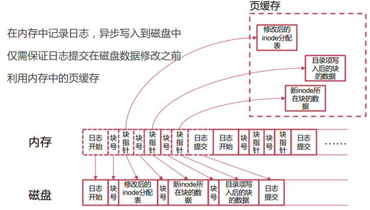
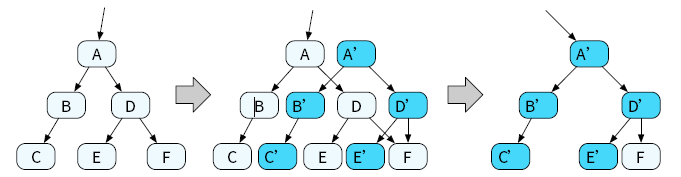
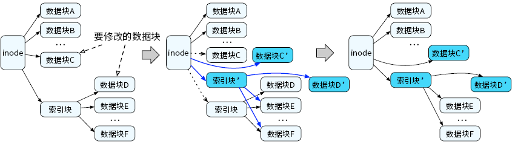

>本文的主要内容是介绍文件系统的崩溃一致性。

<!--more-->

## 1 崩溃一致性

每个文件系统接口的背后，文件系统需要做大量的工作，如空间分配、数据拷贝、元数据更改和数据结构修改等。如果这些修改的过程中发生掉电或崩溃，那么可能导致存储设备所保存的数据之间的一些内在关系遭到破坏。这种问题叫做**奔溃一致性（Crash Consistency）**问题。

以基于inode的文件系统为例，介绍创建文件涉及的文件系统崩溃一致性问题。

创建文件可以分为三步：

1. 分配inode。在inode分配信息中查找空闲的inode，并标记为1。
2. 初始化inode。把新文件的信息保存在inode结构之中。
3. 增加目录项。在父目录中添加新的目录项，保存新的文件名和inode号。


| 崩溃发生时的情况 | inode位图 | inode结构 | 目录项 | 是否影响使用 | 典型问题 |
| ---------------- | --------- | --------- | ------ | ------------ | -------- |
| 1                | 持久      | 未持久    | 未持久 | 否           | 资源泄露 |
| 2                | 未持久    | 持久      | 未持久 | 否           | 无       |
| 3                | 未持久    | 未持久    | 持久   | 是           | 信息错乱 |
| 4                | 未持久    | 持久      | 持久   | 是           | 信息错乱 |
| 5                | 持久      | 未持久    | 持久   | 是           | 信息错乱 |
| 6                | 持久      | 持久      | 未持久 | 否           | 资源泄露 |

如果已经写入到目录项中，那么该文件就是可以被发现的。这种情况下，如果inode位图或inode结构没有被正确持久化，就会出现信息错乱，从而影响使用。

### 1.1 文件系统所要求的三个属性

没有具备绝对一致性的文件系统。

```c
create("a"); fd = create("b"); write(fd, ...); crash
```

**持久化**：那些操作可见 - a和b都可见

**原子性**：要么所有操作都可见，要么都不可见 - 要么a和b都可见，要么都不可见

**有序性**：按照前缀序的方式可见 - 如果b可见，那么a也可见

## 2 同步写入

**同步写入**要求文件系统按照一定的顺序执行其中的各个步骤。

但这样会导致频繁写入存储设备，让存储设备成为性能瓶颈。

## 3 崩溃一致性保障方法

- 原子更新技术
  - 日志
  - 写时复制

- Soft Update

## 4 日志

### 4.1 日志机制的原理

在进行修改之前，先在日志中记录修改的内容，以便在发生崩溃等情况时通过日志进行数据恢复，保证多个修改的原子性。

#### 4.1.1 日志的生命周期

- 创建：为日志分配内存和存储空间，并初始化维护日志所需要的元数据。
- 写入：将要进行的操作或操作影响的数据及其所在的位置写入日志中。**在进行恢复时，处于写入阶段的日志会被直接丢弃。**
- 提交：文件系统将此前在日志中记录的操作原子地标记为有效。
- 完成：完成阶段，文件系统可以将实际的修改写回存储设备中。若此阶段发生崩溃，可以用日志中的内容进行恢复。
- 无效：完成所有的修改，且持久化完成之后，可以把日志标记为无效。
- 销毁：删除日志。

#### 4.1.2 日志的类型

按照日志中保存的内容和恢复时进行的操作，可以分为**重写日志**和**撤销日志**。

- 重写日志：将数据位置和此位置上即将被写入的新数据保存在日志中。后续可以用它来重做。
- 撤销日志：在日志中记录数据位置和位置上原本保存的数据。后面可以撤销修改，可以理解成备份（还原点）

### 4.2 日志优化

如果所有的修改都直接记录到日志，并且日志直接保存到磁盘上，会存在以下问题：

1. 每个操作都要写磁盘，内存缓存的优势被抵消
2. 每个修改都要拷贝新数据到日志
3. 相同块的多个修改被记录多次

#### 4.2.1 页缓存

利用内存中的页缓存，异步地将数据从内存写回存储设备中



缺点：依然要写两次磁盘

#### 4.2.2 批量处理日志以减少磁盘写

把日志内容进行合并。并且在特定时间触发提交日志。

- 定期触发
  - 每一段时间（如5s）触发一次
  - 日志达到一定量（如500MB）时触发一次

- 用户触发
  - 例如，应用调用fsync()时触发

## 5 写时拷贝

### 5.1 更新传递



在树形数据结构中，写时拷贝往往需要更新到根节点才会停止。我们修改节点C 和E 后，需要继续修改节点B、D 和A（根节点）。这种修改一些节点后，还需要进一步修改数据结构中其他节点以保证原子更新的问题，便称为更新传递问题。

**解决**：

解决更新传递问题，一种常见的方法是提前进行原子更新。对于树形数据结构来说，并非只有指向树根的指针才可以被原子更新；在上述例子中，原子更新的粒度为一个节点。若在更新传递的过程中，所有要进行的修改被一个原子更新粒度所覆盖，则可以直接原地进行修改，无需继续传递更新。例如在图13.3中，在节点A 中保存了指向节点B 和D 的指针。由于节点A 可以被原子更新，我们可以通过一次原地更新操作，原子地修改A 中指向节点B 和D的指针，让它们指向节点B’和D’，从而避免继续使用写时拷贝技术，停止更新传递。

### 5.2 写放大

写放大问题是指实际修改数据量大于用户要修改的数据量的情况。如在进行以4KB 内存页为粒度的写时拷贝技术时，若想要修改某个页中的1 个字节，我们不得不拷贝整个4KB 内存页中的所有数据，因此修改量从1 个字节被放大到4KB。写时拷贝技术中的更新传递，会使写放大问题更加严重。

**解决**：
当要修改的数据覆盖了完整的原子更新粒度时，可以无需拷贝原有数据，直接写入新的数据，从而在一定程度上缓解写放大问题。例如在图13.3中，由于原子更新粒度为一个节点，且E 节点中所有的数据均需要被修改，在分配E’后，即使我们将E 中的数据拷贝到E’，这些数据也会被新数据全部覆盖掉。因此，在这种情况下，可以省略写时拷贝中的拷贝操作，从而减少写入操作。

### 5.3 写时拷贝在文件系统中的应用



我们会将数据块C 和数据块D进行拷贝，并在拷贝副本上进行修改。由于指向数据块C 的指针保存在inode中，而指向数据块D 的指针保存在索引块中，我们需要继续对索引块进行写时拷贝。最终，需要修改的指向数据块C 的指针和指向索引块的指针均保存在inode 结构中。由于inode 结构通常小于存储设备的块大小，通过原子更新inode 结构，我们可以原子地持久化文件数据块C 和数据块D 上的数据修改。由于所有文件数据访问均从inode 结构出发，因此一个文件中的任何位置上的修改，均可以通过写时拷贝技术进行原子更新和持久化。

### 5.4 小结

写时拷贝技术对数据结构有一定的要求，当所有的修改最终能够变成一个原子修改时，才可以使用写时拷贝技术。此外，写时拷贝技术的使用与原子更新粒度有关。当修改的数据量远大于原子更新粒度时，往往只有数据头部和尾部需要真正进行拷贝操作，而中间部分可以根据前文提到的方法省略拷贝操作，直接使用新数据写入新分配出来的节点。这种情况下，写时拷贝技术产生的写放大相对较小。而当数据修改量小于原子更新粒度时，写时拷贝技术造成的写放大会非常严重，即使每次仅修改一个字节，也需要按照原子更新粒度进行数据拷贝。因此，是否适合使用写时拷贝，需要结合<u>原子更新粒度</u>和<u>数据修改量</u>综合考虑。

本文的内容属于基础理论概念。后续我们需要对带掉电保护的文件系统进行代码阅读分析，才能加深对文件系统崩溃一致性的理解。

**推荐阅读项目：**

1. *https://github.com/azure-rtos/levelx*
2. *https://github.com/azure-rtos/filex*
3. *https://github.com/littlefs-project/littlefs*