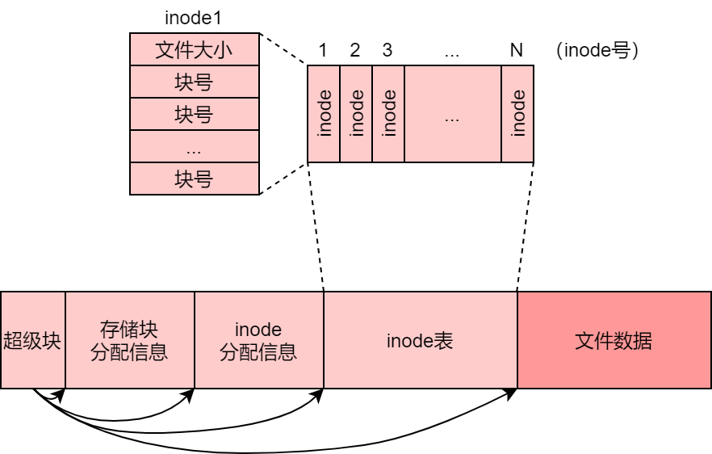
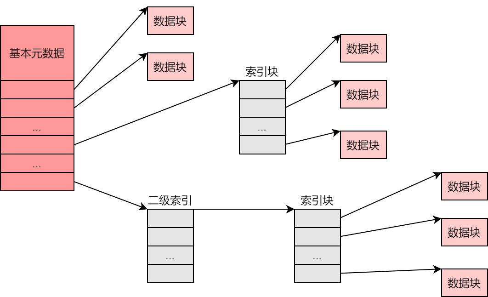
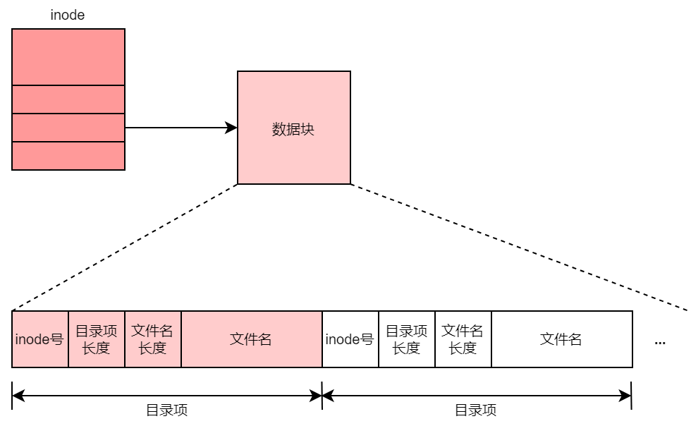
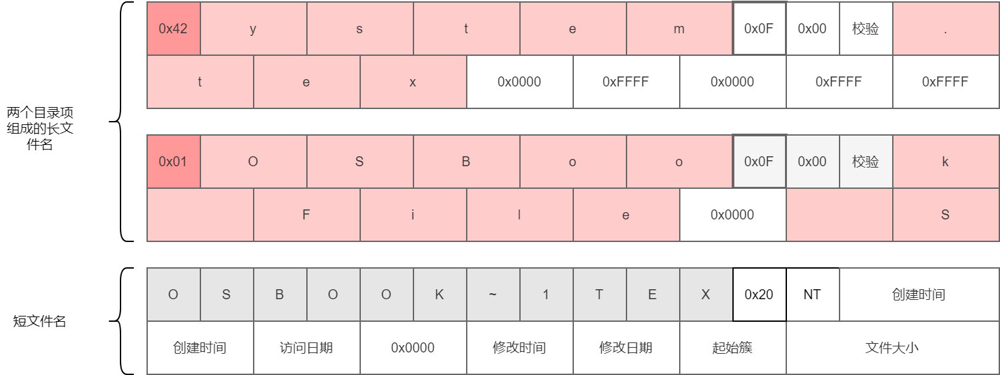
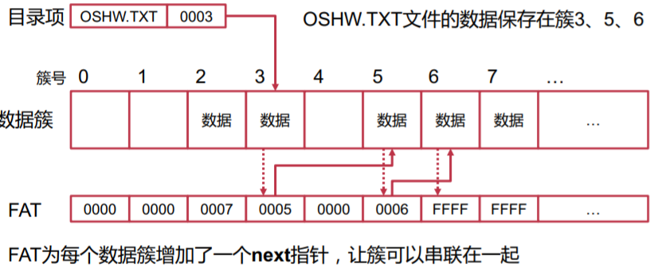
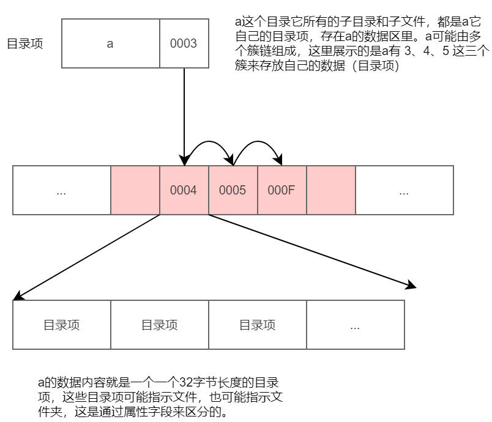

>本文的主要内容是介绍文件系统基础概念。

<!--more-->

## 文件系统概念

### 1 基于inode的文件系统



#### 1.1 inode与文件

inode，即index node，用于记录一个文件的数据所在的存储块号、文件大小以及其他更多的文件属性（包括权限、修改时间、访问时间等），这些属性称为文件的**元数据**。

inode文件系统的存储布局可以分成几个组成部分：

1. **超级块**：指示各个区域的起始块号和大小等信息，文件系统开始的第一个块就是超级块
2. **存储块分配信息**：记录哪些磁盘块正在被使用，哪些块处于空闲状态
3. **inode分配信息表**：记录哪些inode正在被使用，哪些inode是空闲的
4. **inode表**：以数组的方式保存的inode的数组，inode和文件是一一对应的
5. **文件数据区**：用来存储实际文件的内容

#### 1.2 多级inode

每个文件的大小是不一样的，可以从1KB到几GB，如果一个文件所有的存储块号顺序地保存在inode中，就得为所有的inode分配相同的大小，造成空间极大的浪费。

为了解决这个问题，借鉴虚拟内存页表管理的思想，可以采用多级inode的方式进行管理。



假设一个数据块的大小是4KB。一个索引块也是4KB，其中保存512个直接指针，那么一个间接指针能够管理512个4KB的数据块，共2MB数据。

相应的，一个二级索引就可以间接管理1GB的数据。

inode的结构就决定了文件系统能够支持的最大文件的大小。

#### 1.3 文件名与目录

一个文件对应一个inode，文件需要有文件名，那么文件名放在哪里保存呢？

在inode文件系统中，文件名并不作为inode的一部分，文件名由目录文件进行管理。

目录也是一个文件，只是它是一种特殊的由文件系统定义的文件。目录文件里面的数据，就是一条条从文件名到inode号的映射，每条映射成为一个**目录项（Directory Entry，dentry）**。



以**文件路径**确定一个文件的过程，就是从根目录开始，一级一级找到每一个目录的dentry，最后找到文件的inode的过程。

#### 1.4 硬链接

用dentry管理inode和文件名的方式，带来一个新的功能：链接。

如果已经存在一个文件和目录项，又有另外一个目录项的文件名和该文件的inode建立了映射，那么我们称这种新的文件名映射为**链接**。

为了管理这种链接，我们需要给inode增加一个**引用计数器**，也称**链接数**。

限制：只能用于同一个文件系统。

#### 1.5 软链接

如果是不同文件系统，我们要怎么链接呢？答案是使用**符号链接**，也叫**软链接**。

软链接可以理解成：它就是一个独立的文件，只是这个文件里面存的是**目标文件的路径**。

通常符号链接文件里面的内容就是路径字符串，因此我们可以不为它分配数据区，而是直接保存在inode中。

### 2 基于表的文件系统

FAT 文件系统，是基于**文件分配表（File Allocation Table）**的文件系统。

#### 2.1 存储布局

FAT文件系统的基本存储布局如下图所示。


- 引导记录：作用与超级块类似，其中记录了文件系统的元数据以及后续各个区域的位置。若此分区是可启动分区，还包含了引导整个操作系统启动所需要的代码。
- FAT表：通常由两份，互为备份。

FAT文件系统以**簇（Cluster）**为逻辑存储单元，每个簇对应物理存储上的一个或多个连续的存储**扇区（Sector）**。

#### 2.2 目录项格式

与基于inode文件系统不同，FAT中每个目录项的大小固定是32字节。

- **8.3格式的文件名（11字节）**

- **属性（1字节）**

- 创建时间（3字节）

- 创建日期（2字节）

- 最后访问日期（2字节）

- 最后修改时间（2字节）

- 最后修改日期（2字节）

- 数据的起始簇号（2字节）

- 文件大小（4字节）

- 保留字节（3字节）

属性。用来表示该目录项的种类和状态。如果是长文件名，则属性字段固定是0x0F。

短文件名。采用8.3格式，前8字节是文件名，3字节为扩展名。固定用大写存储。

长文件名。在短文件名签名添加一个长文件名。



- 文件系统会自动为"OSBook File System.tex"这个文件生成短文件名。
- 长文件名构建目录项保存在短文件名目录项之前。
- 使用2字节的Unicode编码。

#### 2.3 FAT和文件格式

FAT实际上是一个由簇号组成的数组。




#### 2.4 FAT文件系统小结

FAT是FAT文件系统的核心。本质上，一个文件的多个数据簇以链表的形式进行索引。

相比与基于inode的文件系统，这种方式更加简单直接。

但是使用链表的结构在查找时并不高效。如果要访问一个文件的中间部分，FAT文件系统不得不逐个簇进行查找，使得大文件的访存变得尤为缓慢。

**参考资料**

1. https://en.wikipedia.org/wiki/File_Allocation_Table#External_links
2. http://elm-chan.org/fsw/ff/00index_e.html
3. http://elm-chan.org/docs/fat_e.html
4. http://www.c-jump.com/CIS24/Slides/FAT/lecture.html

### 3 FatFS代码导读

本节通过阅读FatFS几个核心的API，以加深对FAT文件系统的理解。

#### f_mkdir

```c
FRESULT f_mkdir (
    const TCHAR* path       /* Pointer to the directory path */
)
{
    // ..

    // 1. 先确认已经mount
    res = mount_volume(&path, &fs, FA_WRITE);   /* Get logical drive */
    if (res == FR_OK) {
        dj.obj.fs = fs;
        INIT_NAMBUF(fs);
        // 2. 找到最后的路径
        res = follow_path(&dj, path);           /* Follow the file path */
        if (res == FR_OK) res = FR_EXIST;       /* Name collision? */
        // ...
        if (res == FR_NO_FILE) {                /* It is clear to create a new directory */
            sobj.fs = fs;                       /* New object id to create a new chain */
            // 3. 创建一个新的簇，用来放这个新的目录文件
            dcl = create_chain(&sobj, 0);       /* Allocate a cluster for the new directory */
            res = FR_OK;
            if (dcl == 0) res = FR_DENIED;      /* No space to allocate a new cluster? */
            if (dcl == 1) res = FR_INT_ERR;     /* Any insanity? */
            if (dcl == 0xFFFFFFFF) res = FR_DISK_ERR;   /* Disk error? */
            tm = GET_FATTIME();
            if (res == FR_OK) {
                // 4. 初始化目录项
                res = dir_clear(fs, dcl);       /* Clean up the new table */
                if (res == FR_OK) {
                    if (!FF_FS_EXFAT || fs->fs_type != FS_EXFAT) {  /* Create dot entries (FAT only) */
                        memset(fs->win + DIR_Name, ' ', 11);    /* Create "." entry */
                        fs->win[DIR_Name] = '.';
                        fs->win[DIR_Attr] = AM_DIR;
                        st_dword(fs->win + DIR_ModTime, tm);
                        st_clust(fs, fs->win, dcl);
                        memcpy(fs->win + SZDIRE, fs->win, SZDIRE);  /* Create ".." entry */
                        fs->win[SZDIRE + 1] = '.'; pcl = dj.obj.sclust;
                        st_clust(fs, fs->win + SZDIRE, pcl);
                        fs->wflag = 1;
                    }
                    res = dir_register(&dj);    /* Register the object to the parent directoy */
                }
            }
            // 5. 保存到文件系统
            if (res == FR_OK) {
                {
                    st_dword(dj.dir + DIR_ModTime, tm); /* Created time */
                    st_clust(fs, dj.dir, dcl);          /* Table start cluster */
                    dj.dir[DIR_Attr] = AM_DIR;          /* Attribute */
                    fs->wflag = 1;
                }
                if (res == FR_OK) {
                    res = sync_fs(fs);
                }
            } else {
                remove_chain(&sobj, dcl, 0);        /* Could not register, remove the allocated cluster */
            }
        }
        FREE_NAMBUF();
    }

    LEAVE_FF(fs, res);
}
```

创建目录总共可以分为四步。

##### mount_volume

确认该路径是已经mount过了。

##### follow_path

假设我们新建的目录是 `"/a/b/c"`，那么我们需要从根目录开始，逐级找到`/a`和`"/a/b"`，然后返回`"/a/b"`这个父级目录项。这就是`follow_path`要做的事情。

```c
static FRESULT follow_path (    /* FR_OK(0): successful, !=0: error code */
    DIR* dp,                    /* Directory object to return last directory and found object */
    const TCHAR* path           /* Full-path string to find a file or directory */
)
{
    FRESULT res;
    BYTE ns;
    FATFS *fs = dp->obj.fs;

    // 1. 跳过分隔符
    {                                       /* With heading separator */
        while (IsSeparator(*path)) path++;  /* Strip separators */
        dp->obj.sclust = 0;                 /* Start from the root directory */
    }

    // 2. 这里主要是处理根目录的场景
    if ((UINT)*path < ' ') {                /* Null path name is the origin directory itself */
        dp->fn[NSFLAG] = NS_NONAME;
        res = dir_sdi(dp, 0);
    } else {                                /* Follow path */
        // 3. 逐级目录进行处理
        for (;;) {
            // 3.1. 找到top的目录的名字，保存在dp->fn中，如 /a/b/c，先得到A，下一次进来再得到B（会转为大写）
            res = create_name(dp, &path);   /* Get a segment name of the path */
            if (res != FR_OK) break;
            // 3.2 找到目录项
            res = dir_find(dp);             /* Find an object with the segment name */
            ns = dp->fn[NSFLAG];
            // 3.2 如果没有找到
            if (res != FR_OK) {             /* Failed to find the object */
                if (res == FR_NO_FILE) {    /* Object is not found */
                    if (FF_FS_RPATH && (ns & NS_DOT)) { /* If dot entry is not exist, stay there */
                        if (!(ns & NS_LAST)) continue;  /* Continue to follow if not last segment */
                        dp->fn[NSFLAG] = NS_NONAME;
                        res = FR_OK;
                    } else {                            /* Could not find the object */
                        if (!(ns & NS_LAST)) res = FR_NO_PATH;  /* Adjust error code if not last segment */
                    }
                }
                break;
            } 
            // 如果找到了，并且follow_path已经到了最后，那么退出
            if (ns & NS_LAST) break;        /* Last segment matched. Function completed. */
            // 如果找到了，但是它并不是一个目录（如/a/b 并不是一个目录项，那么它是不能follow的）
            if (!(dp->obj.attr & AM_DIR)) { /* It is not a sub-directory and cannot follow */
                res = FR_NO_PATH; break;
            }
            // 如果都符合，那么找到了对应这一级的目录项，更新sclust为这个目录项起始的簇（也可以理解为进入子目录）
            {
                dp->obj.sclust = ld_clust(fs, fs->win + dp->dptr % SS(fs)); /* Open next directory */
            }
        }
    }

    return res;
}
```

`follow_path`这个函数稍微有点复杂，不过理解了这个函数，我们就能知道FAT是如何进行目录管理的了。

首先一开始，dp->obj.sclust 默认为0，也就是被理解为 root 目录（起始root目录的起始簇并不是0，但可以理解成它指示从根目录开始查找）。

我们的path是`/a/b/c`，首先我们要从根目录里面找到`/a`这个目录项。具体是怎么做的呢：

(a) `create_name(dp, &path)`，把 `"a"` 保存在 `dp->fn` 中，然后path 变成`/b/c`

(b) `dir_find(dp)`，从根目录里面查找 `a` 这个目录项

(c) 更新目录项的起始簇（有也可以理解成进入子目录）

这里我们对 `dir_find()`这个函数做进一步的分析。

```c
static FRESULT dir_find (   /* FR_OK(0):succeeded, !=0:error */
    DIR* dp                 /* Pointer to the directory object with the file name */
)
{
    FRESULT res;
    FATFS *fs = dp->obj.fs;
    BYTE c;
#if FF_USE_LFN
    BYTE a, ord, sum;
#endif
    // 从父目录的头开始查找，set index 为0
    res = dir_sdi(dp, 0);           /* Rewind directory object */
    if (res != FR_OK) return res;

    do {
        // 不断地更新窗口
        res = move_window(fs, dp->sect);
        if (res != FR_OK) break;
        c = dp->dir[DIR_Name];
        if (c == 0) { res = FR_NO_FILE; break; }    /* Reached to end of table */

        dp->obj.attr = dp->dir[DIR_Attr] & AM_MASK;
        // 比较目录项的名字，如果相同，就是找到了
        if (!(dp->dir[DIR_Attr] & AM_VOL) && !memcmp(dp->dir, dp->fn, 11)) break;   /* Is it a valid entry? */
        // 否则，继续找下一个目录项
        res = dir_next(dp, 0);  /* Next entry */
    } while (res == FR_OK);

    return res;
}
```

这里面涉及到`dir_sdi()`和`move_window()`以及`dir_next()`这几个函数。我们不妨继续展开说说。

`dir_sdi`这个函数是根据`offset`更新`dp->clust`和`dp->sect`。这个函数里面体现了FAT表、数据簇和扇区的关系，代码分析贴在注释中：

```c
static FRESULT dir_sdi (    /* FR_OK(0):succeeded, !=0:error */
    DIR* dp,        /* Pointer to directory object */
    DWORD ofs       /* Offset of directory table */
)
{
    DWORD csz, clst;
    FATFS *fs = dp->obj.fs;

    dp->dptr = ofs;             /* Set current offset */
    // clst 现在指向 这个目录的起始簇
    clst = dp->obj.sclust;      /* Table start cluster (0:root) */
    // 如果clst是0，那么用 root 簇来代替
    if (clst == 0 && fs->fs_type >= FS_FAT32) { /* Replace cluster# 0 with root cluster# */
        clst = (DWORD)fs->dirbase;
        if (FF_FS_EXFAT) dp->obj.stat = 0;  /* exFAT: Root dir has an FAT chain */
    }
    // 继续是 root 目录的特殊处理
    if (clst == 0) {    /* Static table (root-directory on the FAT volume) */
        if (ofs / SZDIRE >= fs->n_rootdir) return FR_INT_ERR;   /* Is index out of range? */
        dp->sect = fs->dirbase;

    } else {            /* Dynamic table (sub-directory or root-directory on the FAT32/exFAT volume) */
        // 如果不是根目录，那么我们就需要计算 offset 位于哪一个簇，哪一个扇区了
        csz = (DWORD)fs->csize * SS(fs);    /* Bytes per cluster */
        while (ofs >= csz) {                /* Follow cluster chain */
            // 如果超过了一个簇，那么就根据FAT表找到它的下一个簇
            clst = get_fat(&dp->obj, clst);             /* Get next cluster */
            if (clst == 0xFFFFFFFF) return FR_DISK_ERR; /* Disk error */
            if (clst < 2 || clst >= fs->n_fatent) return FR_INT_ERR;    /* Reached to end of table or internal error */
            ofs -= csz;
        }
        dp->sect = clst2sect(fs, clst);
    }
    // 最后就是把 clst 和 sect 写到 dp 中
    dp->clust = clst;                   /* Current cluster# */
    if (dp->sect == 0) return FR_INT_ERR;
    dp->sect += ofs / SS(fs);           /* Sector# of the directory entry */
    dp->dir = fs->win + (ofs % SS(fs)); /* Pointer to the entry in the win[] */

    return FR_OK;
}
```

`move_window()`这个函数体现了，FAT是怎么缓存扇区内容的——它在`fs->win`中一个扇区的内容。`move_window()`就是把一个扇区的数据更新到`fs->win`中。如果之前`fs->win`的数据是dirty了，那么先提前sync到物理存储中。（这几乎就是FAT文件系统最主要的缓存机制了 = =！）

```c
static FRESULT move_window (    /* Returns FR_OK or FR_DISK_ERR */
    FATFS* fs,      /* Filesystem object */
    LBA_t sect      /* Sector LBA to make appearance in the fs->win[] */
)
{
    FRESULT res = FR_OK;


    if (sect != fs->winsect) {  /* Window offset changed? */
#if !FF_FS_READONLY
        res = sync_window(fs);      /* Flush the window */
#endif
        if (res == FR_OK) {         /* Fill sector window with new data */
            if (disk_read(fs->pdrv, fs->win, sect, 1) != RES_OK) {
                sect = (LBA_t)0 - 1;    /* Invalidate window if read data is not valid */
                res = FR_DISK_ERR;
            }
            fs->winsect = sect;
        }
    }
    return res;
}
```

了解了`dir_sdi()`的机制，也就很容易理解`dir_next()`所作的事情了。它要做的就是要到下一个目录项。这个函数的要点：

- 当前目录的指针是`dp->dptr`，每一个目录项的长度是SZDIRE，也就是32个字节
- 如果到达sector边界，那么就更新sector
- 如果到达clust边界，那么就通过 `get_fat()` 获取下一个簇 

```c
static FRESULT dir_next (   /* FR_OK(0):succeeded, FR_NO_FILE:End of table, FR_DENIED:Could not stretch */
    DIR* dp,                /* Pointer to the directory object */
    int stretch             /* 0: Do not stretch table, 1: Stretch table if needed */
)
{
    DWORD ofs, clst;
    FATFS *fs = dp->obj.fs;


    ofs = dp->dptr + SZDIRE;    /* Next entry */
    if (ofs >= (DWORD)((FF_FS_EXFAT && fs->fs_type == FS_EXFAT) ? MAX_DIR_EX : MAX_DIR)) dp->sect = 0;  /* Disable it if the offset reached the max value */
    if (dp->sect == 0) return FR_NO_FILE;   /* Report EOT if it has been disabled */

    if (ofs % SS(fs) == 0) {    /* Sector changed? */
        dp->sect++;             /* Next sector */

        if (dp->clust == 0) {   /* Static table */
            if (ofs / SZDIRE >= fs->n_rootdir) {    /* Report EOT if it reached end of static table */
                dp->sect = 0; return FR_NO_FILE;
            }
        }
        else {                  /* Dynamic table */
            if ((ofs / SS(fs) & (fs->csize - 1)) == 0) {    /* Cluster changed? */
                clst = get_fat(&dp->obj, dp->clust);        /* Get next cluster */
                if (clst <= 1) return FR_INT_ERR;           /* Internal error */
                if (clst == 0xFFFFFFFF) return FR_DISK_ERR; /* Disk error */
                if (clst >= fs->n_fatent) {                 /* It reached end of dynamic table */
#if !FF_FS_READONLY
                    if (!stretch) {                             /* If no stretch, report EOT */
                        dp->sect = 0; return FR_NO_FILE;
                    }
                    clst = create_chain(&dp->obj, dp->clust);   /* Allocate a cluster */
                    if (clst == 0) return FR_DENIED;            /* No free cluster */
                    if (clst == 1) return FR_INT_ERR;           /* Internal error */
                    if (clst == 0xFFFFFFFF) return FR_DISK_ERR; /* Disk error */
                    if (dir_clear(fs, clst) != FR_OK) return FR_DISK_ERR;   /* Clean up the stretched table */
                    if (FF_FS_EXFAT) dp->obj.stat |= 4;         /* exFAT: The directory has been stretched */
#else
                    if (!stretch) dp->sect = 0;                 /* (this line is to suppress compiler warning) */
                    dp->sect = 0; return FR_NO_FILE;            /* Report EOT */
#endif
                }
                dp->clust = clst;       /* Initialize data for new cluster */
                dp->sect = clst2sect(fs, clst);
            }
        }
    }
    dp->dptr = ofs;                     /* Current entry */
    dp->dir = fs->win + ofs % SS(fs);   /* Pointer to the entry in the win[] */

    return FR_OK;
}
```

理解了这三个子函数，我们也就能知道 `dir_find()`的原理了。它不过是要逐个找到目录项，然后比较目录项的名字，和当前要找的目录项是否匹配。

目录项的存储结构示意图如下，**请仔细理解这个图，因为它是理解FAT文件系统目录和文件管理机制的关键**。



再回到 `follow_path(&dj, path)`，我们要新建的是`/a/b/c` 这个目录，假设`/a/b`已经存在，那么最终，`/a/b/c`这个目录肯定是找不到的，因为还没有创建。而`/a/b`可以找到，它保存在 `dj`中。

##### create_chain

创建一个新的簇，用来存放即将要添加的新的目录。

这个函数主要是FAT表的管理。这里列出一些该函数的要点：

- `fs->last_clst` 中保存了上次分配的簇，也即当前建议开始查找的簇
- `fs->free_clst` 中保存了剩余的空闲簇
- `get_fat()`就是根据簇号找到FAT表对应的FAT entry，它是4字节长度的数据
- 为0表示空闲的簇
- 分配完成之后，这个簇就是簇链最后的簇，因此给它的FAT entry赋值为0xFFFFFFFF

```c
static DWORD create_chain ( /* 0:No free cluster, 1:Internal error, 0xFFFFFFFF:Disk error, >=2:New cluster# */
    FFOBJID* obj,       /* Corresponding object */
    DWORD clst          /* Cluster# to stretch, 0:Create a new chain */
)
{
    DWORD cs, ncl, scl;
    FRESULT res;
    FATFS *fs = obj->fs;

    // 我们要新建一个chain，因此 clst传入的是0, 如果不是0，表示在原先的簇链上再添加一个簇。
    if (clst == 0) {    /* Create a new chain */
        scl = fs->last_clst;                /* Suggested cluster to start to find */
        if (scl == 0 || scl >= fs->n_fatent) scl = 1;
    }
    else {              /* Stretch a chain */
        cs = get_fat(obj, clst);            /* Check the cluster status */
        if (cs < 2) return 1;               /* Test for insanity */
        if (cs == 0xFFFFFFFF) return cs;    /* Test for disk error */
        if (cs < fs->n_fatent) return cs;   /* It is already followed by next cluster */
        scl = clst;                         /* Cluster to start to find */
    }
    if (fs->free_clst == 0) return 0;       /* No free cluster */

    {   /* On the FAT/FAT32 volume */
        ncl = 0;
        if (scl == clst) {                      /* Stretching an existing chain? */
            ncl = scl + 1;                      /* Test if next cluster is free */
            if (ncl >= fs->n_fatent) ncl = 2;
            cs = get_fat(obj, ncl);             /* Get next cluster status */
            if (cs == 1 || cs == 0xFFFFFFFF) return cs; /* Test for error */
            if (cs != 0) {                      /* Not free? */
                cs = fs->last_clst;             /* Start at suggested cluster if it is valid */
                if (cs >= 2 && cs < fs->n_fatent) scl = cs;
                ncl = 0;
            }
        }
        if (ncl == 0) { /* The new cluster cannot be contiguous and find another fragment */
            ncl = scl;  /* Start cluster */
            for (;;) {
                ncl++;                          /* Next cluster */
                if (ncl >= fs->n_fatent) {      /* Check wrap-around */
                    ncl = 2;
                    if (ncl > scl) return 0;    /* No free cluster found? */
                }
                cs = get_fat(obj, ncl);         /* Get the cluster status */
                if (cs == 0) break;             /* Found a free cluster? */
                if (cs == 1 || cs == 0xFFFFFFFF) return cs; /* Test for error */
                if (ncl == scl) return 0;       /* No free cluster found? */
            }
        }
        res = put_fat(fs, ncl, 0xFFFFFFFF);     /* Mark the new cluster 'EOC' */
        if (res == FR_OK && clst != 0) {
            res = put_fat(fs, clst, ncl);       /* Link it from the previous one if needed */
        }
    }

    if (res == FR_OK) {         /* Update FSINFO if function succeeded. */
        fs->last_clst = ncl;
        if (fs->free_clst <= fs->n_fatent - 2) fs->free_clst--;
        fs->fsi_flag |= 1;
    } else {
        ncl = (res == FR_DISK_ERR) ? 0xFFFFFFFF : 1;    /* Failed. Generate error status */
    }

    return ncl;     /* Return new cluster number or error status */
}
```

##### 目录项初始化

```c
if (res == FR_OK) {
    // 清除目录
    res = dir_clear(fs, dcl);       /* Clean up the new table */
    if (res == FR_OK) {
        // 创建 "." 和 ".." 这两个目录项
        if (!FF_FS_EXFAT || fs->fs_type != FS_EXFAT) {  /* Create dot entries (FAT only) */
            memset(fs->win + DIR_Name, ' ', 11);    /* Create "." entry */
            fs->win[DIR_Name] = '.';
            fs->win[DIR_Attr] = AM_DIR;
            st_dword(fs->win + DIR_ModTime, tm);
            st_clust(fs, fs->win, dcl);
            memcpy(fs->win + SZDIRE, fs->win, SZDIRE);  /* Create ".." entry */
            fs->win[SZDIRE + 1] = '.'; pcl = dj.obj.sclust;
            st_clust(fs, fs->win + SZDIRE, pcl);
            fs->wflag = 1;
        }
        // 把该目录项注册到父级目录中（添加dir entry）,之前就是从父级目录分配的，只是还没有保存 子目录项的 起始簇号等信息
        res = dir_register(&dj);    /* Register the object to the parent directoy */
    }
}
if (res == FR_OK) {
    {
        // 为该目录项更新起始簇号和其他属性信息
        st_dword(dj.dir + DIR_ModTime, tm); /* Created time */
        st_clust(fs, dj.dir, dcl);          /* Table start cluster */
        dj.dir[DIR_Attr] = AM_DIR;          /* Attribute */
        fs->wflag = 1;
    }
    // 刷新到驱动中
    if (res == FR_OK) {
        res = sync_fs(fs);
    }
}
```

- 清空目录
- 创建 `.` 和 `..` 这两个目录项
- `dir_register`注册到父级目录中
- 更新起始簇号和其他属性信息

```C
static FRESULT dir_register (   /* FR_OK:succeeded, FR_DENIED:no free entry or too many SFN collision, FR_DISK_ERR:disk error */
    DIR* dp                     /* Target directory with object name to be created */
)
{
    FRESULT res;
    FATFS *fs = dp->obj.fs;

    res = dir_alloc(dp, 1);     // 分配一个目录项

    /* Set SFN entry */
    if (res == FR_OK) {
        res = move_window(fs, dp->sect);
        if (res == FR_OK) {
            memset(dp->dir, 0, SZDIRE); /* Clean the entry */
            // 保存名字
            memcpy(dp->dir + DIR_Name, dp->fn, 11); /* Put SFN */

            fs->wflag = 1;
        }
    }

    return res;
}
```

这样，就完成了一个目录项的创建。

通过分析这样的一个函数，我们可以一窥FAT文件系统对目录、文件的管理。

目录是一种特殊类型的文件，区别在于，目录文件的数据区存储的是一个个的目录项，而普通的文件的数据区中存储的是文件数据的内容。