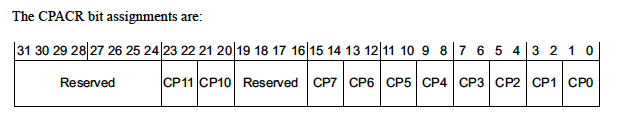
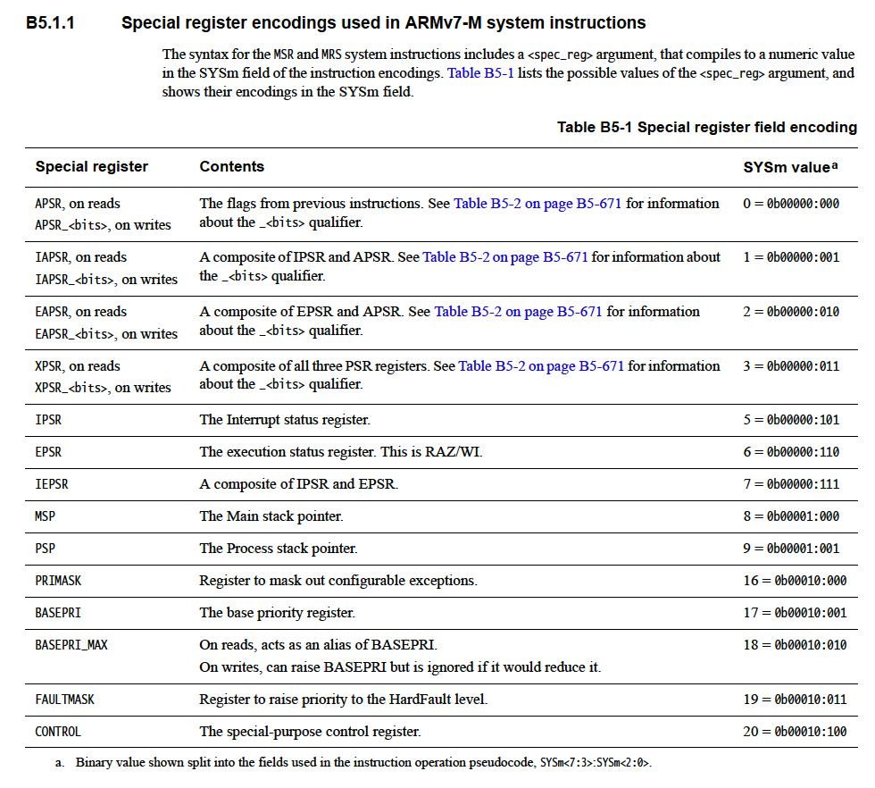
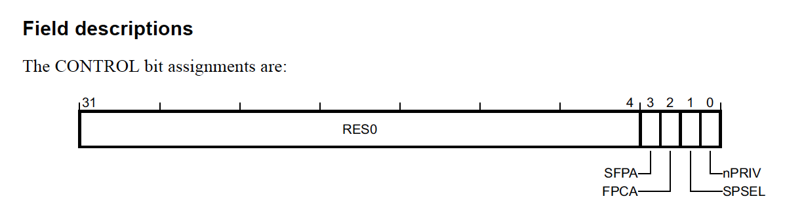
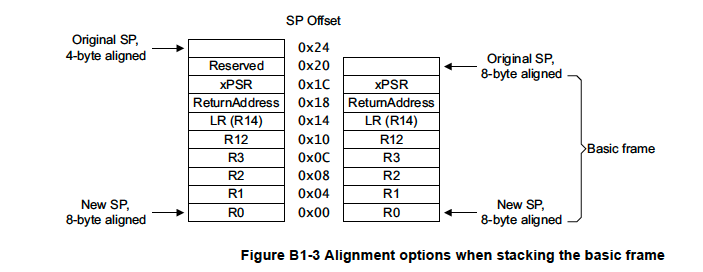
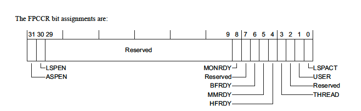
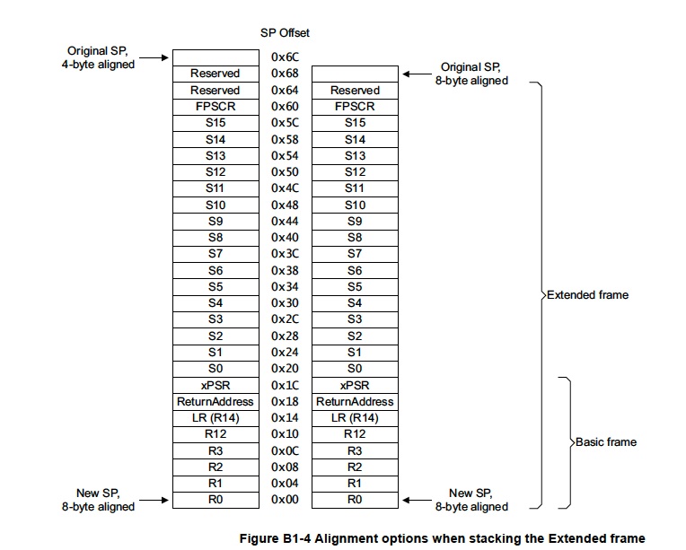

> 本文介绍ARM Cortex-m设备上下文切换相关内容。

<!--more-->

## Cortex-M ARM MCU Features

ARM体系结构过程调用标准（AAPCS）定义了ARM编译器需要遵循的ABI接口。

### Cortex-M Operation Modes

运行在异常处理函数如 ISR 时，处于 **Handler Mode**。否则是 **Thread Mode**。

在 Handler Mode 时，总是处于特权模式 (**privileged**)。

在 Thread Mode 时，可以处于特权模式，也可以处于非特权模式（**unprivileged**）。

一些指令或操作只允许在特权模式下执行，如访问 NVIC 寄存器。

只有在 Handler Mode 的时候，才允许将 Thread Mode 从非特权模式切换到特权模式。

### Registers

#### Core Registers

| Register                    | Alternative Names            | Role in the procedure call standard                          |
| :-------------------------- | :--------------------------- | :----------------------------------------------------------- |
| `r15`                       | `PC`                         | The Program Counter (Current Instruction)                    |
| `r14`                       | `LR`                         | The Link Register (Return Address)                           |
| `r13`                       | `SP`                         | The Stack Pointer                                            |
| `r12`                       | `IP`                         | The [Intra-Procedure-call](https://interrupt.memfault.com/blog/cortex-m-rtos-context-switching#ip-register) scratch register |
| `r11`                       | `v8`                         | Variable-register 8                                          |
| `r10`                       | `v7`                         | Variable-register 7                                          |
| `r9`                        | `v6`, `SB`, `TR`             | Variable-register 6 or [Platform Register](https://interrupt.memfault.com/blog/cortex-m-rtos-context-switching#r9-platform-register) |
| `r8`,`r7`, `r6`, `r5`, `r4` | `v5`, `v4`, `v3`, `v2`, `v1` | Variable-register 5 - Variable-register 1                    |
| `r3`, `r2`, `r1`, `r0`      | `a4`, `a3`, `a2`, `a1`       | Argument / scratch register 4 - Argument / scratch register 1 |

##### r12 Intra-Procedure-call Scratch Register

当执行 `bl` 跳转指令时，并不是任意位置都可以跳转的（因为32 bits 的指令中有一些位被用来编码指令本身了）。

这时候，要跳转到一个比较远的地址，需要用到链接器生成的 shim function （也叫 **veneer**）。这个函数可以使用 r12 寄存器而不需要保存它原来的值。

##### r9 as Platform Register

大多数时候，r9被用来作为变量寄存器（v6）。但有时候它也被用来作为其他用途。

一种应用时把 r9 寄存器用作静态基址（*static base*）。当我们编写一段代码时，我们希望它可以在任意位置运行，这种代码叫做位置无关代码（**Position Independent Code, PIC**）。对于这种代码，我们需要给出全局和静态变量的地址，也叫做全局偏移表（**Global Offset Table**）。这个表的地址被保存在 r9 中。

> 通过 -fpic 和 -msingle-pic-base 来使能这个特性。

#### Floating Point (FP) registers

即使支持FPU，复位后默认也是没有使能的。要打开FPU，需要设置 协处理器访问控制器 *Coprocessor Access Control Register* (**CPACR** - 0xE000ED88) 。



#### Special Registers

特殊寄存器的访问用到两条指令：

- MRS - Move from Register to Special register
- MSR - Move to Special Register



另外，

> 非特权级的代码读取 stack pointer, priority masks, IPSR 都将返回0
>
> Thread Mode 的非特权级代码写 stack pointer, EPSR, IPSR, Masks，CONTROL，都会被忽略。如果在特权级的 Thread Mode 中写1 到CONTROL.nPriv 位，会切到非特权级。这时候需要跟这一个ISB指令，确保指令取址的正确性。



其中，

- SFPA - 指示安全浮点单元是否激活，只在 ARMv8-M上才实现了
- FPCA - 指示浮点上下文是否激活
- SPSEL - 控制用msp还是psp，为1时用psp
- nPriv - 为1时，Thread Mode 会处于非特权级

### Stack Pointers

Cortex-M 实现了两个栈指针寄存器，msp和psp。

复位后默认使用msp，且它的值保存在中断向量表的起始位置。

在 Handler Mode，总是使用msp。在 Thread Mode，SPSEL为1时用psp。

### Context State Stacking

AAPCS中规定，子例程必须要需要保存 r4-r8, r10, r11, SP（callee-save）。

[C]PSR中保存了比较相关的一些状态，需要 caller-save。

且AAPCS要求进入子函数时必须8字节对齐。

> 自动压栈到psp还是msp，是根据异常发生前的状态决定的。如果之前是处于 Thread Mode，则会用psp压栈；否则会用msp。



> ARM 用 xPSR 的 bit9 指示是否增加了4字节填充用来做8字节对齐。

#### FP Extension & Context State Stacking

如果有浮点数扩展，s0-s15以及FPSCR，总共16个寄存器可能会处理器自动压栈。

s16-s31 这16个寄存器可能需要做额外的软件保存。

一种优化是使用 lazy context  save。只有检测到 ISR 中用到了FPU，才做相关压栈。



- ASPEN - 为1时，所有的浮点数指令都会置位FPCA位
- LSPEN - 为1时，使用 laze context save



#### Exception Return

在异常退出时，需要给 lr 寄存器装载一个特殊的值，叫做EXC_RETURN。

| EXC_RETURN Value | Mode to Return To                 | Stack to use |
| :--------------- | :-------------------------------- | :----------- |
| 0xFFFFFFF1       | Handler Mode                      | MSP          |
| 0xFFFFFFF9       | Thread Mode                       | MSP          |
| 0xFFFFFFFD       | Thread Mode                       | PSP          |
| 0xFFFFFFE1       | Handler Mode (FPU Extended Frame) | MSP          |
| 0xFFFFFFE9       | Thread Mode (FPU Extended Frame)  | MSP          |
| 0xFFFFFFED       | Thread Mode (FPU Extended Frame)  | PSP          |

bit4 : 0 表示 FPU 已激活

bit3 : 0 表示返回到 Thread Mode

bit2 : 0 表示使用msp

**如何理解 LR 和 返回地址？**

- 在普通函数调用返回时，`bl lr`就是跳转到lr寄存器里面的地址执行。
- 但是在异常返回时，lr 里面保存的是一个叫做EXC_RETURN的值。它让处理器知道是要回到 Handler Mode 还是 Thread Mode；是否有FPU上下文，以及回去后要使用msp还是psp。具体跳转回到哪里执行，还是根据硬件出栈里面的返回地址（ReturnAddress）来确定的。

## RTOS Context Switching

SysTickHandler：

主要是增加tick，并触发PendSV异常。

```C
void xPortSysTickHandler( void )
{
    /* The SysTick runs at the lowest interrupt priority, so when this interrupt
    executes all interrupts must be unmasked.  There is therefore no need to
    save and then restore the interrupt mask value as its value is already
    known. */
    portDISABLE_INTERRUPTS();
    {
        /* Increment the RTOS tick. */
        if( xTaskIncrementTick() != pdFALSE )
        {
            /* A context switch is required.  Context switching is performed in
            the PendSV interrupt.  Pend the PendSV interrupt. */
            portNVIC_INT_CTRL_REG = portNVIC_PENDSVSET_BIT;
        }
    }
    portENABLE_INTERRUPTS();
}
```

PendSV：

```c
// FreeRTOSConfig.h

#define vPortSVCHandler    SVC_Handler
#define xPortPendSVHandler PendSV_Handler
#define xPortSysTickHandler SysTick_Handler

// port.c
void xPortPendSVHandler( void )
{
    /* This is a naked function. */

    __asm volatile
        (
        "       mrs r0, psp                     \n"
        "       isb                             \n"
        "                                       \n"
        "       ldr     r3, pxCurrentTCBConst   \n" /* Get the location of the current TCB. */
        "       ldr     r2, [r3]                \n"
        "                                       \n"
        "       tst r14, #0x10                  \n" /* Is the task using the FPU context?  If so, push high vfp registers. */
        "       it eq                           \n"
        "       vstmdbeq r0!, {s16-s31}         \n"
        "                                       \n"
        "       stmdb r0!, {r4-r11, r14}        \n" /* Save the core registers. */
        "       str r0, [r2]                    \n" /* Save the new top of stack into the first member of the TCB. */
        "                                       \n"
        "       stmdb sp!, {r0, r3}             \n"
        "       mov r0, %0                      \n"
        "       msr basepri, r0                 \n"
        "       dsb                             \n"
        "       isb                             \n"
        "       bl vTaskSwitchContext           \n"
        "       mov r0, #0                      \n"
        "       msr basepri, r0                 \n"
        "       ldmia sp!, {r0, r3}             \n"
        "                                       \n"
        "       ldr r1, [r3]                    \n" /* The first item in pxCurrentTCB is the task top of stack. */
        "       ldr r0, [r1]                    \n"
        "                                       \n"
        "       ldmia r0!, {r4-r11, r14}        \n" /* Pop the core registers. */
        "                                       \n"
        "       tst r14, #0x10                  \n" /* Is the task using the FPU context?  If so, pop the high vfp registers too. */
        "       it eq                           \n"
        "       vldmiaeq r0!, {s16-s31}         \n"
        "                                       \n"
        "       msr psp, r0                     \n"
        "       isb                             \n"
        "                                       \n"
        "                                       \n"
        "       bx r14                          \n"
        "                                       \n"
        "       .align 4                        \n"
        "pxCurrentTCBConst: .word pxCurrentTCB  \n"
        ::"i"(configMAX_SYSCALL_INTERRUPT_PRIORITY)
    );
}
```

1. 判断是否使用了FPU上下文（LR的bit4）
2. 如果使用了FPU上下文，那么保存 {s16-s31}
3. 保存 {r4-r11, r14}
4. psp保存在当前TCB的第一个字段中
5. 关中断，basepri设置为configMAX_SYSCALL_INTERRUPT_PRIORITY
6. 调用 vTaskSwitchContext，这时候pxCurrentTCB 被更新
7. 开中断
8. 从新的任务的栈中恢复{r4-r11, r14}
9. 如果FPU激活，则恢复{s16-s31}
10. 把新任务的栈恢复到psp中
11. bx r14，跳到新的任务执行 -> 再次说明，这里的r14，也就是lr，放的不是返回地址，而是EXC_RETURN。