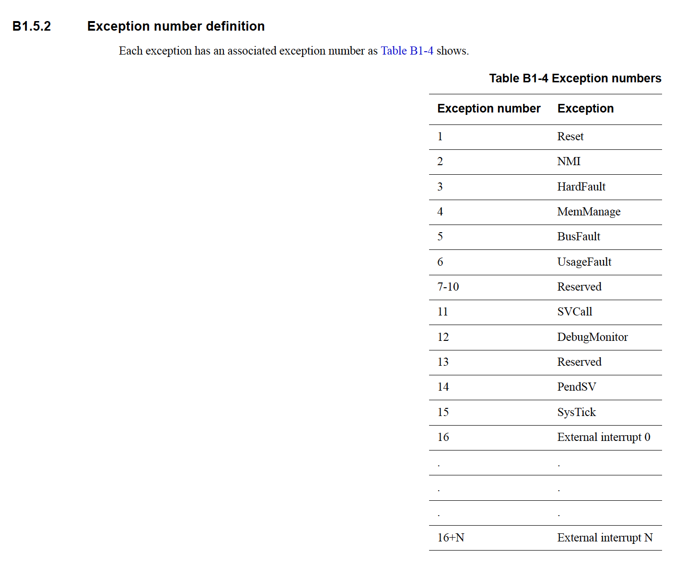
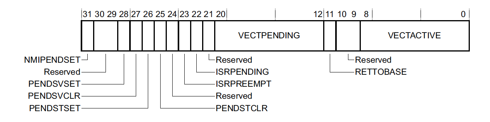
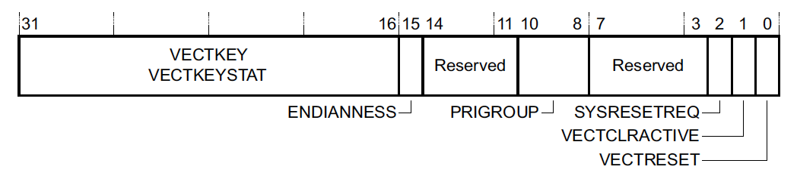
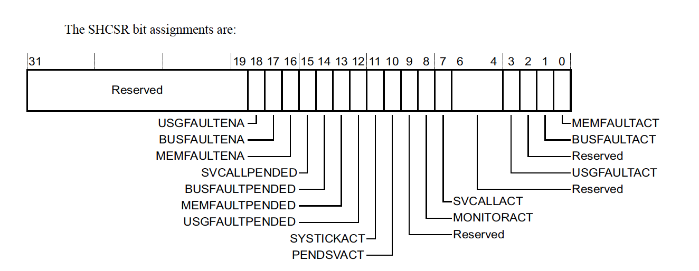
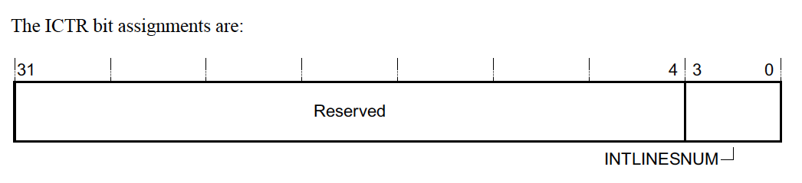

> 几乎所有的嵌入式设备都依赖异步事件的能力来完成系统的工作。
>
> 本文介绍ARM Cortex-m设备的异常模型。

<!--more-->

## ARM 异常模型概述

异常的定义：改变程序正常控制流程的一种条件。

中断和异常的差异：“中断”是用来描述“异常”的。异常由以下几个部分组成：

- **Exception Number 异常编号**

  异常编号是用来唯一指示一个特定异常的数字（从1开始）。这个数字也作为**中断向量表**的索引，用来定位一个异常处理函数（**Exception handler**），通常也称为中断服务程序（**Interrupt Service Routine**）。当异常触发的时候，ARM硬件会自动查找中断向量表并开始执行相应的代码。

- **Priority Level 中断优先级**

  每个异常都有它自己的优先级。大多数异常的优先级是可以配置的。数字越小，优先级越高。

  如果两个异常由相同的优先级，那么，Exception Number 异常编号小的先执行。

- **Synchronous or Asynchronous 同步或异步**

  SVCall 这类的异常，是同步异常，相应的指令执行后会立刻触发异常。其他的叫做异步异常。

异常可以处于下面几种状态中的一种：

- **Pending**

  MCU检测到异常但是还没有开始执行异常处理函数

- **Active**

  开始执行异常处理函数，但是还没有结束。这种情况下可以被更高优先级的中断抢占

- **Pending & Active**

  只在异步异常的时候发生。一般是正在处理异常时，再次触发了相同的异常

- **Inactive**

  既不是pending也不是active

> 即使中断被禁用了，它还是可以变成 **pending** 状态的。一旦使能它，就会变成 **active**。因此，在使能中断的时候，最好先清除pending。

### 内置异常

Cortex-M 保留 1-15 异常编号，这些异常被称为**内置异常**。

> 异常编号同样是中断向量表的偏移。向量表的0号索引保存的是 msp 的复位值。剩余的1到15号，保存的是异常处理函数的指针。

这六个异常默认是都支持的：

- **Reset** - 复位
- **NMI** - 不可屏蔽中断，如果在异常处理函数中再发生错误，就会触发NMI异常
- **HardFault** - 各种可能的系统故障的统括，包括内存非法访问、处理错误和非对齐访问等
- **SVCall** - 当执行svc指令时触发的异常
- **PendSV & SysTick** - 软件触发的系统层级的中断。RTOS系统常用它来管理系统调度和上下文切换

### 外部中断

如DMA，GPIO等核外中断被称为外部中断。它们都是通过 **Nested Vectored Interrupt Controller （NVIC）** 来管理的。



## 异常相关中断寄存器

异常是通过 **System Control Space (SCS)** 的一组寄存器来进行配置的。

### Interrupt Control and State Register (ICSR) - 0xE000ED04

**中断控制和状态寄存器**



该寄存器控制NMI、PendSV和SysTick异常，并且指示系统当前中断的状态。

其中，

- **VECTACTIVE** - 当前正在运行的中断异常编号（没有时是0）。这个值同样保存在xPSR的IPSR位。
- **RETTOBASE** - 如果为0，表示除了当前执行的中断外，还有另外的中断是active的。
- **VECTPENDING** - 未完成的 pending 中断中级别最高（值最小）的异常编号。

### Application Interrupt and Reset Control Register (AIRCR) - 0xE000ED0C

**应用中断和复位控制寄存器**



其中，

- **SYSRESETREQ**  - 写1将触发系统复位
- **PRIGROUP** - 优先级组。该字段允许我们将异常优先级分为两部分（组优先级和子优先级）。这个值表示的是子优先级由多少位组成。组优先级用来控制哪些中断可以互相抢占。子优先级控制处理同一组中异常的顺序。（不同组可抢占，同组的没有抢占只有先后）

> 要写这个寄存器，必须将VECTKEY字段设置为0x05FA。

### System Handler Priority Register (SHPR1-SHPR3) - 0xE000ED18 - 0xE000ED20

**系统处理程序（Built in）优先级寄存器**

8个字节为一组。之所以从1开始，是因为最开始的异常编号是不可以配置的（Reset，NMI，HardFault）。

编号4~7对应的是SHPR1寄存器，以此类推。

默认这些系统异常的优先级都是0，也就是最高优先级。一般是不需要配置的。

### System Handler Control and State Register (SHCSR) - 0xE000ED24

**系统处理函数控制和状态寄存器**

该寄存器用来指示系统（内置）异常的状态，或者使能（激活）系统异常。



### Interrupt Controller Type Register (ICTR) - 0xE000E004

**中断控制类型寄存器**

该寄存器允许我们决定支持多少外部中断。Cortex-M系列最多是496。



支持的中断数为：32 * (INTLINESNUM + 1)

### NVIC Registers

NVIC有一组用来配置外部中断的寄存器。

外部中断是从16开始的，因此外部中断N的异常编号是 16 + N。

#### Interrupt Set-Enable (NVIC_ISER) and Clear-Enable (NVIC_ICER) Registers

**中断使能和清除寄存器**

- `NVIC_ISER0`-`NVIC_ISER15`: `0xE000E100`-`0xE000E13C`
- `NVIC_ICER0`-`NVIC_ICER15`: `0xE000E180`-`0xE000E1BC`

写1到对应的bit，可以使能和清除对应的中断。如果中断已经使能，那么读回来的值是1。

#### Interrupt Set-Pending (NVIC_ISPR) and Clear-Pending (NVIC_ICPR) Registers

**中断pending使能和清除寄存器**

- `NVIC_ISPR0`-`NVIC_ISPR15`: `0xE000E200`-`0xE000E23C`
- `NVIC_ICPR0`-`NVIC_ICPR15`: `0xE000E280`-`0xE000E2BC`

写1可以设置或清除中断的pending状态。

#### Interrupt Active Bit Registers (NVIC_IABR)

**中断激活位寄存器**

- `NVIC_IABR0`-`NVIC_IABR15`: `0xE000E300`-`0xE000E33C`

只读的，如果中断已经激活，那么读回来的值是1。

#### Interrupt Priority Registers (NVIC_IPR)

**中断优先级寄存器**

- `NVIC_IPR0`-`NVIC_IPR123`: `0xE000E400`-`0xE000E5EC`

设置中断的优先级。每个中断8位。只允许配置为4~256。

它是用的高位，如，只用了2 bits 时，它的有效值为：

**0b000.0000** (**0x0**), **0b0100.0000** (**0x40**), **0b1000.0000** (**0x80**) and **0b1100.0000** (**0xC0**).

### Software Triggered Interrupt Register (STIR) - 0xE000EF00

**软件触发中断寄存器**

跟设置NVIC_ISPR是一样的。

这里设置到寄存器的值为 **外部中断号（中断编号 - 16）**，而不是按 bit 设置的。

## 高级异常主题

### 异常进入与退出

异常发生时，会自动保存一些寄存器（**caller-save**）。至少保存8个寄存器：x0, x1, x2, x3, x12, lr, pc, xpsr。如果使能了FPU，可能还会保存 17个FPU寄存器。

异常退出时，会自动出栈这些 caller-save 的寄存器。

### Tail-Chaining 尾链

退出异常的时候，硬件需要自动pop和restore最少8个caller-save的寄存器。

但如果退出ISR的时候，新的异常已经pended了，那么就可以不需要pop和push这些寄存器，因为pop和push的是完全相同的寄存器。这个优化叫做 “Tail-Chaining（尾链）”。

这个优化可以提升我们中断响应的速度。

### Late-arriving Preemption 迟到抢占

ARM核可以在中断进入阶段（保存寄存器和取出ISR例程执行）检测更高优先级的中断。

这种情况下，高优先级的ISR可以直接执行，而不再做已经做过的寄存器保存动作。这个优化可以提高高优先级中断响应的速度。

高优先级中断执行完之后，可以直接 tail-chain 到之前的异常来执行。

### Lazy State Preservation 延迟状态保存

ARMv7 和 ARMv8 设备可选地支持FPU。

支持FPU需要额外增加33个寄存器（s0-s31 & fpscr）。其中17个是 caller-save 的。

如果每次发生异常都自动保存这17个寄存器，会带来额外的开销。

一般ISR中是很少用到FPU的。因此，一种优化是在ISR中检测到FPU指令的时候，才保存这些FPU寄存器，这个优化叫做 **“lazy context save”**。

### 执行优先级和优先级提升

**执行优先级**：当没有异常激活时，当前系统的执行优先级可以被认为是 “最大可配置优先级” + 1。这意味着，任何异常发生，都将会打断当前的流程。

软件上有几种可以修改“执行优先级”的方法，使其高于线程模式的默认优先级或高于一些激活的异常来执行。这种操作叫做**”优先级提升“**。在RTOS上经常用来处理一些不能被中断打断的代码，如上下文切换。

优先级提升的方法：

- **PRIMASK**：对应CMSIS的 `__disable_irq()` 和 `__enable_irq()`，或者`cpsid i` 和 `cpsie i`。这会禁用所有**可配置优先级**的异常。（只有 NMI，HardFault 和 Reset 可以触发）
- **FAULTMASK**：对应CMSIS的 `__disable_fault_irq()` 和 `__enable_fault_irq()`，或者`cpsid f` 和 `cpsie f`。这会禁用所有**除了 NMI 以外**的异常。
- **BASEPRI**：CMSIS `__set_BASEPRI()`。屏蔽低于特定优先级的异常。

### 可中断执行的指令

很多ARM的指令是原子执行的。例如32位的内存访问就是一个原子操作。

然而为了降低中断延迟，在异常发生时，一些多周期的指令会被丢弃，并在异常处理结束之后重新执行。如除法指令（udiv 和 sdiv）和双字加载/保存指令（ldrd & strd）。

另外，一些指令是“可中断-继续”的，也就是说这些指令可以被中断打断，中断结束后继续执行。如多寄存器的加载/保存指令（ldm和stm）。

> 最好不要对重复读写会出问题的内存使用 ldm 和 stm 指令，或者通过关部分中断来保护这些临界段的访问。

## FreeRTOS中的中断和临界区

### Systick 和 Pendsv

（1）什么是 PendSV？

> PendSV（可悬起的系统调用），它是一种CPU系统级别的异常，它可以像普通外设中断一样被悬起，而不会像SVC服务那样，因为没有及时响应处理，而触发Fault。

要点是可以缓期执行。

（2）Systick 优先级高于外部中断可不可以？

可以，但有问题。如果外部中断的ISR执行过程中，Systick 打断外部中断处理函数的执行，那么 Systick 中做任务切换，尝试再中断活跃时企图回到线程状态。则会触发Fault。为了解决这个问题，早期的OS会检测是否有中断活跃，只有无任何中断时才响应 Systick 中断。

（3）Systick 优先级设置为最低可不可以？

可以。实际现在FreeRTOS也是把 Systick 和 PendSV 的优先级设置为最低。

但是呢，一般OS会在任务调度时，关闭中断，也就是进入临界区，而OS任务调度是比较耗时的，这会导致任务调度期间，无法快速响应外部IRQ。

（4）Systick 优先级调低，避免了触发 Fault 的问题，但是又会影响外部中断IRQ的处理速度。那如何处理呢？

使用 PendSV。1. Systick 制作调度前的判断工作，不做任务切换（降低延时）；2. 触发 PendSV。如果此时有外部IRQ请求，则先处理外部IRQ，最后再执行PendSV做任务调度。

（5）能不能把Systick设置成最高优先级，PendSV设置成最低优先级？

也会有问题。因为Systick的优先级最高，而且又是周期性地触发，因此会经常抢占外部IRQ，这就导致外部IRQ变慢。

**小结：**

- 因此在实际项目中，我们把 Systick 和 PendSV 都设置成最低优先级。外部中断的优先级是比 Sytick 和 PendSV 都高的。

```c
// 定义成最低优先级
#define portMIN_INTERRUPT_PRIORITY            ( 255UL )
#define portNVIC_PENDSV_PRI                   ( portMIN_INTERRUPT_PRIORITY << 16UL )
#define portNVIC_SYSTICK_PRI                  ( portMIN_INTERRUPT_PRIORITY << 24UL )

// 这里可以看到是设置是Ssystem Handler Priority Register，参考前面章节的内容
BaseType_t xPortStartScheduler( void ) /* PRIVILEGED_FUNCTION */
{
    /* Make PendSV, CallSV and SysTick the same priority as the kernel. */
    portNVIC_SHPR3_REG |= portNVIC_PENDSV_PRI;
    portNVIC_SHPR3_REG |= portNVIC_SYSTICK_PRI;
    
    ...
}
```

### 临界区保护

- taskENTER_CRITICAL() 和 taskEXIT_CRITICAL()

这是通过设置BASEPRI来屏蔽部分中断来达到临界区的目的，它屏蔽的中断为 `configMAX_SYSCALL_INTERRUPT_PRIORITY`，优先级低于该值（数值大）的中断都被屏蔽。另外它是带计数的。

```c
#define taskENTER_CRITICAL() portENTER_CRITICAL()
#define taskEXIT_CRITICAL() portEXIT_CRITICAL()

#define portENTER_CRITICAL() vPortEnterCritical()
#define portEXIT_CRITICAL() vPortExitCritical()

void vPortEnterCritical( void )
{
    portDISABLE_INTERRUPTS();
    uxCriticalNesting++;
    if( uxCriticalNesting == 1 )
    {
        configASSERT( ( portNVIC_INT_CTRL_REG & portVECTACTIVE_MASK ) == 0 );
    }
}

void vPortExitCritical( void )
{
    configASSERT( uxCriticalNesting );
    uxCriticalNesting--;
    if( uxCriticalNesting == 0 )
    {
        portENABLE_INTERRUPTS();
    }
}

#define portDISABLE_INTERRUPTS() vPortRaiseBASEPRI()
#define portENABLE_INTERRUPTS() vPortSetBASEPRI( 0 )

static portFORCE_INLINE void vPortSetBASEPRI( uint32_t ulBASEPRI )
{
    __asm
    {
        /* Barrier instructions are not used as this function is only used to lower the BASEPRI value. */
        msr basepri, ulBASEPRI
    }
}

static portFORCE_INLINE void vPortRaiseBASEPRI( void )
{
    uint32_t ulNewBASEPRI = configMAX_SYSCALL_INTERRUPT_PRIORITY;
    __asm
    {
        /* Set BASEPRI to the max syscall priority to effect a critical section. */
        msr basepri, ulNewBASEPRI
        dsb
        isb
    }
}
```

- taskENTER_CRITICAL_FROM_ISR()和taskEXIT_CRITICAL_FROM_ISR()

可以在中断中调用，且这个中断的优先级一定要低于configMAX_SYSCALL_INTERRUPT_PRIORITY

```c
#define taskENTER_CRITICAL_FROM_ISR() portSET_INTERRUPT_MASK_FROM_ISR()
#define taskEXIT_CRITICAL_FROM_ISR( x ) portCLEAR_INTERRUPT_MASK_FROM_ISR( x )

#define portSET_INTERRUPT_MASK_FROM_ISR()        ulPortRaiseBASEPRI()
#define portCLEAR_INTERRUPT_MASK_FROM_ISR(x)     vPortSetBASEPRI(x)

static portFORCE_INLINE uint32_t ulPortRaiseBASEPRI( void )
{
    uint32_t ulReturn, ulNewBASEPRI = configMAX_SYSCALL_INTERRUPT_PRIORITY;
    __asm
    {
        /* Set BASEPRI to the max syscall priority to effect a critical section. */
        mrs ulReturn, basepri       // 读出BASEPRI的值，保存在ulReturn中
        msr basepri, ulNewBASEPRI   // 将configMAX_SYSCALL_INTERRUPT_PRIORITY写入到寄存器BASEPRI中。
        dsb
        isb
    }
    return ulReturn;                // 返回ulReturn，退出临界区代码保护时要用此值！
}
```

它通过记录并恢复之前的BASEPRI返回值，来达到支持嵌套调用的目的。

- vTaskSuspendAllvTaskSuspendAll() 和 xTaskResumeAllxTaskResumeAll()

单纯关调度器，不能屏蔽中断。

#### **补充问题**

- vPortEnterCritical() 能不能屏蔽外部中断？

答案是取决于我们项目的配置。如果我们设置 configMAX_SYSCALL_INTERRUPT_PRIORITY 为 4<<5 也就是128，那么只能屏蔽**低于 IRQ_PRIORITY_ABOVENORMAL** 级别的中断（同级别的IRQ_PRIORITY_ABOVENORMAL级别的中断只会有先后，没有抢占）。一般如 GPIO 等使用IRQ_PRIORITY_NORMAL 之类的中断，还是可以屏蔽的。

FreeRTOS 中 configMAX_SYSCALL_INTERRUPT_PRIORITY 的默认值是16，这种情况下几乎所有外部中断都可以屏蔽（因为 1<< 5 = 32，就已经比16要大了）。

```c
// 我们使用最高的3 bits 来描述中断优先级。
#define configKERNEL_INTERRUPT_PRIORITY         	(0x7 << 5)
#define configMAX_SYSCALL_INTERRUPT_PRIORITY    	(0x4 << 5)
#define NVIC_configKERNEL_INTERRUPT_PRIORITY        (0x7)
#define NVIC_configMAX_SYSCALL_INTERRUPT_PRIORITY   (0x4)

#define IRQ_PRIORITY_REALTIME               0
#define IRQ_PRIORITY_HIGHPLUSPLUS           1
#define IRQ_PRIORITY_HIGHPLUS               2
#define IRQ_PRIORITY_HIGH                   3
#define IRQ_PRIORITY_ABOVENORMAL            4
#define IRQ_PRIORITY_NORMAL                 5
#define IRQ_PRIORITY_BELOWNORMAL            6
#define IRQ_PRIORITY_LOW                    7
```

- 为什么不允许优先级高于configMAX_SYSCALL_INTERRUPT_PRIORITY的中断调用FreeRTOS的API?

优先级高于configMAX_SYSCALL_INTERRUPT_PRIORITY的中断，FreeRTOS的临界区是保护不了的。因此就会存在竞态问题。

- 为什么中断中一定要调用_FROM_ISR的API？

这两组API的主要区别是，普通API里面会直接yield，但是_FROM_ISR的API是返回是否需要yield，然后再调用portYIELD_FROM_ISR(pxHigherPriorityTaskWoken)根据情况yield。

有的硬件对中断中切换上下文是有不同实现要求的，如有的只能在中断最后yield。所以要求中断中统一使用_FROM_ISR的API。

另外，在我们项目中，这两个yield其实是一样的，没有什么区别。portYIELD_FROM_ISR 也是触发PendSV中断，而PendSV中断是最低优先级，也得等到当前中断执行结束之后才进入PendSV中断执行任务切换。


**参考资料：**

1. *https://interrupt.memfault.com/blog/arm-cortex-m-exceptions-and-nvic*
2. *Cortex -M4 Devices Generic User Guide*
