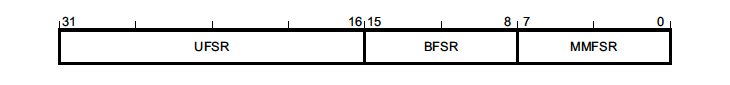
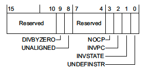
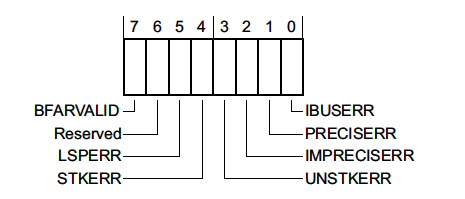
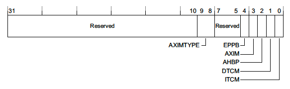
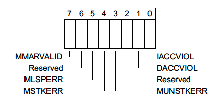
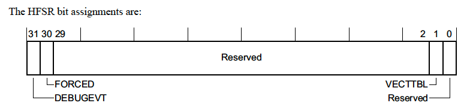

> 嵌入式设备经常会遇到各种各样的异常，理解和掌握如何快速调试和解决这类问题非常重要。
> 本文主要介绍如何在ARM Cortex-M设备上调试异常，包括错误寄存器和如何自动进行故障分析。

<!--more-->

Cortex-M 系列的MCU有几种不同的状态，发生故障时我们可以分析这些状态，以追查问题发生的原因。

## 1 错误状态寄存器

### 1.1 Configurable Fault Status Registers（CFSR）- 0xE000ED28

这个32位寄存器包含发生并导致异常的故障的主要信息。它包含了三个不同的状态寄存器：UFSR、BFSR和MMFSR



可以通过0xE000ED28处的32位读取访问该寄存器，也可以单独读取每个寄存器。

- 整个CFSR - `print/x *(uint32_t *) 0xE000ED28`
- UFSR  - `print/x *(uint16_t *) 0xE000ED2A`
- BFSR  - `print/x *(uint8_t *) 0xE000ED29`
- MMFSR  - `print/x *(uint8_t *) 0xE000ED28`

#### 1.1.1 Usage Fault Status Register (UFSR) - 0xE000ED2A

这个寄存器由2字节，它总结了与内存访问失败无关的任何故障，如执行了无效指令、尝试进入无效状态。



其中，

- **DIVBYZERO** - 除零错误。该故障是可配置的。 

- **UNALIGNED** - 表示发生了未对齐的访问操作。未对齐的多字访问，例如访问非 8 字节对齐的 uint64_t，将产生此错误。除 Cortex-M0 MCU 外，4 字节以下的未对齐访问是否产生故障也是可配置的。 

- **NOCP** - 指示已发出 Cortex-M 协处理器指令，但协处理器已禁用或不存在。发生此故障的一种常见情况是，当代码被编译为使用浮点扩展 (`-mfloat-abi=hard -mfpu=fpv4-sp-d16`) 但协处理器未在启动时启用。

-  **INVPC** - 指示 EXC_RETURN 上的完整性检查失败。如果设置了此故障标志，则意味着在异常退出时使用了保留的 EXC_RETURN 值。

-  **INVSTATE** - 表示处理器尝试执行某个指令，但程序状态寄存器 (EPSR) 的值是无效的。

  一般情况下，ESPR 指示处理器是否处于 Thumb 模式。使用 `bx & blx 或 ldr & ldm` 加载 pc 相对值时，必须将指令的位 [0] 设置为 1。如果违反此规则，将生成一个 INVSTATE 异常。一般编写 C 代码时，编译器会自动处理此问题。但如果是手写汇编的话，就比较可能出现这个错误。 

  *平时在实践中，最常见的是传入一个错误的PC值（如注册的callback是非法的），然后进行跳转，就容易出现这个错误。*

- **UNDEFINSTR** - 表示执行了未定义的指令。如果**堆栈损坏**，这可能会在异常退出时发生。编译器也可能会针对应该无法访问的代码路径发出未定义的指令。

**Configurable UsageFault**

某些usage fault的类型可以通过CCR寄存器来配置是否使能。

- Bit 4 (DIV_0_TRP) - 控制除0是否产生错误
- Bit3 (UNALIGN_TRP) - 控制非对齐访问是否产生错误

#### 1.1.2 BusFault Status Register (BFSR) - 0xE000ED29

这是一个1字节的寄存器，用来汇总与指令预取和内存访问失败相关的故障。



- **BFARVALID** - 表示总线故障地址寄存器 (BFAR-0xE000ED38) 是否保存了触发故障的地址。
- **LSPERR & STKERR** - 分别表示在惰性状态保存期间（lazy state preservation）或异常进入期间发生的故障。这两种情况都是硬件自动在堆栈上保存状态。可能发生此错误的一种方式是，在尝试处理异常时栈溢出了有效的 RAM 地址范围。 
- **UNSTKERR** - 表示尝试从异常返回时发生错误。通常发生这种错误的情况是：在处理异常时堆栈破坏，或者切换栈帧时栈里面的内容没有正确地初始化。 
- **IMPRECISERR** - 这个标志非常重要。它告诉我们硬件是否能够确定故障的确切位置。这种错误一般比较难查一点。
- **PRECISERR** - 表示在异常进入之前正在执行的指令触发了错误。这种情况下异常发生时自动保存的PC就是导致错误的PC。

**非精确错误的调试建议**

非精确错误是最难查的错误，这意味着堆栈在异常入口处的寄存器不会指向导致异常的代码。

Cortex-M设备上，**指令预取和数据加载通常产生的是同步的错误**，并且是精确的。而**存储操作则会发生异步故障**。这是因为写入操作有时候会被缓存，所以有时候PC会在数据存储完成之前增加。

当遇到一个不精确的错误时，**我们需要检查报告异常区域看起来可疑的存储指令**。如果MCU支持ARM Embbedded Trace Macrocell（ETM），一些调试器可以查看最近执行指令的历史纪录。

#### 1.1.3 Auxiliary Control Register (ACTLR) - 0xE000E008

辅助控制寄存器。这个寄存器关闭一些硬件优化或特性（通常会带来性能的损失和中断的延迟）。

对Cortex M3和M4，可以通过设置这个寄存器的 bit 1(DISDEFWBUF) 为1，来关闭写缓冲，从而让所有的非精确错误都变成精确错误。

#### 1.1.4 Auxiliary Bus Fault Status Register (ABFSR) - 0xE000EFA8

这个寄存器仅存在于Cortex-M7设备。当非精确错误发生时，这个寄存器可以指示错误发生在什么内存总线上。



#### 1.1.5 MemManage Status Register (MMFSR) - 0xE000ED28

这个寄存器报告了MPU相关的错误。

一般来说只有MPU被配置并使能之后才会产生MPU错误。但是有一些内存访问错误也会出发MemManage Fault。如：尝试在系统地址范围（0xExxx.xxxx）内执行代码。



- **MMARVALID** - 表示 MemManage 故障地址寄存器 (MMFAR - 0xE000ED34) 中是否保存了触发 MemManage 故障的地址。 
- **MLSPERR & MSTKERR** - 分别表示在惰性状态保存或异常进入期间发生了 MemManage 故障。例如，如果使用 MPU 区域检测堆栈溢出，就有可能会发生这种情况。 
- **MUNSTKERR** - 表示从异常返回时发生错误 
- **DACCVIOL** - 表示数据访问触发了 MemManage 故障。
-  **IACCVIOL** - 指示尝试执行一条指令触发了 MPU 或从不执行 (XN) 故障。

### 1.2 HardFault Status Register (HFSR) - 0xE000ED2C

这个寄存器表示发生了 HardFault。



- **DEBUGEVT** - 未启用调试子系统时发生了指示调试事件（即执行断点指令）
- **FORCED** - 这意味着可配置故障（即我们在前面部分讨论的故障类型）升级为 HardFault，如可配置故障处理程序未启用，或者在handler中发生了故障。 
- **VECTTBL** - 表示由于从向量表中的地址读取问题而发生故障。这种情况很少，但如果向量表中存在错误地址并且意外中断触发，则可能会发生这种情况。

## 2 调用栈恢复

如果可以复现问题，我们可以在异常处理函数处添加断点：

```c
(gdb)break HardFault_Handler
```

在异常发生时，一些寄存器会自动压栈。（FPU开启会压更多的寄存器）

Cortex-M设备有两个栈指针，msp和psp。在异常发生时，EXC_RETURN 会被保存在 lr 寄存器中，它的bit 2指示了发生异常时使用的是msp还是psp。如果bit2为1，则使用psp，否则使用msp。

示例：

```c
int illegal_instruction_execution(void) {
  int (*bad_instruction)(void) = (void *)0xE0000000;
  return bad_instruction();	// 这个PC是非法的，返回到这个地址会触发错误
}
```

如果我们在异常入口添加了断点：

```c
(gdb) p/x $lr
$4 = 0xfffffffd

# lr的bit2为1，说明错误发生时用的是psp
(gdb) p/x $lr&(1<<2)
$5 = 0x4

# 栈中最开始的8个寄存器总是这个顺序:
# r0, r1, r2, r3, r12, LR, pc, xPSR
(gdb) p/a *(uint32_t[8] *)$psp
$16 = {
  0x0 <g_pfnVectors>,
  0x200003c4 <ucHeap+604>,
  0x10000000,
  0xe0000000,
  0x200001b8 <ucHeap+80>,
  0x61 <illegal_instruction_execution+16>,
  0xe0000000,
  0x80000000
}
```

当我们知道sp之后，我们就可以从栈中恢复异常发生前的 callstack。

### 2.1 异常中再发生异常

如果在异常中再次发生异常，会发生什么？

如果使能了可配置错误寄存器（如MemManage, BusFault, UsageFault），这些异常处理程序中的错误，会升级为HardFault。

一旦到了HardFault，ARM Core就会在不可配置的优先级（-1）上执行。这时候，错误会使得处理器处于无法恢复的状态，需要重置。这种状态被成为**锁定（Lockup）**。

通常处理器会在进入锁定状态后自动复位，但这不是规范中要求的。这时候，你可以通过使能硬件看门狗来进行复位。

如果接上了调试器，lockup可能会有不同的行为。如在NRF52840上，处于调试模式时lockup是关闭的。

当发生lockup时，处理器会重复执行相同的指令，0xFFFFFFFE，或者出发lockup的指令，直到复位。

## 3 自动错误分析

现在我们已经掌握了错误分析的主要信息。接下来我们看如何自动分析这些错误。

### 3.1 暂停和确定核心寄存器状态

第一步，我们在系统异常的时候触发一个断点：

```c
// NOTE: If you are using CMSIS, the registers can also be
// accessed through CoreDebug->DHCSR & CoreDebug_DHCSR_C_DEBUGEN_Msk
#define HALT_IF_DEBUGGING()                              \
  do {                                                   \
    if ((*(volatile uint32_t *)0xE000EDF0) & (1 << 0)) { \
      __asm("bkpt 1");                                   \
    }                                                    \
} while (0)
```

为了不需要手动展开寄存器状态，我们定义一个c的结构体：

```c
typedef struct __attribute__((packed)) ContextStateFrame {
  uint32_t r0;
  uint32_t r1;
  uint32_t r2;
  uint32_t r3;
  uint32_t r12;
  uint32_t lr;
  uint32_t return_address;
  uint32_t xpsr;
} sContextStateFrame;
```

我们可以通过一段小的汇编指令来确定在错误发生时使用的是msp还是psp，并把sp传给`my_fault_handler_c`：

```c
#define HARDFAULT_HANDLING_ASM(_x)               \
  __asm volatile(                                \
      "tst lr, #4 \n"                            \
      "ite eq \n"                                \
      "mrseq r0, msp \n"                         \
      "mrsne r0, psp \n"                         \
      "b my_fault_handler_c \n"                  \
                                                 )
```

这时候，我们的c的处理函数可以写成这个样子：

```c
// 关闭优化，以确保frame参数不会被优化掉
__attribute__((optimize("O0")))
void my_fault_handler_c(sContextStateFrame *frame) {
  // 如果接着调试器，我们执行断点
  HALT_IF_DEBUGGING();

  // 异常处理的逻辑，如:
  //  - 记录错误以进行事后分析
  //  - 如果错误可恢复
  //    - 则清除错误并返回到 Thread Mode
  //  - 否则
  //    - 重启系统
}
```

如果接着调试器，我们就可以把寄存器状态打印出来：

```c
0x00000244 in my_fault_handler_c (frame=0x200005d8 <ucHeap+1136>) at ./cortex-m-fault-debug/startup.c:94
94	  HALT_IF_DEBUGGING();
(gdb) p/a *frame
$18 = {
  r0 = 0x0 <g_pfnVectors>,
  r1 = 0x200003c4 <ucHeap+604>,
  r2 = 0x10000000,
  r3 = 0xe0000000,
  r12 = 0x200001b8 <ucHeap+80>,
  lr = 0x61 <illegal_instruction_execution+16>,
  return_address = 0xe0000000,
  xpsr = 0x80000000
}
```

这时候，我们就有了一个错误的现场，我们可以结合PC，LR，SP，来做进一步的分析，内存变量也都可以查看。

### 3.2 调试插件

很多IDE都有插件可以看到寄存器。这些实现通常是利用了CMSIS系统视图描述格式文件（System View Description），它是一个XML的标准格式，用来描述ARM MCY的内存映射寄存器。

你甚至可以通过GDB来加载这些文件，如 PyCortexMDebug，一个GDB的python脚本。

这是一个实例：

```c
(gdb) source cmdebug/svd_gdb.py
(gdb) svd_load cortex-m4-scb.svd
(gdb) svd
Available Peripherals:
    ...
	SCB:        System control block
    ...
(gdb) svd SCB
Registers in SCB:
    ...
	CFSR_UFSR_BFSR_MMFSR:      524288  Configurable fault status register
    ...
(gdb) svd SCB CFSR_UFSR_BFSR_MMFSR
Fields in SCB CFSR_UFSR_BFSR_MMFSR:
	IACCVIOL:     0  Instruction access violation flag
	DACCVIOL:     0  Data access violation flag
	MUNSTKERR:    0  Memory manager fault on unstacking for a return from exception
	MSTKERR:      0  Memory manager fault on stacking for exception entry.
	MLSPERR:      0
	MMARVALID:    0  Memory Management Fault Address Register (MMAR) valid flag
	IBUSERR:      1  Instruction bus error
	PRECISERR:    0  Precise data bus error
	IMPRECISERR:  0  Imprecise data bus error
	UNSTKERR:     0  Bus fault on unstacking for a return from exception
	STKERR:       0  Bus fault on stacking for exception entry
	LSPERR:       0  Bus fault on floating-point lazy state preservation
	BFARVALID:    0  Bus Fault Address Register (BFAR) valid flag
	UNDEFINSTR:   0  Undefined instruction usage fault
	INVSTATE:     1  Invalid state usage fault
	INVPC:        0  Invalid PC load usage fault
	NOCP:         0  No coprocessor usage fault.
	UNALIGNED:    0  Unaligned access usage fault
	DIVBYZERO:    0  Divide by zero usage fault
```

### 3.3 事后分析（Postmortem Analysis）

通常说的保存dump文件，就是事后分析。我们可以参考CmBacktrace之类的一些开源组件来完成。它里面的代码，就是对上述知识点的运用。 

**参考资料：**

1. *https://interrupt.memfault.com/blog/cortex-m-hardfault-debug*

4. *https://github.com/armink/CmBacktrace*