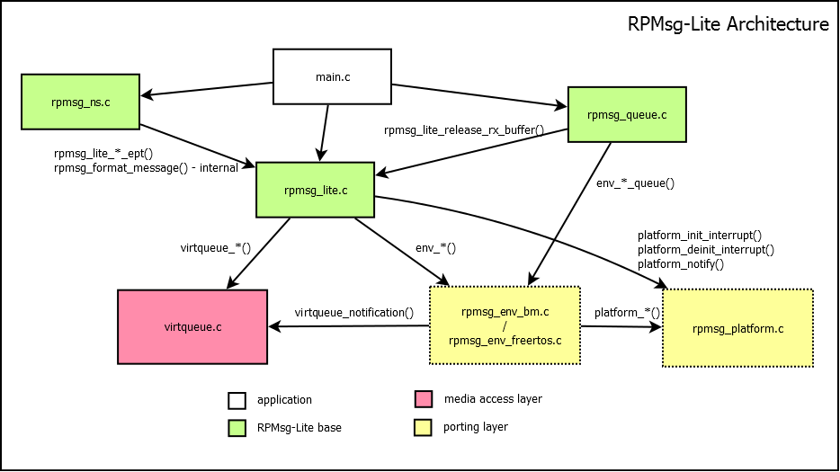
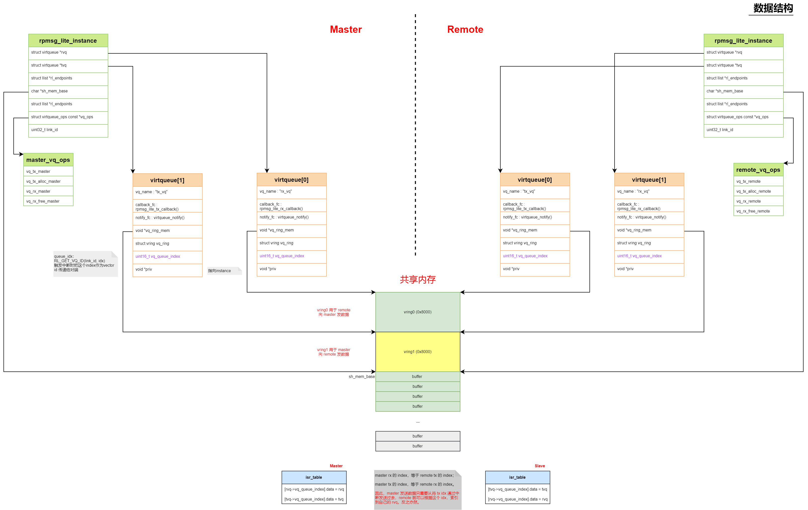
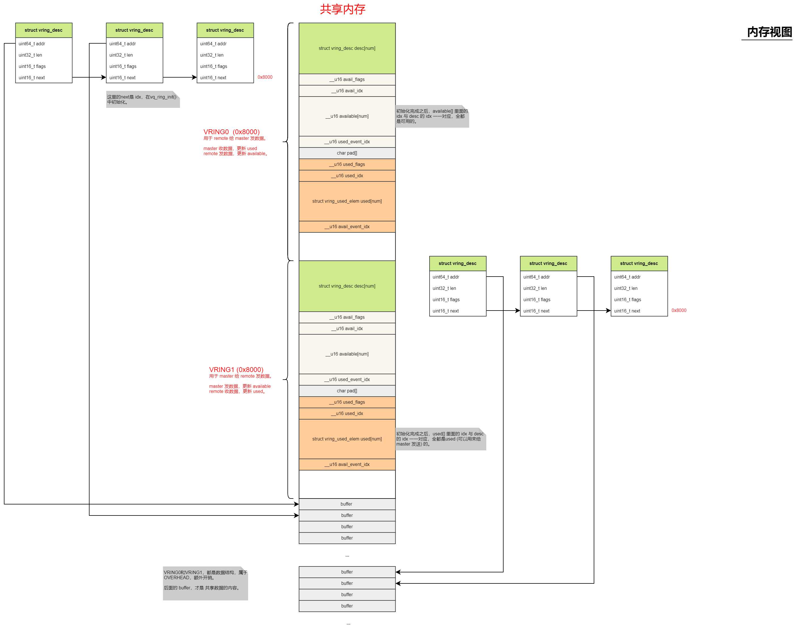
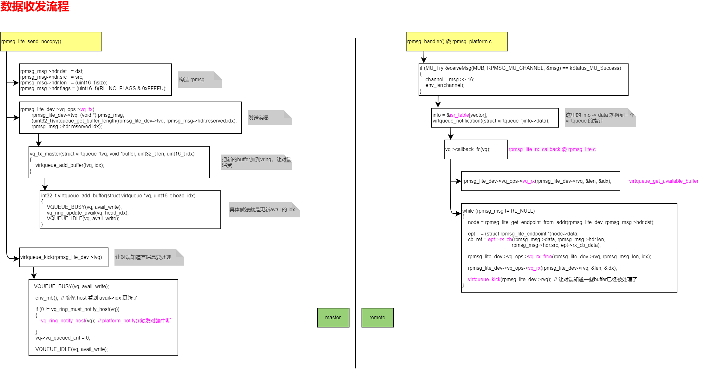
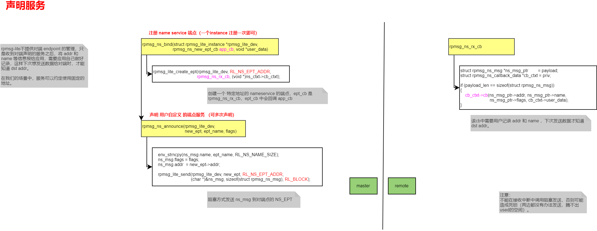
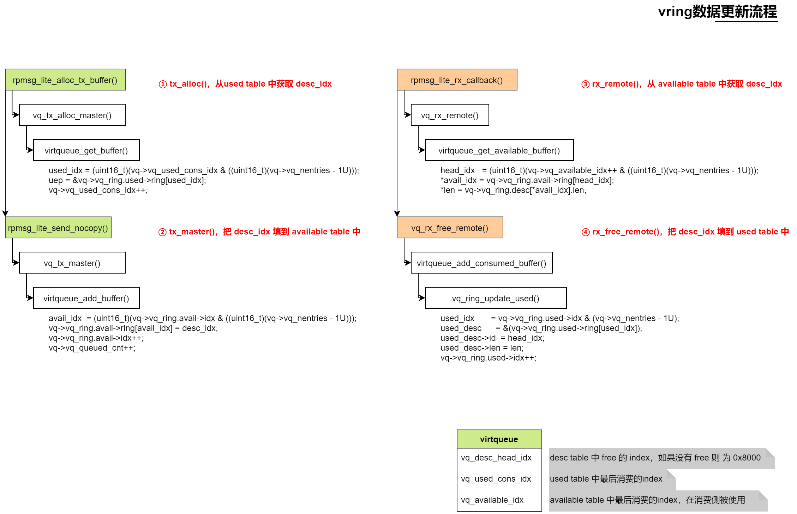
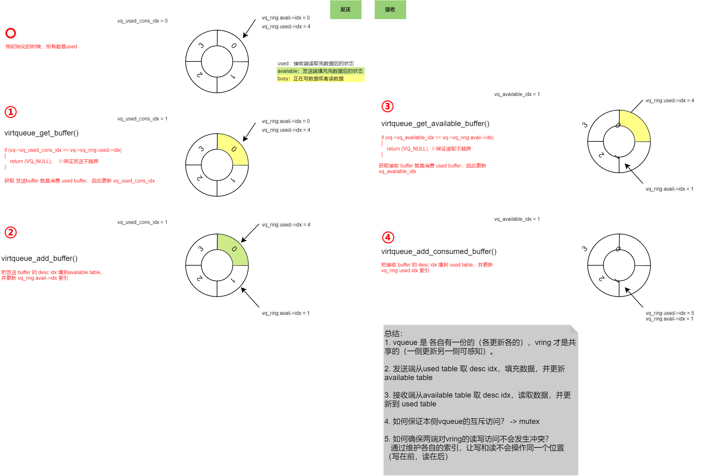

> 本文介绍RPMsg-Lite核间通信协议的工作原理与应用。

<!--more-->

RPMsg-Lite是NXP开源的一个核间通信组件，它可以作为eRPC的IPC传输层实现核间RPC调用，本文介绍该组件的核心工作原理，以及它在项目中的实施方案。

开源链接：https://github.com/nxp-mcuxpresso/rpmsg-lite

### 1 Architecture



rpmsg_lite.c：核心文件，实现了核间通信的主要功能

rpmsg_ns.c：name service，用于声明服务，对应端点的概念

rpmsg_queue.c：消息缓存队列，配合eRPC实现了零拷贝的传输层

virtqueue.c：实现了一个基于共享内存的环形缓冲区，参考了Linux virtio的实现

env&platform：适配层，主要是osal和核间通信硬件设施

### 2 数据结构



**rpmsg_lite_Instance**

```c
struct rpmsg_lite_instance
{
    struct virtqueue *rvq;      // 接收队列
    struct virtqueue *tvq;      // 发送队列
    struct llist *rl_endpoints; // 端点的list
    LOCK *lock;

    uint32_t link_state;
    char *sh_mem_base;                  // 共享内存起始地址
    uint32_t sh_mem_remaining;         
    uint32_t sh_mem_total;              
    struct virtqueue_ops const *vq_ops; // virtqueue的ops，master和remote有不同的ops

    uint32_t link_id;
};
```

全局的rpmsg_lite实例，对应一组核间通信实现。

在master和remote都有对应的实例。

master和remote的实例在初始化的时候做的动作稍微有点差异，初始化过程由master完成对共享内存数据结构的配置。

注意：virtqueue类型的tvq和rvq，分别是自己的发送queue和接收queue。

**virtqueue_ops**

```c
struct virtqueue_ops
{
    void (*vq_tx)(struct virtqueue *vq, void *buffer, uint32_t len, uint16_t idx);
    void *(*vq_tx_alloc)(struct virtqueue *vq, uint32_t *len, uint16_t *idx);
    void *(*vq_rx)(struct virtqueue *vq, uint32_t *len, uint16_t *idx);
    void (*vq_rx_free)(struct virtqueue *vq, void *buffer, uint32_t len, uint16_t idx);
};
```

用来和virtqueue层交互的操作接口，master和remote使用的是不同的接口。

**virtqueue**

```c
struct virtqueue
{
    /* 32bit aligned { */
    char vq_name[VIRTQUEUE_MAX_NAME_SZ];
    uint32_t vq_flags;
    int32_t vq_alignment;
    int32_t vq_ring_size;
    void *vq_ring_mem;							// 指向vring的起始地址
    void (*callback_fc)(struct virtqueue *vq);  // 如果是tvq则是tx callback，如果是rvq则是rx callback
    void (*notify_fc)(struct virtqueue *vq);	// 如果是tvq则是tx notify
    int32_t vq_max_indirect_size;
    int32_t vq_indirect_mem_size;
    struct vring vq_ring;						// 核心数据结构！这里是结构体，不是指针
    /* } 32bit aligned */

    /* 16bit aligned { */
    uint16_t vq_queue_index;
    uint16_t vq_nentries;
    uint16_t vq_free_cnt;
    uint16_t vq_queued_cnt;

	// 一组用来指示数据位置的索引
    uint16_t vq_desc_head_idx;
    uint16_t vq_used_cons_idx;
    uint16_t vq_available_idx;
    /* } 16bit aligned */

    boolean avail_read;  /* 8bit wide */
    boolean avail_write; /* 8bit wide */
    boolean used_read;   /* 8bit wide */
    boolean used_write;  /* 8bit wide */

    uint16_t padd; /* aligned to 32bits after this: */

    void *priv; // 指向rpmsg_lite_instance
};

struct vring
{
    uint32_t num;

    struct vring_desc *desc;
    struct vring_avail *avail;
    struct vring_used *used;
};
```

virtqueue数据结构是完成共享内存数据交换的关键。

接下来我们看下这些virtqueue数据结构，和共享内存的关系。

### 3 共享内存



共享内存初始化后是上图的布局。其中，vring0和vring1都是为了管理共享buffer而增加的数据结构。

**vring_desc**： 指向了各个数据buffer

**vring_avail** 和 **vring_used**：用来做发送和接收的索引管理，它们的idx取模后就是 desc 的 idx，也就是指向一个buffer。

### 4 数据收发流程



### 5 声明服务



### 6 vqueue&vring数据流



简单总结这些指针的变化过程：

**master->remote**

1. master发送：master tvq的avail->idx++，vq_used_cons_idx++

2. remote接收：remote rvq的used->idx++，vq_available_idx++

初始化的时候，`used->idx - avail->idx = vq_nentries`，也就是说，刚开始的时候，全部都是空的，master一个数据都还没发送

注意：master的tvq和remote的rvq是同一片内存，同一个数据结构！

**remote->master**

1. remote发送：remote tvq 的 used->idx++，vq_available_idx++

2. master接收：masterrvq 的 avail->idx++，vq_used_cons_idx++

初始化的时候，`avail->idx - used->idx = vq_nentries`，也就是说，刚开始的时候，全部都是空的，remote一个数据都还没发送

### 7 硬件视图

为了完成核间通信，rpmsg-lite需要：

1. 一片共享内存，用来存放vitrqueue的数据结构，以及共享数据的buffer，两个核都要可以访问
2. 中断
   - 发送中断：发送方告诉接收方数据准备好了
   - 接收中断：接收方收到接收中断之后，然后从共享内存读数据
   - 接收完成中断：接收方接收完数据后，通知发送方数据已经被收完了
   - 发送完成中断：发送方知道自己数据被处理完了

### 8 项目实施

在项目实施过程中，遇到了一些比较棘手的问题。

1. 两个核都可以独立休眠，在对端休眠期间，一端是无法正确访问对端数据的
2. 这些中断不是随时想发就可以发的，上面的几个中断需要是顺序的
3. 两个核之间的内存有cache问题，需要做好cache同步

为了解决这些问题，我们需要：

1. 使用两块独立的共享内存，master和remote需要初始化自己的共享内存的tvq，因此这需要我们修改初始化流程
2. 提供休眠锁机制，可以控制自己在发送数据到收到tx done中断期间，不进入休眠，保证对端能正确访问自己的数据
3. 做好cache同步机制
   - 发送方发送数据，在发tx irq之前，需要确保内存被更新到内存中（cache sync）
   - 接收方接收数据，以及收完数据之后更新索引，也需要确保从真正的共享内存中读写， 而不是cache
   - 发送方收到tx done中断，需要检查索引，为了确保是真实的内存中的数据，需要做cache invalidate