> 本文介绍BLE中安全相关的内容。

<!--more-->

### 1 Overview

#### 1.1 Referring to devices

蓝牙核心规范使用不同的属于描述通信中的两个设备，使用什么属于需要根据语境来确定。概括如下表：

| 术语                    | 语境                                    |
| ----------------------- | --------------------------------------- |
| initiator and responder | 通常用在安全相关交互的语境中，如pairing |
| master and slave        | BLE链路层中通常将它们成为主设备和从设备 |
| peripheral and central  | GAP中通常称之为外围设备和中心设备       |
| client and server       | GATT和ATT中通常成为客户端和服务器       |

#### 1.2 Security Levels and Models

安全等级和模式定义了”设备，服务和服务请求“的安全要求。

- **model 1**
  - L1 没有安全要求
  - L2 Unauthenticated pairing with encryption 未经认证的加密配对
  - L3 Authenticated pairing with encryption 经认证的加密配对
  - L4 经认证的LE 安全链接与使用128为强度加密密钥的加密配对

- **model 2**
  - L1 Unauthenticated pairing with data signing 未经认证的数据签名配对
  - L2 Authenticated pairing with data signing 未经认证的数据签名配对

- **model 3**
  - L1 没有安全要求
  - L2 使用未经身份认证的 Broadcast_Code
  - L3 使用经过认证的 Broadcast_Code

#### 1.3 Integrity Check

BLE PDU 包含了CRC用以检查空口数据是否改变。实际上，它并不是一个安全的做法，因为CRC只能防止背景噪声等带来的偶然的数据的变化，但并不能避免恶意的主动攻击。

#### 1.4 Pairing and Bonding

设备通过配对来建立安全的信任关系。配对提供了安全所需要的资源，如加密所需要的密钥。两个没有经过配对的设备，无法对链路进行加密，也不能对数据进行签名。此外，不配对的话，也无法使用resolvable private address特性，来得到其他设备的真实身份ID。

配对是蓝牙安全的基础。有多种方式可以进行配对，以适应设备不同的IO能力及其安全要求。

#### 1.5 Security Keys and Security Capabilities

蓝牙LE安全功能（例如链路加密、隐私和数据签名），需要由配对设备创建和共享特定的安全密钥才能使用。

密钥派发是配对的主要目的。

BLE中由三种主要的key。

| 密钥类型 | 用途                                                         |
| -------- | ------------------------------------------------------------ |
| LTK      | Long Term Key - 用于链路加密                                 |
| CSRK     | Connection Signature Resolving Key - 用于非加密链路的数据签名 |
| IRK      | Identity Resolving Key - 用于蓝牙隐私功能                    |

#### 1.6 Encrypted Connections

蓝牙 LE 使用称为 AES-CCM 的身份验证加密算法，因此也可以确保使用加密连接交换的数据的真实性。

#### 1.7 Device Authentication

当设备配对时，过程中可能涉及身份验证。 这意味着在配对过程种，也验证了与之配对的设备确实是该设备而不是冒名顶替者。

#### 1.8 Authentication of Data

 由于蓝牙使用了AES-CCM认证加密算法，因此加密链路的数据包的真实性可以得到保障。

 GATT write 流程可以通过ATT Signed Write command来对数据签名，它允许接收设备只验证 ATT 命令中属性值的真实性，而不是整个数据包的真实性。

####  1.9 Privacy and Device Tracking Protection

 设备可以使用private address，这种地址类型周期性的改变，可以防止被追踪。

#### 1.10 Attribute Permissions

ATT的所有属性，都包含了一系列的访问规则。我们可以规定只有经过配对认证的设备，才能读或写属性。

#### 1.11 The White List

白名单是BLE 链路层的一个特性。白名单是设备地址和类型的一个列表。它的主要目的是允许链路层根据filter policy对设备进行过滤。

白名单的主要目的是减少stack对不感兴趣的设备的packet的处理，从而降低功耗。它同样可以用来抵御拒绝服务攻击。

GAP外设通常一次只能容纳一个连接。因此，攻击者可以通过首先连接到外设来阻止另一个GAP中心设备的连接。为了解决这个问题，使用广播过滤策略，白名单可以防止未配对的设备建立连接-只需要在为每个配对设备的白名单中添加一个条目，然后开启广播过滤策略即可。未包含在白名单中的设备的连接请求将被忽略。

### 2 Examination

了解了前面关键的安全概念和特性之后，现在我们对这些特性进行更详细的了解。

####  2.1 Pairing

 理解配对过程的关键，首先需要弄明白配对是为了实现什么目的。总结为以下三点：

```
1. 蓝牙安全特性如加密、数据签名和隐私策略都需要使用密钥，密钥需要在两个设备之间派发。
2. 两个设备之间密钥的派发，需要得到保护，以防止被窃听。
3. 配对期间需要对设备进行身份认证，以防止中间人（MITM）攻击。
```

##### 2.1.1 Alternative Pairing Methods

 4.2及以上的蓝牙协议栈，可以使用两种不同的配对方法。第一种是LE经典配对（LE Legacy Pairing），第二种则是LE安全连接（LE Secure Connections），是一种新的更安全的方法。

 下图展示了配对的三个阶段。第一阶段决定了配对过程使用LE经典配对还是LE安全连接。第二阶段，包含了一个可选的身份认证过程，以及产生加密链路所需的密钥，并开始链路加密。第三个阶段，则主要是密钥的派发，包括LTK, CSRK和IRK。

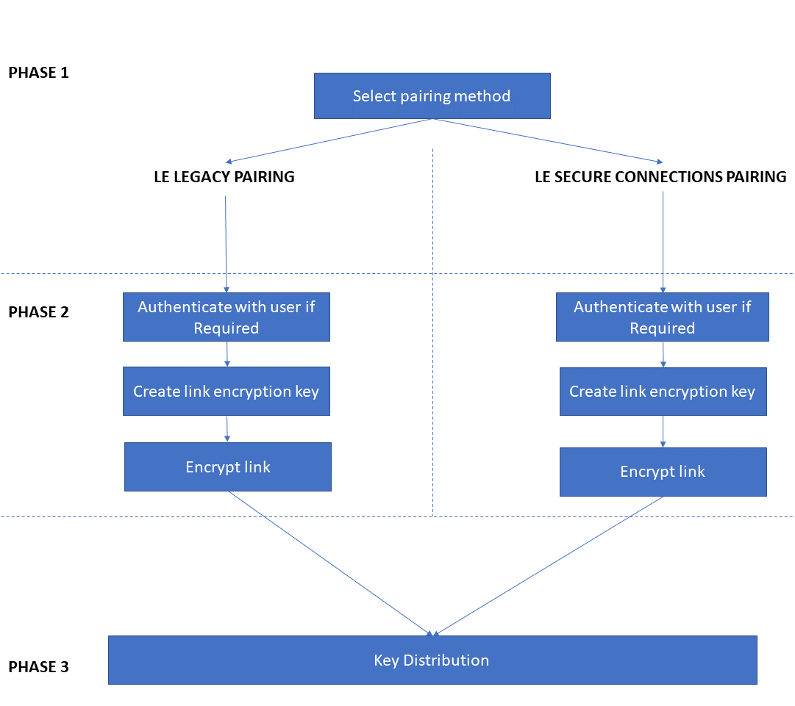

 

##### 2.1.2 Association Models

每种配对方法，都提供了多种不同的配对方式，包括如何处理身份验证。这些不同的配对方式被称为关联模型（association models）。

- LE Legacy Pairing 具有三种可用的关联模型，称为 Just Works (JW)、Passkey Entry (PKE) 和 Out of Band (OOB)。

- LE Secure Connections 配对提供四种关联模型：Just Works、数字比较 (NC)、密钥输入和 OOB。

关联模型的区别将在后续进行介绍。

##### 2.1.3 The Difference Between LE Legacy Pairing and LE Secure Connections

两种配对方法都是为了实现相同的目标，但是它们之间有一些区别：

|                      | LE Legacy Pairing                                            | LE Secure Connections                                        |
| -------------------- | ------------------------------------------------------------ | ------------------------------------------------------------ |
| 密钥分发期间的保密性 | 使用交换私密数据的方法来派生对称密钥，在密钥分发阶段使用该对称密钥来加密链接。 | 使用椭圆曲线公钥密码术来允许安全地导出对称密钥。 然后在密钥分发阶段使用该密钥对链接进行加密。 |
| 关联模型             | Just Works, Passkey Entry, OOB                               | Just Works, Passkey Entry, Numeric Comparison, OOB           |

##### 2.1.4 Pairing Feature Exchange

在配对之前有一个步骤，叫做配对特征交换（Pairing Feature Exchange）。发起者发送一个SMP配对请求PDU到应答者，应答者回复一个SMP配对应答。


该交换过程提供了两个设备所需要的一些信息：
```
1. 决定是使用LE Legacy Pairing 还是LE Secure Connections pairing 

2. 决定配对过程中是否需要设备认证，以及采用何种格式认证

3. 决定应该生成和派发哪些密钥类型

4. 决定LTK的长度
```


SMP配对请求和响应PDU，包含了一些字段：IO Capability, SC, MITM，最大加密Key长度，发起方的密钥派发，响应方的密钥派发。

- IO Capability

| IO Capability   | Meaning            |
| --------------- | ------------------ |
| DisplayOnly     | 只能显示，不能输入 |
| KeyboardOnly    | 可以输入           |
| DisplayYesNo    | 可以应答Yes or No  |
| NoInputNoOutput | 没有输入输出能力   |
| KeyboardDisplay | 可以输入和输出     |

这个信息从两方面影响配对的流程。

1. 首先，如果已请求身份验证，则两个设备的 IO 能力将决定如何准确执行身份验证。 例如，用户可能会看到一个设备上显示一个六位数的数字，并且必须使用其键盘将其输入到另一台设备中。

2. 在LE经典配对中，我们需要一些额外的数据来创建temporary key(TK)，如何获取这些数据取决于两个设备交换的IO能力。

- Bonding Flags

用来只是是否设备是否希望绑定，即，保存key留给后续使用。

- SC

SC 字段是复合字段 AuthReq的一部分。 它是一个一位标志，指示设备是否支持 LE 安全连接配对。 如果设备支持它，则必须将此标志设置为 1。如果两个设备都表示支持安全连接配对，则必须使用安全连接配对。

- MITM

MITM 字段是 AuthReq 字段中的另一个一位标志。 无论使用 LE Legacy Pairing 还是 LE Secure Connections，都可以通过设置此标志来请求任一设备或两个设备的身份验证。

- OOB Data Flag

身份认证可以通过多种方式实现。其中一种涉及使用带外（OOB）数据。OOB 数据是使用除了蓝牙之外的机制来传输的数据。如NFC或QR code。

- OOB 数据标志允许设备表明它拥有来自其他设备的 OOB 数据。

- Maximum Encryption Key Size

这个字段允许设备告诉对端自己支持的密钥的最大长度（7到16字节）。配对的设备需要使用相同的密钥长度，因此，取两者的较小值。

- Initiator Key Distribution and Responder Key Distribution

该字段指示它想要提供的密钥类型以及它从其他设备请求的密钥类型。如LTK, CSRK和/或IRK。

- Selecting the Pairing Method

如果双方设备都支持安全连接配对，那么必须使用安全连接配对。

其他的，则需要结合IO Capability values, the OOB data flag, and the MITM flag from each device来决定。稍后我们再来介绍怎么确定配对的方式。

##### 2.1.4.1 LE Legacy Pairing

- An Overview of LE Legacy Pairing

配对分为三步。第一步和第三步，在LE Legacy Pairing和Secure Connection pairing中是一样的。第二步有点差别。

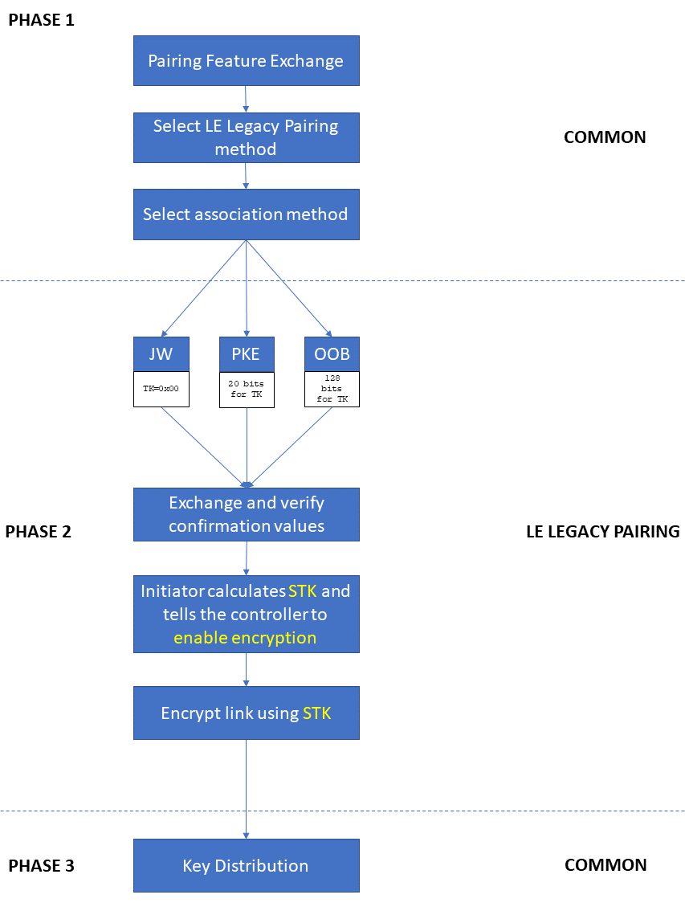

- **Phase1**

首先选择使用使用两种配对方式中的哪一种。如果两个设备的SC，有一个不为1，则必须使LE经典配对。接着，选择association model，在LE Legacy pairing中，选项包括JW, PKE, OOB。

| association model | 描述                                                         |
| ----------------- | ------------------------------------------------------------ |
| Just Works        | 不需要用户交互<br />满足以下条件时使用：<br />\- 一台或两台设备都没有设置SC<br />\- 两台设备的MITM都为0<br />或者<br />\- 一台或两台设备没有设置SC<br />\- 两台设备的OOB都为0<br />\- 一台或两台设备的MITM为1<br />\- IO能力表示不支持输入 |
| Passkey Entry     | 需要一台设备显示一个6位的随机数，然后用户将其输入到另一台设备中。<br />满足以下条件时使用：<br />\- 一台或两台设备都没有设置SC<br />\- 两个设备的OOB都位0<br />\- 一台或两台设备的MITM为1<br />\- IO能力表示可以支持密钥输入 |
| OOB               | 使用非蓝牙的数据通道在两个设备之间单向或双向传递数据<br />满足以下条件时使用：<br />\- 一台或两台设备没有设置SC<br />两个设备的OOB标记为都为1 |

- **Phase2**

LE 经典配对，使用一个叫做Short Term Key (STK)的密钥，对第三步中安全派发密钥的过程进行加密。STK只有这一个用途，因此不会保存。

 派生STK是第二步主要的两个重点之一。另一个重点则是身份认证，目的是防止MITM中间人攻击。

 Phase2包含了以下4个步骤：

 **Step 1 - Establish a Temporary Key (TK)**

 STK的派生需要用到几个值，其中一个是TK，临时密钥。

 TK是一个128-bit的值。如何获得TK，取决于选择的association model。

 

| Association Model | TK Value                                | 备注                                  |
| ----------------- | --------------------------------------- | ------------------------------------- |
| JW                | 0                                       | 0位熵                                 |
| PKE               | 用户输入的6位数字，并增加前导0到128位。 | 6位数字用20bits表示，我们有20bits的熵 |
| OOB               | 完全的128-bit值，通过OOB来传递          | 128位的熵（如果是完全随机产生的话）   |

Notes：TK 将用于派生称为 STK 的加密密钥。 鉴于 TK 中熵的明显不同，根据所使用的关联模型，已经可以看到，不同的关联模型在配对过程中导致不同级别的安全性。

**Step 2 - Authenticate**

 身份认证是由一个设备到另一个传递确认码来实现的，确认码的计算包含了TK。在PKE和OOB中，TK没有在空口上传输，并且包含以抵抗MITM攻击的方式在两个设备之间共享的数据（例如从一个设备的屏幕上读取并输入，由另一个用户确认）。因此，如果两者拥有相同的TK，则可以认为配对的两个设备之间是直接的通信交流，没有中间人恶意攻击。

 **以下是该过程工作的原理：**

 首先，每个设备计算一个128位的确认码（confirm value）。确认码使用了一个叫做c1的函数，参数包含了TK（请记住，TK从来没有在空中传输过）.

 除了TK之外,创建确认码函数的其他输入包括两个设备都知道的字段以及一个随机数，在此阶段，只有创建确认码的设备才知道该随机数。 在 master 上，此值称为 Mrand。 在slave上，它被称为Srand。

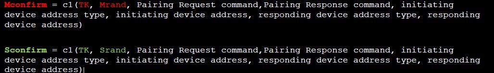

 

接着，主设备发送MConfirm, 从设备回复SConfirm。

收到SC之后，master通过发送一个Pairing Random PDU把Mrand传给slave。

slave现在知道计算MConfirm所需要的所有东西，slave将计算得到的MConfirm和收到的MConfirm进行比较。如果匹配的话，则完成了master对slave的认证。slave通过Pairing Random PDU回复Srand给master。

master计算SConfirm并和收到的SConfirm进行比较。如果相同，则slave对master就是经认证的。

```
每个设备都证明了它知道TK，此时身份认证已经完成。 
```

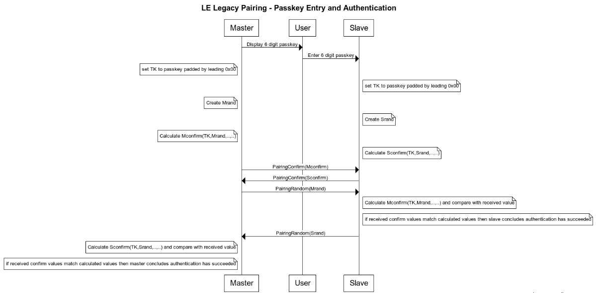

 **Step 3 - Generate the Short Term Key (STK)**

接着，我们可以用TK计算STK了：

`STK = s1(TK, Srand, Mrand)`

**Step 4 - Start Encryption on the Link**

第4步中，使用STK计算得到一个会话秘钥（session key），开始对链路进行加密。从此开始，蓝牙链路层的所有数据包都被加密了。

- **Phase3**

phase3派发中对密钥进行派发，包括LTK, CSRK, IRK。

密钥派发的链路经过session key进行加密，因此是安全的。 

```
注意：链接将继续使用基于 STK 的会话密钥加密，直到下一次重新连接时将使用 LTK。 这可能会持续很长时间。这也是 STK 的潜在弱点（而且在 Just Works 的情况下熵为零）。
```
- How do LTK, CSRK, and IRK get created?

蓝牙核心规范中给出了LTK, CSRK, IRK的计算方法。

一个设备可能与多个设备配对，因此需要有一种设备可以识别密钥并从安全管理器协议中引用它们的方法。出于这个原因，LE Legacy Pairing 定义了两个特殊的安全值，称为加密密钥分集器/ EDIV 和一个随机数/ RAND。它们一起保存在security database中。 

##### 2.1.4.2 LE Secure Connections

LE Secure Connection是在蓝牙核心规范的4.2版本之后引入的，它是一种可选的并且更安全的配对方法。

- An Overview of LE Secure Connections Pairing

LE Secure Connection也分为三步，其中第二步和LE Legacy Pairing明显不同。

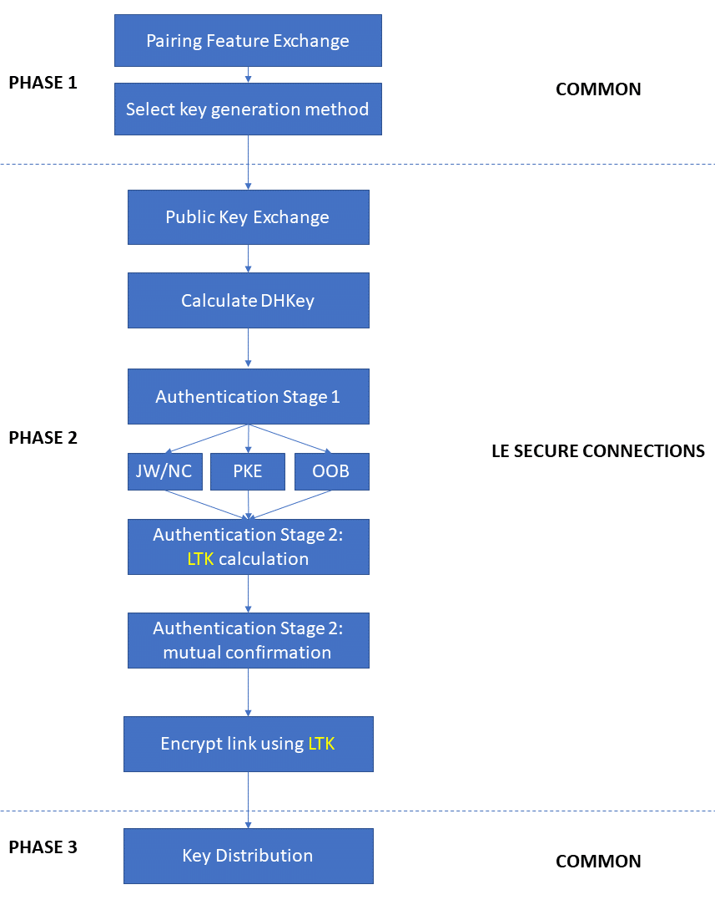

如上图所示，LE Secure Connections pairing使用公钥加密算法。更准确的，是使用P-256椭圆曲线的椭圆曲线加密算法。

- **Phase1 – Pairing Feature Exchange and Pairing Method Selection**

Phase1一开始是pairing feature exchange。如果 两个设备的SC flag都是1，那么必须选择LE Secure Connections。接着，要决定使用哪种association model。决定将产生和派发何种key。

| association model  | 描述                                                         |
| ------------------ | ------------------------------------------------------------ |
| Just Works         | 不需要用户交互<br />满足以下条件时使用：<br />\- 两台设备都设置了SC flag<br />\- 两台设备的MITM都为0<br />或者<br />\- 两台的设备的OOB 都为0<br />\- 一台或两台设备的MITM为1<br />\- 一台或两台设备的MITM为1<br />\- IO能力表示不支持输入 |
| Numeric Comparison | 两个设备上都显示6位数字。用户需要指出两个数字是不是一样的，通过点击按钮选择yes or no<br />满足以下条件是使用：<br />\- 两个设备的SC都为1<br />\- 1或2个设备的MITM为1<br />\- 两个设备的OOB为0<br />\- IO能力表明两个设备都能显示并支持用户选择yes or no |
| Passkey Entry      | 与Security Connections pairing配合使用时有两种变体。1.两个设备输入相同的6位数字。2.一个设备显示6位数字，另一个设备输入该6位数字。<br />满足以下条件时使用：<br />\- 两台设备都设置SC<br />\- 1或2个设备的MITM为1<br />\- 两个设备的OOB为0<br />\- IO能力表示两个设备都支持输入，或者一个支持显示一个支持输入 |
| OOB                | 使用非蓝牙的数据通道在两个设备之间单向或双向传递数据<br />满足以下条件时使用：<br />\- 两台设备没有设置SC<br />\- 两个设备的OOB标记为都为1 |

- **Phase2 - Public Key Exchange, DHKey Calculation, and Authentication**

**step1 Public Key Exchange**

发起者把它的public key发送给响应者。响应者回复它的public key。-->使用SMP Pairing Public Key PDU

公钥在收到时进行验证（检查它们是否在正确的椭圆曲线上）。 请注意，LE 安全连接仅使用 P-256 曲线。

**step2 Calculate DHKey**

```
Alice: DHKey = P256(SKa, PKb)

Bob : DHKey = P256(SKb, PKa)
```

自己的私钥和别人的公钥，计算得到DHKey。上面的计算，Alice和Bob得到的DHKey是相同的。

注意，私钥从未有在空中进行传播。

**step3 Authentication Stage 1**

这个阶段允许用户验证设备是不是自己想要配对的，除了Just Works。

**LE Secure Connections with Just Works and Numeric Comparison Authentication**

首先，设备B产生一个128-bit的伪随机数Nb，然后计算得到confirm value，Cb

```
Cb=f4(PKb, PKa, Nb, 0)
```

接着，Cb从B设备发送到A设备。

设备A类似的，产生Na，并将随机数Na发送给设备B。

B回复它的随机数Nb。

这时候设备A就可以通过f4函数计算Cb，与得到的Cb进行对比。如果不同，直接退出配对。

如果是Just Works的方式，则认证的步骤1就完成了。如果是Numeric Comparison的方式，还需要额外的一步。

每个设备使用一个叫做`g2`的函数，通过PKa, PKb，和Na, Nb，计算得到一个6位数字。然后两个设备上都显示各自计算的6位数字。用户确认配对码是否相同。 ->至此，完成了两个设备的身份认证。接着，我们进行步骤2。

##### LE Secure Connections with Passkey Entry

PKE的方式，在LE Secure Connection pairing和LE Legacy Pairing的上用户体验是不相同的。

它有两种变种：1.一端显示，然后输入到另一端。2.两个设备都没有显示但是有输入，则用户需要在两个设备上输入相同的key。

用户输入passkey之后，设备计算，交换和确认confirm value(Ca和Cb)。但是，PKE的方式，确认的过程不是1次完成的，而是迭代完成的。

在每一次迭代中，每个设备产生1个128位的随机数（Na或Nb）,每次迭代中，使用passkey的1位参与到confirm value的计算中。confirm value的计算方式如下：

```
C=f4(PKa, PKb, N, 1 bit of passkey)
```

每一次迭代中，confirm value互相交换和检查。20位的passkey，一共20轮。这种方法被称为Gradual Disclosure，其优点是 MITM 攻击在实际中更加困难，大多数攻击在没有看到完整和最终确认值的情况下提前失败。

##### LE Secure Connections with OOB

The Out of Band Part

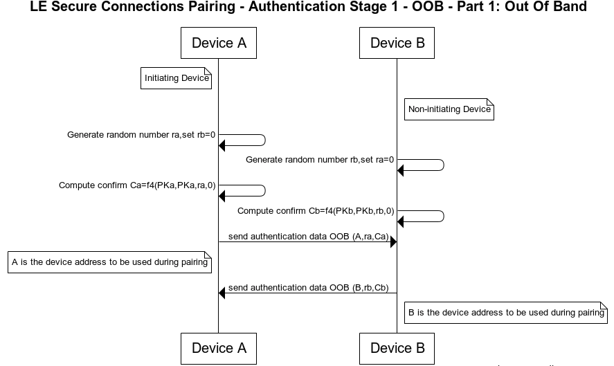

The Out of Band Part

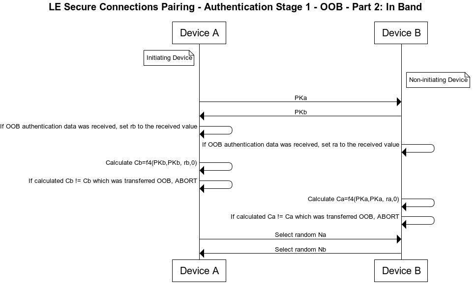

 

如果两边都能认证通过，则成功，否则，配对失败。

**step3 Authentication Stage 2**

4个步骤：

1. 使用f5计算得到LTK和MacKey

```
MacKey || LTK = f5(DHKey, N_Master, N_Slave, BD_ADDR_Master, BD_ADDR_Slave)
```
2. A计算得到Ea，并发送给B，然后B计算并比较Ea

   使用f6函数计算Ea，它使用AES-CMAC函数，并使用MacKey作为key

4. B计算得到Eb，并发送给A，然后A计算并比较Ea

4. 链路使用LTK进行加密

- **Phase3 – Key Distribution**

LE Legacy Pairing中，LTK, IRK, CSRK在这一步可能会被派发。此外，EDIV和RAND也被派发，用于作为数据库中LTK的identifiers。

LE Secure Connections时，IRK和CSRK在这一步也可能会被派发。LTK在phase 2的时候就已经交换了。并且，不需要EDIV和RAND。而是使用Bluetooth device address来作为LTK的identifier。

在LE Secure Connections的phase 3中，链路使用LTK派生的session key进行加密。但是LE Leagcy Pairing中， 直到这一步才使用STK派生的session key对链路进行加密。

##### 2.1.5 An Appraisal of Bluetooth Pairing and Security

- 最好使用LE Secure Connections

- 提供MITM保护

- LE Leagcy Pairing时使用OOB的认证方式是最安全的

- 使用最大的密钥size

#### 2.2 Link Encryption

##### 2.2.1 Starting Link Encryption

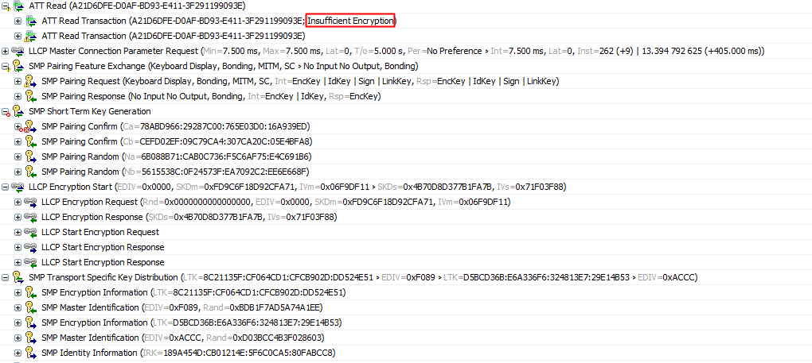

连接建立的时候，如果安全model和level表示需要链路加密的话，host on the master会告诉它的controller开始link encryption。同样的，访问需要encryption 权限的GATT attribute，如果链路没有加密的话，也会开始link encryption。

注意，无连接的情况下是不能使用安全特性的。

host发送HCI_LE_Start_Encryption命令来开始加密

slave可以通过向master发送SMP Slave Security Request PDU来请求安全加密。如果还没配对的话，master会开始pairing，或者已经paired的话就start link encryption。

在上图中，由于还没有配对过，因此，进行配对的过程，并使用的是LE Legacy Pairings的方式，链路上通过STK派生的session key来进行加密。

链路开始加密的流程包含了几步。master和slave交换PDU，如上图。master和slave各自产生初始向量表和session key的一部分，然后彼此交换。并连接IVm和IVs得到完全的IV value，SKDm和SKDs类似。

现在，两边就都有完整的相同的IV和SDK了。

master和slave的host通过HCI_LE_Start_Encryption命令，为controller提供LTK。使用LE Legacy Pairing的话，响应者设备根据EDIV和RAND来从数据库中拿到LTK, LE Secure Connection pairing则使用发起者的蓝牙地址找到LTK。

使用LTK作为key，对SKD进行加密，则计算得到session key。

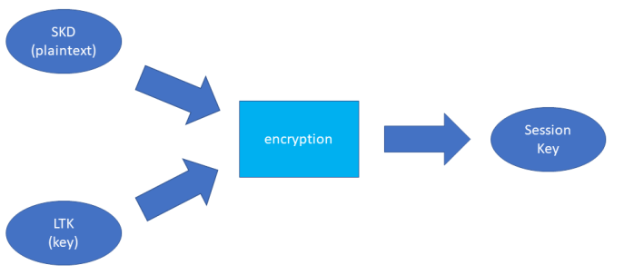

 

接下来，从设备向主设备发送一个未加密的 LL_START_ENC_REQ PDU。 主设备使用加密的 LL_START_ENC_RSP PDU 进行响应。 从设备用它自己的加密 LL_START_ENC_RSP PDU 进行响应。 可以在下图中看到两个响应 PDU，完成加密启动程序。

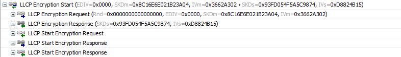 

##### 2.2.2 Encryption and Authentication of Link Data

BLE使用AES-CCM来进行加密。

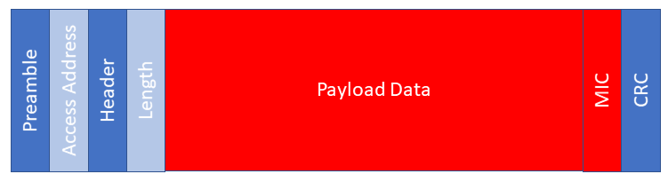

 

当数据加密使能时，所有的PDU都有一个MIC加在Payload Data后面和CRC前面。

MIC的计算包含了多个输入，其中包括一个随机数，其值包括一个包计数器。包计数器长39位，每一个非空包增加一次。

接收设备解密并检查MIC是否一致。如果不一致，则连接断开。

##### 2.3.3 Verifying the On-Going Integrity of the Encrypted Link

LE Ping 是可选支持的链路层控制过程。

LE Ping 允许本地设备中的链路层检查已一段时间没有与之进行任何通信的远程设备仍然存在，仍然能够生成有效的加密数据包，并且没有数据包被丢失。

LE Ping 程序的目的是提供一种机制，该机制可用于检测通过故意抑制合法蓝牙消息而起作用的攻击。

为了使用 LE Ping，主机设置了一个名为 Authenticated_Payload_Timeout 的链路层参数。 此参数指示在接收到由有效 MIC 验证的数据包之间可能经过的最长时间。 链路层设置一个定时器来监控这种情况，当指定的 Authenticated_Payload_Timeout 时间帧接近被超过而没有从远程设备收到一个 MIC 认证的数据包时，链路层调用 LE Ping。

LE Ping 涉及通知本地主机已发生经过身份验证的有效负载超时事件，并且本地链路层向远程链路层发送 LL_PING_REQ PDU。 如果远程链路层支持 LE Ping 过程，它应该回复一个带有有效 MIC 的 LL_PING_RSP PDU。

如果由于某种原因，远程设备无法提供所需的验证，则本地设备应断开链接。

#### 2.3 Privacy

##### 2.3.1 Private Addresses

蓝牙设备使用地址作为身份标识符（BD_ADDR）。该地址在不同的PDU中出现在空中，包括广播PDU中的AdvA，定向广播中的TargetA，以及定向扫描中的ScanA。

如果每次都使用真实地址，那么恶意三方可以通过该地址对设备进行跟踪。蓝牙的privacy feature就是用来降低该风险的。

当使用private feature时，设备拥有两个地址。1是identity address，它一直保持不变。2是private device address，周期性的改变。

当使用privacy feature时，设备处于private mode。Host通过发送HCI_LE_Set_Privacy_Mode命令给controller来是能privacy mode。

HCI_LE_Set_Resolvable_Private_Address_Timeout命令允许设置1秒到11.5小时的超时，私有地址将根据该周期进行变化。蓝牙核心规范推荐使用15minutes来周期变更私有地址。

Private address有两种: resolvable和non-resolvable。

- resolvable：使用IRK对private address进行resolve，从而得到identity address。

- non-resolvable：即使是配对设备也无法得到identity address。

##### 2.3.2 Privacy Modes

两种privacy mode。默认的是network privacy mode。当为给定的对端设备选择了此模式时，来自该设备的包含公共身份地址的任何广告数据包都应被链路层忽略，并且不会在stack上进一步处理。

另一种是device privacy mode。这种模式下，local device将会接收对端设备的私有地址和public identity address的数据包。

##### 2.3.3 The Resolving List

IRK， identity address, privacy mode 组成的Resolving List。

##### 2.3.4 Private Address Generation

non-resolvable：48位的地址，最高两位是0，剩下的46位是随机数（不全为0也不全为1）。

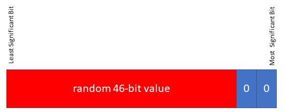

resolvable:最高2位是0和1，接着的22位是随机数prand，剩下的24位是用IRK和prand计算得到的hash。


##### 2.3.5 Private Address Resolution

如果最高两位是0和1的话，那么该地址被识别为resolvable address。收到该地址后，local device将尝试resolve该地址。

```
localHash = ah(IRK, prand)
```

如果计算的localHash和低智商的hash相同，则resolve成功。接着，就可以根据IRK检索得到identity address。

##### 2.3.6 Attribute Permissions

- Overview

每个attribute table包含了一系列的attribute permissions。

- Access Permissions

定义了attribute能都被读或写

- Encryption Permissions

定义了是否需要对链路进行加密

- Authentication Permissions

定义了访问属性的对端设备是否经过认证。

- Authorization Permissions

授权定义了访问属性前是否获得授权。如何理解？

该许可类型，允许定义各种规则，包括对其他许可类型的增强和精炼。比如：加密许可指定访问是否需要加密。但是我们可以通过授权许可，指定最小的协商key的长度。又比如，当要求认证的时候，我们可以指定必须在访问该属性之前，在配对中完成认证。

授权属性一定程度上也不依赖与其他的许可类型。我们可以定义在连接周期内，给定的特征值只能在其他的特征值被写过之后才能读取。授权许可很灵活，我们可以通过授权许可定义非常灵活的规则。

- Permission Representation and Implementation

如何定义属性的许可权限，以及如何确定授权规则，是具体实现的问题。蓝牙核心规范不做规定。

- Permission Failures

如果权限不满足attribute protocol定义了一些回复码。包括insufficient encryption, insufficient authentication, and insufficient encryption key size等。

- Data Signing

如果配对设备交换了CSRK的话，可以使用connection data signing。它在ATT PDU后面加一个数据签名（Signed Write）。实际情况下很少使用。

ATT server收到Signed Write之后，重新计算签名并和收到的签名进行对比。如果匹配，则签名得到验证，完整性和认证也得到验证。否则，认证失败，建议ATT server关闭连接。

Data Signing可以在unencrypted link上被使用。对应安全模式M2L2。

签名的数据包含了ATT opcode,handle，和代表counter的SignCounter。SignCounter保存在secure data中，产生CSRK时清0，每次发送ATT Signed Write时增加。 ->目的是防止重放攻击。

注意，只有一种Connection Data Signing流程，即 ATTribute Signed Write.

```
最好不要用M2L2,最好用M1 L2,L3,L4。
```

