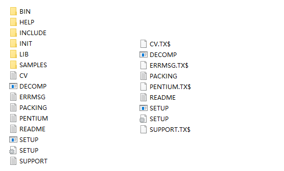
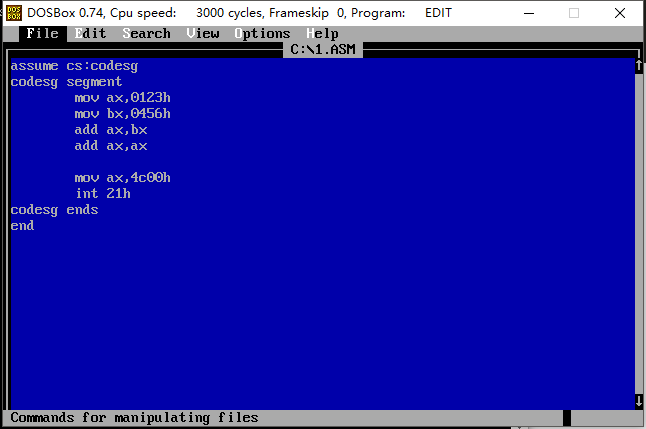
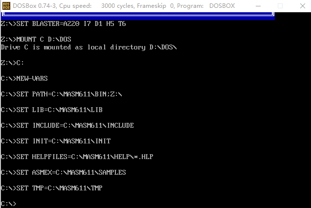

## Win10下汇编环境的搭建
&nbsp;&nbsp;&nbsp;&nbsp;最近在看王爽老师的《汇编语言》学习汇编，需要在我的Win10笔记本下搭建汇编语言编译调试环境。

&nbsp;&nbsp;&nbsp;&nbsp;由于书籍一开始的前三章只需要熟悉调试debug调试工具，因此用[CSDN上这位网友][link1]的DOSBox软件，完美地满足了我debug调试的需求。

&nbsp;&nbsp;&nbsp;&nbsp;到了第四章，需要自己编写汇编程序，编译、链接、调试，之前的操作就不再满足需求了。自己动手丰衣足食，今天到网上搜集了一下资源，整理于此。
- 实验平台：Win10 64位
- 所需软件：DOSBox-0.74, MASM 6.11, debug.exe, edit.com

<!--more-->

### 1. 安装DOSBox-0.74
&nbsp;&nbsp;&nbsp;&nbsp;[DOSBox-0.74][link2]资源在这里，直接安装即可，选择自己想要安装的位置，我的是：D:\DOSBox-0.74 。
### 2. 选择模拟DOS环境的C分区位置
&nbsp;&nbsp;&nbsp;&nbsp;新建一个文件夹作为模拟DOS环境的C分区，这里假定为 D:\DOS 。
### 3. 下载MASM
&nbsp;&nbsp;&nbsp;&nbsp;网上随便下载masm 6.11，[链接一][link3]，[链接二][link4]。将其中几个名为DISK?（?是数字）的文件夹合并到一起（把DISK?文件夹里边的内容放到一起），放在某个地方备用，假定为* D:\MASM611 。像这样：

 
`提示：如果出现.TXT扩展名不对，如上图右边，可到[这个链接][link5]上下载替换.TXT文件，像左边才是正确的，不然安装会提示.TXT文件找不到。`
### 4. 安装MASM
&nbsp;&nbsp;&nbsp;&nbsp;在DOSBox的安装目录下，找到DOSBox 0.74 Options，双击，在最后添加两行：
```
MOUNT A D:\MASM611
MOUNT C D:\DOS
```
启动DOSBox，执行:
```
A:
SETUP
```
&nbsp;&nbsp;&nbsp;&nbsp;开始安装MASM。安装时选择“MS-DOS/Microsoft Windows”，除了Brief Capability以外其他的组件都装上，其他选项 保持默认值 即可。
&nbsp;&nbsp;&nbsp;&nbsp;安装完后把 D:\DOS\MASM611\BIN 目录下的 NEW-VARS 批处理文件拷贝到 D:\DOS 目录下。
&nbsp;&nbsp;&nbsp;&nbsp;最后在DOSBox的安装目录下，找到DOSBox 0.74 Options，双击，注释掉：
“MOUNT A D:\MASM611”，并添加：
```
C:
NEW-VARS
```
由于debug和edit不是内置的，因此需要自行到[网上下载][link6]，资源在此。下载之后放到我们的模拟分区目录中 D:\DOS 。
&nbsp;&nbsp;&nbsp;&nbsp;至此，安装完成。
### 测试

- 测试edit

打开DOSBox，输入edit，编辑第一个asm程序，保存为 C:\1.ASM，退出。


- 测试编译
输入`masm 1` ，即可把 C:\1.AMS 编译成 C:\1.OBJ 。
- 测试链接
输入`link 1`，即可将 C:\1.OBJ 链接生成可执行文件 C:\1.EXE 。
- 测试运行
输入`1`，程序1即被运行。
- 测试debug
输入`debug`， 没报错，表示已进入debug调试模式，输入q退出。

以下是在屏幕中间依次显示'a'~'z'，并通过esc修改颜色的程序效果：


为了方便，我把masm、debug、edit三个软件也传了一份到百度云，地址是：https://pan.baidu.com/s/11oejHmAhQBL-WOptGsQbcg，提取码：3kp2。

本文主要参考了[知乎问题][link7]上Louis Tong的回答，特此感谢。

[link1]:https://download.csdn.net/download/meifan33/10012764
[link2]:https://www.dosbox.com/download.php?main=1
[link3]:https://download.csdn.net/download/Winsock32/184125 
[link4]:https://sourceforge.net/projects/masm611/
[link5]:https://github.com/fititnt/assembly-masm/tree/master/MASM611
[link6]:https://download.csdn.net/download/m3470/2673081
[link7]:https://www.zhihu.com/question/46756197