## 前言
由于工作的原因，初次接触安全芯片并使用到安全相关的一些工具，并在后续的学习中陆陆续续看了一些安全的知识。在这里做一些security相关的笔记，希望之后可以温故知新，也希望能帮助到有需要的同学。
我主要参考了以下三本书籍，感兴趣的同学可以看看：
- [《图解密码技术》][link1] ：非常浅显易懂的入门书籍
- [《密码技术与物联网安全 -- mbedtls开发实战》][link2]：19年出的mbedtls相关的书籍
- [Understanding Cryptography, by Christo Paar][link6]

另外参考了别人的博文和维基百科，在此表示感谢：

- [SHA256算法原理详解][link4]
- [SHA-2][link5]

[link1]:https://book.douban.com/subject/26265544/
[link2]:https://item.jd.com/12507477.html
[link3]:https://book.douban.com/subject/1142306/
[link4]:https://blog.csdn.net/u011583927/article/details/80905740
[link5]:https://en.wikipedia.org/wiki/SHA-2
[link6]:https://www.amazon.com/Understanding-Cryptography-Textbook-Students-Practitioners/dp/3642446493
<!--more-->

## 单向散列函数
单项散列函数又称安全散列函数或哈希函数（Hash function），是一种从任何数据中创建小的数字“指纹”(fingerprint)的方法，可用于检查消息的完整性。
### Motivation
在现代密码学中，哈希运算有着非常多的应用，最著名的是在数字签名中的运用。

在数字签名中，经常采用基于离散对数问题的非对称算法RSA算法，这种算法要求消息的长度不能比模数(modulus)小。实际常用的是模数长度是1024和3072-bits，而我们一封邮件就很可能比这个长度要大。

那么，怎么解决这种问题呢？

很容易想到的一种方法是，对消息分段，使得每段签名的长度，都比模数的长度小。

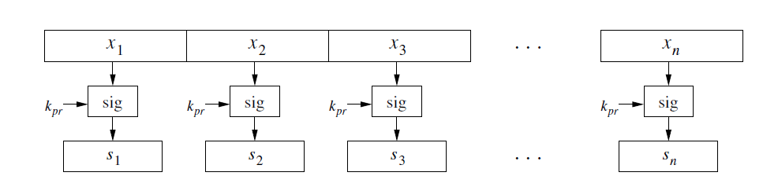

这种方法有什么坏处呢？

- 很大的运算负载。非对称的签名算法计算得很慢，全部计算效率太低。
- 长度太长。消息+签名，使得输出的长度直接变成了两倍。
- 安全的限制。攻击者从中截取掉部分消息和签名、对消息和签名变换顺序、重复消息和签名，都不会被发现。

因此，对消息进行分段加密使不可行的，在实际使用中，签名都是对消息的哈希（散列值）进行签名。首先，对完整的消息计算哈希值，然后再用签名算法对消息进行签名，这个哈希值，就代表了消息本身。消息的哈希值也常常叫做消息摘要（message digest）或者消息的指纹（fingerprint of the message）。
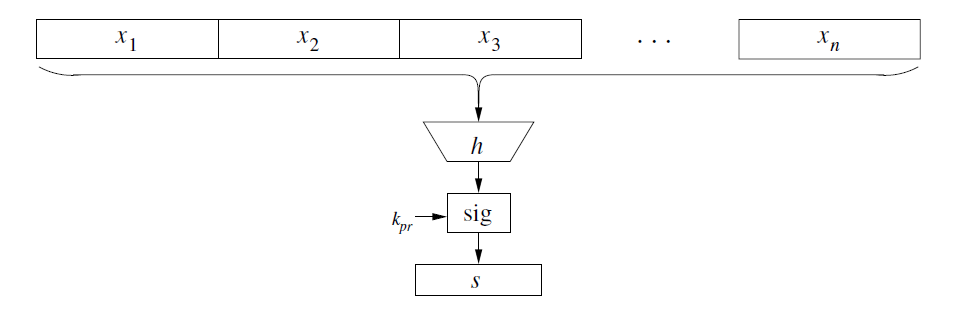

在讨论哈希的安全性之前，我们先总结一下哈希运算希望拥有的几个特性：

- 它能接受任意长度的消息输入，然后输出固定长度的哈希值（128-512bits）
- 这个哈希值跟输入的消息紧密相关（highly sensitive），输入做一点点小小的改变,哈希值都完全不一样。
- 运算尽量地快。

### 哈希函数的安全性要求

哈希函数跟加密算法不一样，哈希函数是不需要密钥的。为了保证哈希函数的安全，焊锡函数需要用有三个最主要的特性：

- 单向性（one-wayness）
- 抗弱碰撞性
- 抗强碰撞性

这三点特性描述如下图：

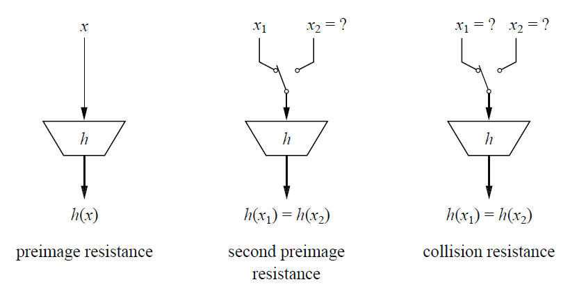
```
单向性:只能由输入计算输出，不能由输出反过来得到输入。
抗弱碰撞性：给定x1，（计算上）求不到x2，使得它们的哈希值相等。
抗强碰撞性：（计算上）找不到任意得x1和x2，使得它们得哈希值相等。
```
#### 单向性
考虑一下为什么哈希函数需要具有单向性。我们假设Bob向Alice传输了加密的消息，以及（对明文哈希的）签名。

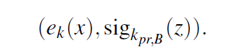

e()是对称加密算法，密钥是k。z是对明文的哈希，用Bob自己的公钥对z进行签名。

假设Bob用的是RSA签名算法，则签名由下式进行计算：

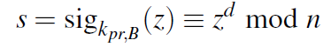

攻击这Oscar可以用Bob的公钥得到消息的哈希值：

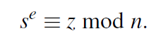

如果哈希函数不是单向的，那么通过z，就可以反过来得到明文x。而在这个传输中，Bob并不希望其他人知道明文。

此外，在哈希函数的另外一些应用中，比如密钥派生，单向性显得更为重要。

#### 抗弱碰撞性

抗弱碰撞性很好理解，如果给定x1，能找到x2，使得它们得哈希值相等，则哈希值就不能作为消息的指纹了。

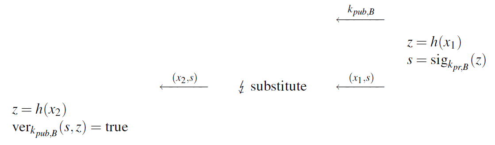

需要说明的是，由于我们输出的长度是有限的，根据鸽笼原理，100个笼子，101个鸽子，那么总是有1个笼子里面有不止一个鸽子。因此，我们指的抗弱碰撞性，是指的不能实现分析计算上的攻击，且穷举所有的可能，是不实际的。

#### 抗强碰撞性

为什么需要抗强碰撞性呢？如果攻击者能修改x1，也能修改x2，那么并且能找到x1、x2的哈希值相等，那么攻击也同样能成为可能。
```
x1： Transfer $10 into Oscar's acount
x2： Transfer $10,000 into Oscar's acount
```
过程如下：
```
Oscar -> Bob：转10美元到我（Oscar）的账户
Bob -> Alice：转10美元到Oscar的账户（消息x1 + 签名）
Oscar截获了消息并做修改
Oscar->Alice：转10000美元到Oscar的账户（消息x2 + 签名）
```
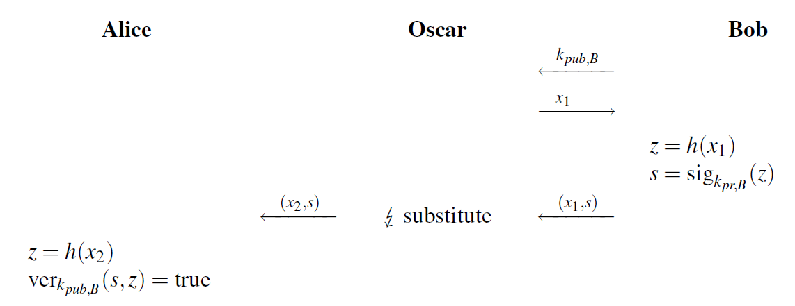

**生日攻击**

这里说明一下，抗强碰撞性的概率计算问题。

一年365天。366个人中，一定有至少2个人生日相同。但是如果我们想要求有两个人的生日相同的概率是50%，那么需要多少人呢？实际只需要23个人！

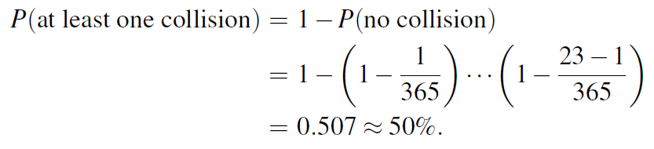

假设哈希函数的输出位数是n，碰撞的概率是lamda,输入尝试次数是t，它们之间存在关系：

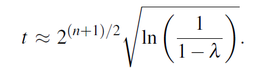

如果哈希函数输出长度是80位，碰撞概率是50%时，只需要尝试这么多次：

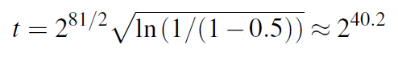

因此，所有的哈希函数，输出都至少有128位，有一些则会更多。

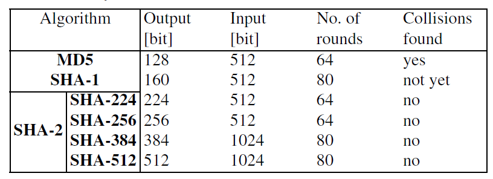


### 单向散列函数的应用
#### 消息完整性检测
单向散列函数的一个重要应用是对消息的完整性进行检测。例如在传输消息的后面添加散列值，在传输完成之后再比较计算出来的散列值和收到的散列值是否相等，来检测是否发生了篡改。
#### 伪随机数生成器
单向散列函数可以用来构造伪随机数生成算法，如TLS1.2中的PRF函数。
#### 消息认证码
消息认证码用来检测消息传输过程中的错误、篡改和伪装。什么是伪装呢？比如Alice向Bob传输了一条带有散列值的消息，但是这个传输过程被Mallory截获，并且Mallory伪装成Alice发了一条新的消息+散列值给Bob。消息认证码就是为了完成认证的过程：它除了单项散列函数外还加入了共享密钥，该密钥只有Alice和Bob有，这样就能防止伪装，完成认证。
#### 数字签名
因为“指纹”代表了数据的真实性，因此一般对“指纹”进行签名而不是对完整消息进行签名（太慢）。
### SHA256详细描述
单向散列函数的实现方法有很多种，常用的包括MD4、MD5、SHA-256、SHA384-512等。

MD4、MD5算法的碰撞性已被攻破，SHA0、SHA1算法存在缺陷不推荐使用，因此推荐使用的是SHA2和SHA3算法。

下面以SHA256为例详细描述哈希算法的计算过程。

#### 常量初始化

首先介绍一下SHA256算法需要用到的常量以及逻辑运算。

SHA256算法使用到的**8个哈希初值：**
```
(first 32 bits of the fractional parts of the square roots of the first 8 primes 2..19):
h0 := 0x6a09e667
h1 := 0xbb67ae85
h2 := 0x3c6ef372
h3 := 0xa54ff53a
h4 := 0x510e527f
h5 := 0x9b05688c
h6 := 0x1f83d9ab
h7 := 0x5be0cd19
```
用到的**64个常量：**
```
k[0..63] :=
   0x428a2f98, 0x71374491, 0xb5c0fbcf, 0xe9b5dba5, 0x3956c25b, 0x59f111f1, 0x923f82a4, 0xab1c5ed5,
   0xd807aa98, 0x12835b01, 0x243185be, 0x550c7dc3, 0x72be5d74, 0x80deb1fe, 0x9bdc06a7, 0xc19bf174,
   0xe49b69c1, 0xefbe4786, 0x0fc19dc6, 0x240ca1cc, 0x2de92c6f, 0x4a7484aa, 0x5cb0a9dc, 0x76f988da,
   0x983e5152, 0xa831c66d, 0xb00327c8, 0xbf597fc7, 0xc6e00bf3, 0xd5a79147, 0x06ca6351, 0x14292967,
   0x27b70a85, 0x2e1b2138, 0x4d2c6dfc, 0x53380d13, 0x650a7354, 0x766a0abb, 0x81c2c92e, 0x92722c85,
   0xa2bfe8a1, 0xa81a664b, 0xc24b8b70, 0xc76c51a3, 0xd192e819, 0xd6990624, 0xf40e3585, 0x106aa070,
   0x19a4c116, 0x1e376c08, 0x2748774c, 0x34b0bcb5, 0x391c0cb3, 0x4ed8aa4a, 0x5b9cca4f, 0x682e6ff3,
   0x748f82ee, 0x78a5636f, 0x84c87814, 0x8cc70208, 0x90befffa, 0xa4506ceb, 0xbef9a3f7, 0xc67178f2
```
**需要到的逻辑运算**

SHA256用到的逻辑运算包括：

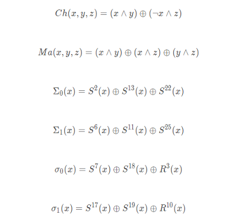

其中：

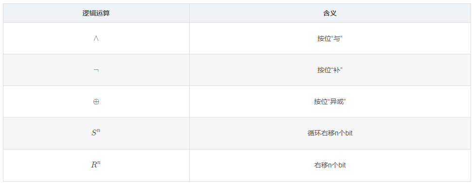

#### 消息预处理

算法首先要对消息进行填充。

**消息填充**

SHA256算法的分组长度是512bit，因此需要先经过填充使长度达到512的整数倍。
假设原始数据长度是L比特，则在后面填充一个比特1、K个比特0和长度L的二进制表示（64比特）。
` K = (512 - 64 - 1 - L) mod 512`
假设消息是"abc"，则填充后的消息为：
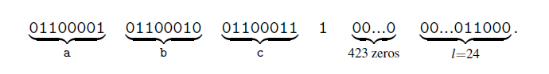

**消息分割:**

完成消息填充后，将消息M其分解成N个512比特的分组chunk： `M(1)~M(N)`。

#### 哈希计算

计算哈希的过程，就是对消息进行`N`轮的映射计算的过程，表示为：

```
H_i = Map(H_i-1, M(i))          //最外层循环，N轮
```    
 
H_0是前面提到的8个哈希初值，利用Map映射函数对H进行更新，更新N轮后的输出H_N，就是最后的哈希值。

**Map映射函数**

首先，Map映射函数需要构造64个字(**WORD**)

每个512比特的分组消息M(i)，可以用16个32比特表示：

`w[0],...,w[15]`

它们是64个字的前16个，后面的字由如下迭代公式的到：

`w[t] = σ1(w[t-2]) + w[t-7] + σ0(w[t-15]) + w[t-16]`

然后，Map映射包含了64次循环，每次循环的过程为：

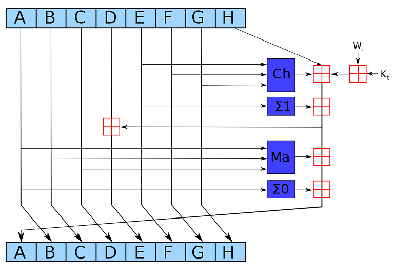

其中：

- 输入ABCDEFGH这8个字一开始的初值分别为：H_i-1(0),...,H_i-1(7),它们按照上图中的规则进行更新；

- 深蓝色方块是实现定义好的非线性逻辑函数；

- 红色田字方块表示:两个数字相加，对2^32求余；

- Kt是第t个密钥，对应前面提到的64个常量；

- Wt是本区块第t个word。

由此完成了SHA256的计算。

